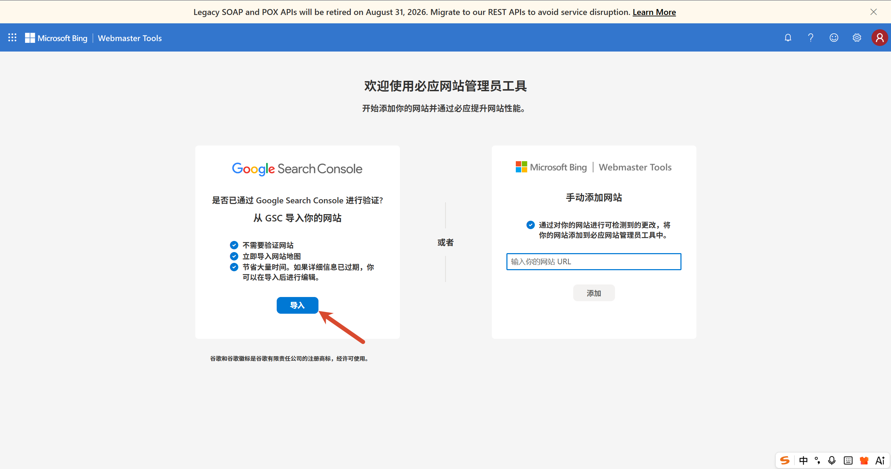
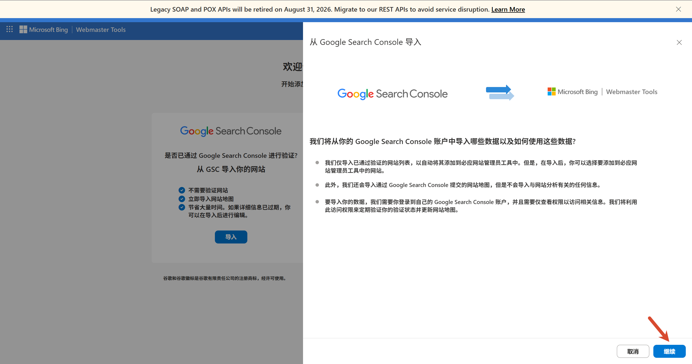
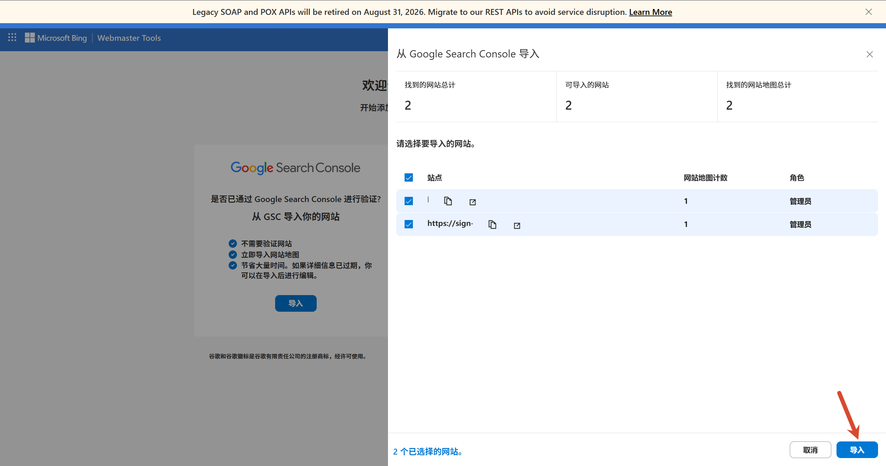
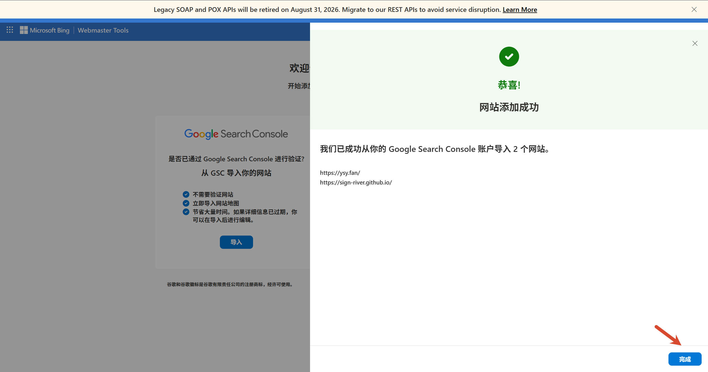
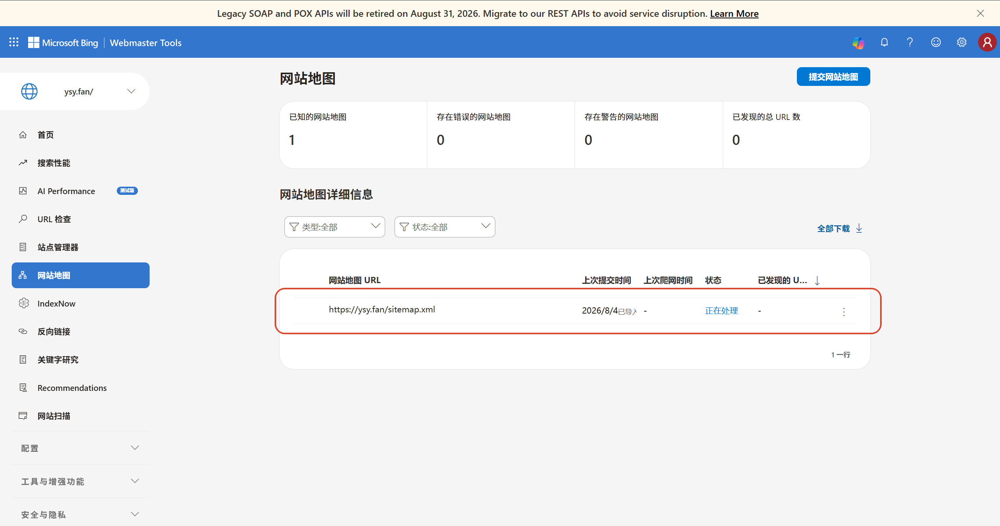

本文介绍如何将 GitHub Pages 博客提交到 Bing Webmaster Tools，几分钟即可完成站点验证与站点地图提交，让 Bing 快速收录你的内容。

本文是《[解决 Google Search Console 无法抓取 GitHub Pages 站点地图](/p/github-pages-google-sitemap-fix/)》的姊妹篇，记录 Bing 侧的提交流程。

## 1. 打开并登录

浏览器打开 [Bing Webmaster Tools](https://www.bing.com/webmasters)，使用微软账号登录：

## 2. 从 Google Search Console 导入

在欢迎页面选择 **从 Google Search Console 导入**：

## 3. 授权 Google 账号

点击 **继续**，选择你的 Google 账号，接下来一路点击 **继续** 即可；在授权页面记得勾选 **允许访问 Google Search Console 的数据**：

## 4. 导入网站

点击 **导入网站**：

看到「网站添加成功」的提示即完成导入：

## 5. 确认站点地图

点开 **站点地图（Sitemaps）**，一般会自动导入；如果没有，手动提交 `https://ysy.fan/sitemap.xml` 即可：

