本文记录 GitHub Pages 博客的站点地图在 Google Search Console 中长期显示“无法抓取”的排查过程与最终解决方案，供遇到同样问题的朋友参考。

## 1. 问题现象

自从搭建博客以来，我一直希望文章能被更多人看到，但 Google Search Console 始终无法读取我的站点地图。期间尝试了网络上各种方法都没有成功，前后耗时几个月，最终通过更换域名解决了问题。

<a href="images/2026-08-05-00-19-04.png" target="_blank"> 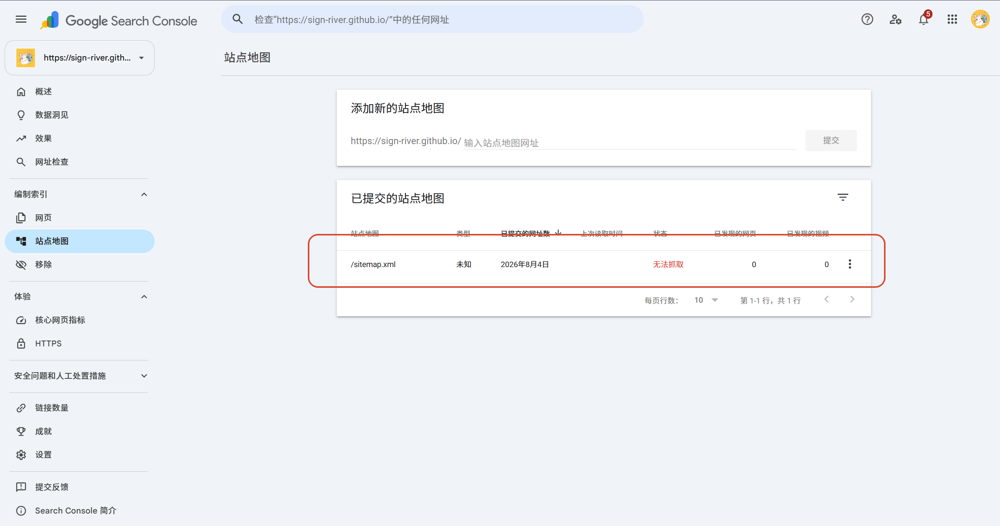 </a>

## 2. 排查过程

我先后排查了站点地图格式、文件内容等，均未发现问题。后来在论坛中发现，这是 **GitHub Pages 与 Google Search Console 之间的长期平台问题**，并非个例。既然问题不在站点地图本身，我决定从外部入手——更换域名。

## 3. 解决方案

### 3.1. 购买域名

首先需要购买一个域名，购买渠道不限。我这里是在阿里云购买的；国内外渠道都可以，国外购买后可直接使用，但在国内访问效果一般；国内购买则需要注意实名认证与审核流程，需要一定时间，看个人能否接受。

### 3.2. 配置 DNS 解析

进入域名的解析设置：

<a href="images/2026-08-05-00-24-13.png" target="_blank"> 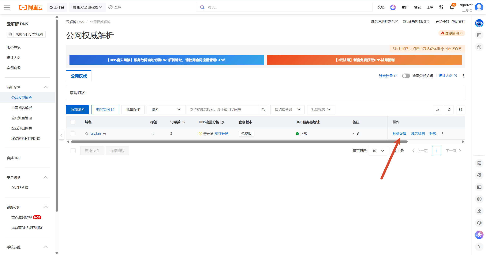 </a>

如果域名之前绑定过其他服务器，需要先移除旧记录，或者换一个新域名，否则可能导致解析冲突。我的域名下还有一条过期服务器的记录，所以直接删除。

<a href="images/2026-08-05-00-26-21.png" target="_blank"> 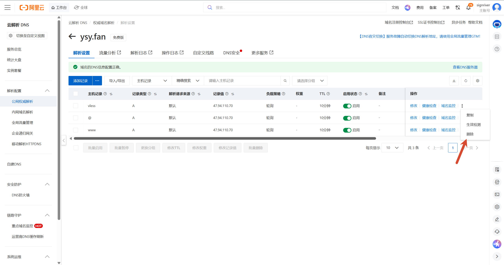 </a>

然后添加 GitHub Pages 的四个服务器 IP：

| 记录类型 | 主机记录 | 记录值            |
| -------- | -------- | ----------------- |
| A        | `@`      | `185.199.108.153` |
| A        | `@`      | `185.199.109.153` |
| A        | `@`      | `185.199.110.153` |
| A        | `@`      | `185.199.111.153` |

点击右侧的 **⋮（更多操作）**，选择 **快速添加网站解析**：

<a href="images/2026-08-05-00-28-31.png" target="_blank"> 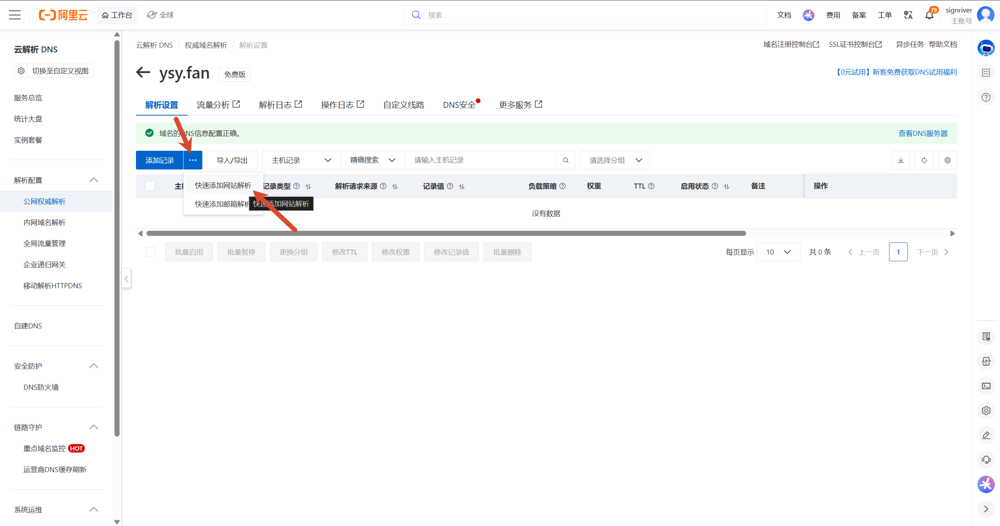 </a>

按图中所示填写四个 IP，点击 **确定**：

<a href="images/2026-08-05-00-49-48.png" target="_blank"> 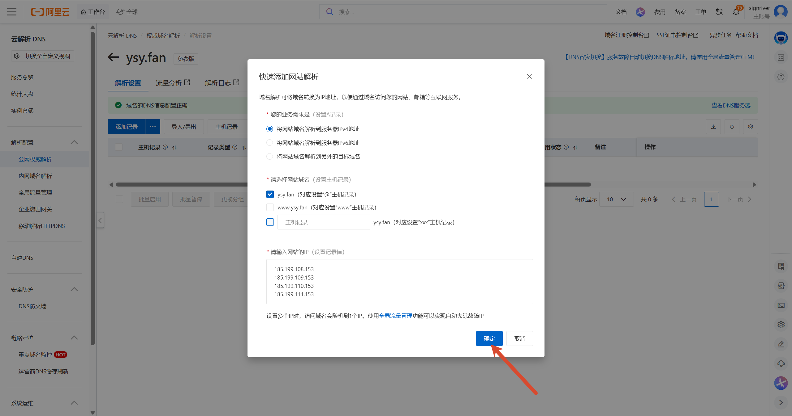 </a>

随后点击 **添加记录**：

<a href="images/2026-08-05-00-50-17.png" target="_blank"> 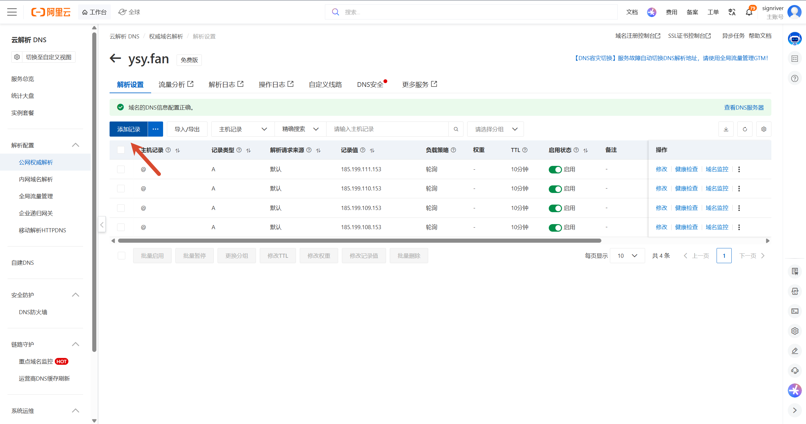 </a>

记录类型选择 **CNAME**，主机记录填 `www`，记录值填你的原域名（例如 `sign-river.github.io`）：

<a href="images/2026-08-05-00-56-49.png" target="_blank"> 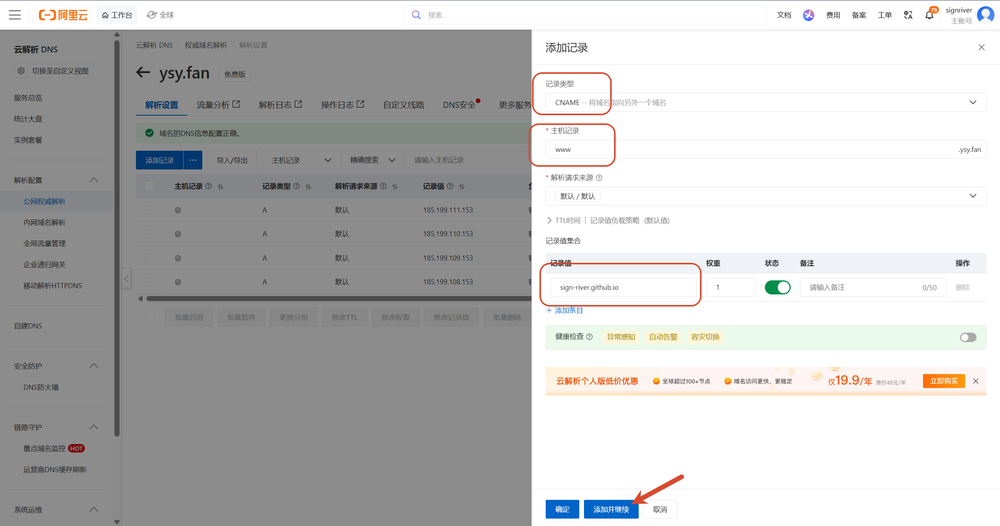 </a>

添加成功后，解析记录列表应包含 4 条 A 记录和 1 条 CNAME 记录：

<a href="images/2026-08-05-00-57-32.png" target="_blank"> 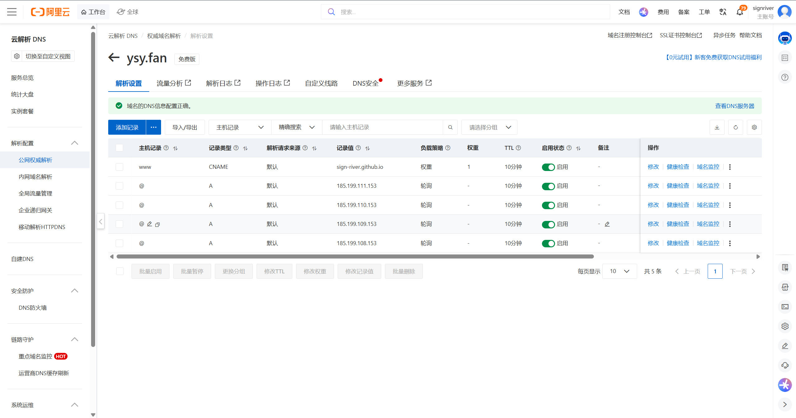 </a>

### 3.3. 在 GitHub Pages 绑定域名

接下来到 GitHub 仓库中绑定域名：打开 GitHub → 进入你的博客仓库 → **Settings（设置）**：

<a href="images/2026-08-05-00-33-48.png" target="_blank"> 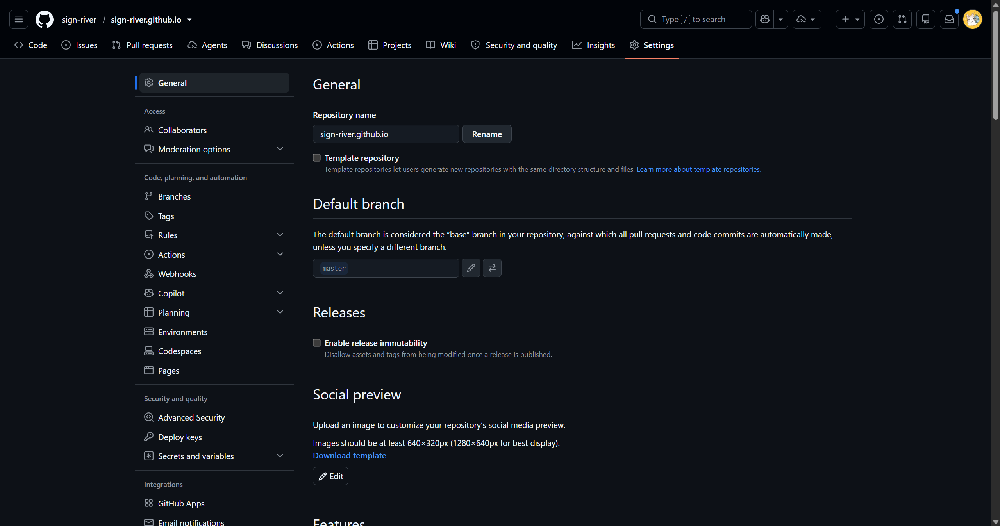 </a>

在左侧菜单找到 **Pages（页面）**，在 **Custom domain（自定义域）** 输入框中填写你的域名（例如我的 `ysy.fan`），勾选 **Enforce HTTPS**，点击 **Save（保存）**。保存后会显示 **DNS Check in Progress**，通常需要等待十几分钟才能配置完成，可以先去做别的事情：

<a href="images/2026-08-05-01-04-10.png" target="_blank"> 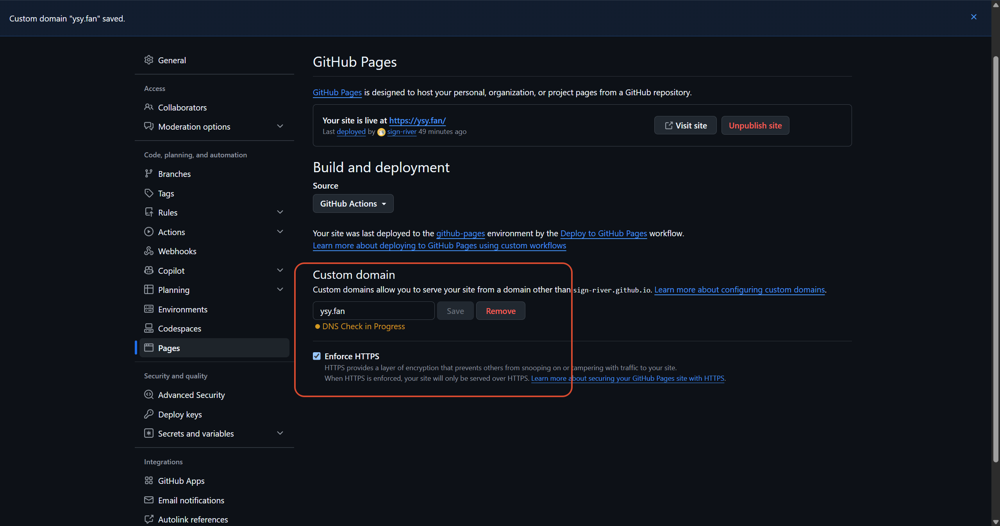 </a>

配置成功后显示 **DNS check successful（DNS 检查成功）**：

<a href="images/2026-08-05-02-19-48.png" target="_blank"> 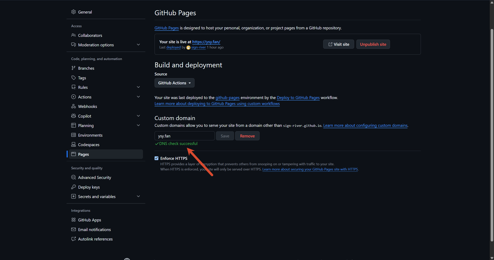 </a>

### 3.4. 在 Google Search Console 提交站点地图

打开 Google Search Console，点击 **添加资源（Add property）**：

<a href="images/2026-08-05-02-21-41.png" target="_blank"> 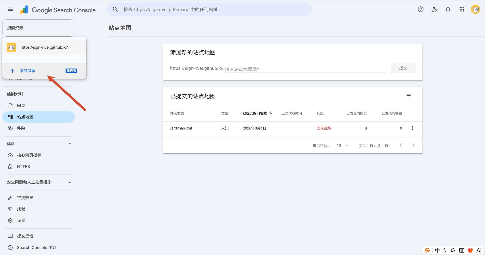 </a>

选择 **添加网站**：

<a href="images/2026-08-05-02-22-05.png" target="_blank"> 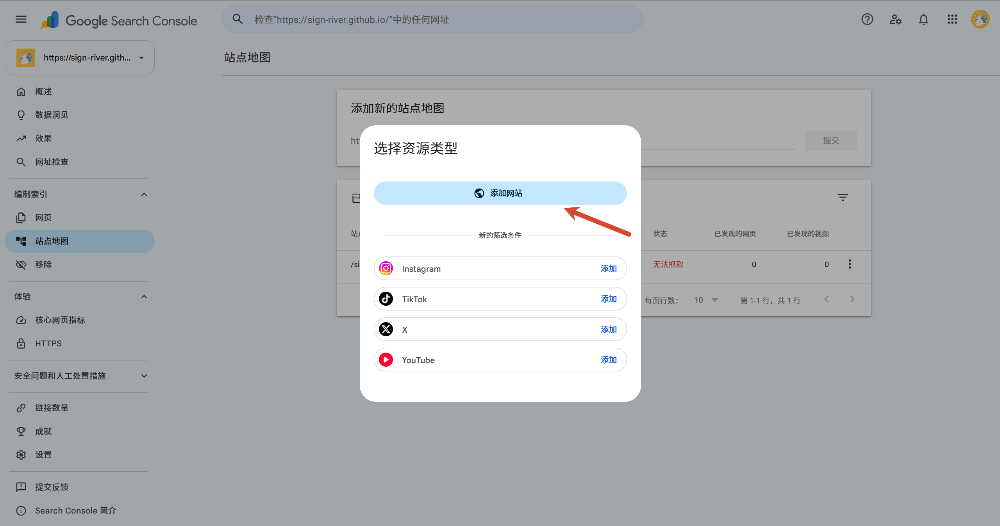 </a>

选择 **网址前缀（URL prefix）**：

<a href="images/2026-08-05-02-22-38.png" target="_blank"> 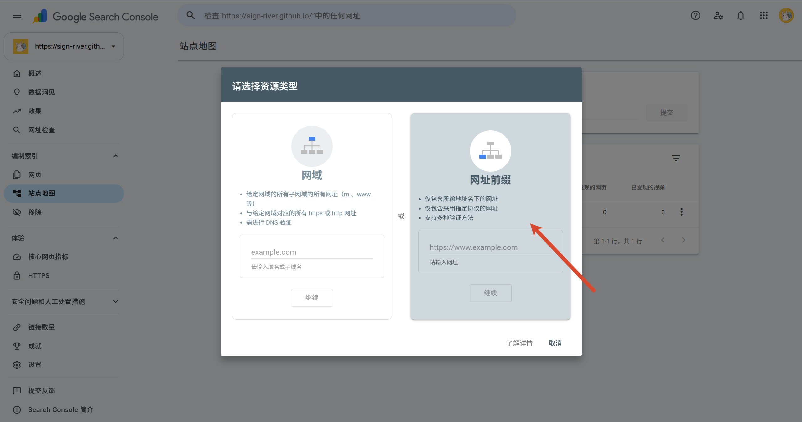 </a>

填写 `https://` + 你的域名 + `/`，例如我的 `https://ysy.fan/`，点击 **继续**：

<a href="images/2026-08-05-02-23-28.png" target="_blank"> 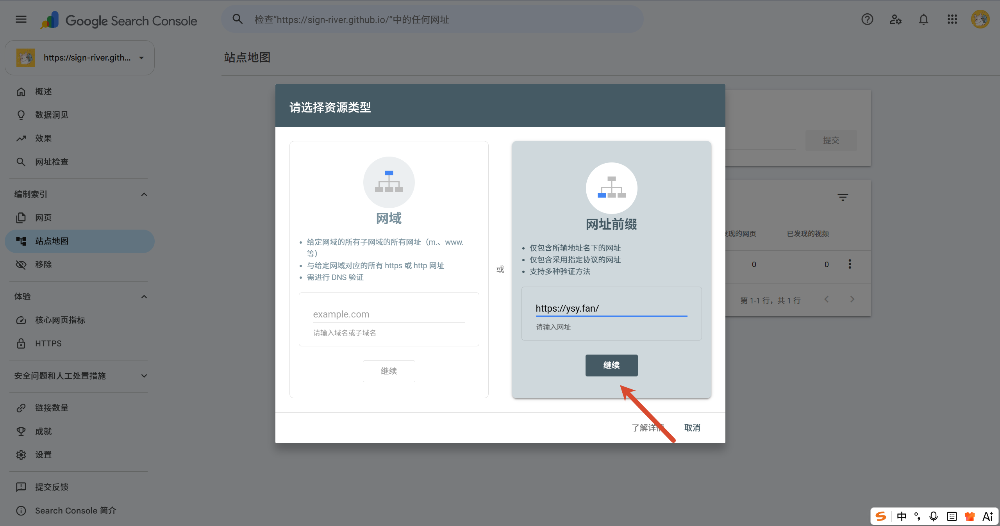 </a>

选择 **前往资源界面**：

<a href="images/2026-08-05-02-23-59.png" target="_blank"> 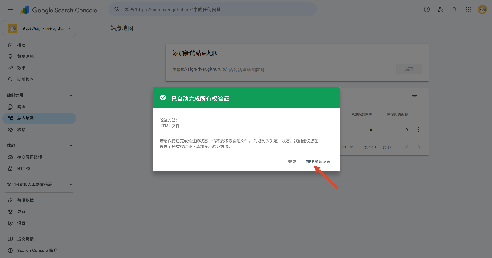 </a>

在左侧菜单依次进入 **索引编制 → 站点地图（Sitemaps）**，提交站点地图，例如我的 `https://ysy.fan/sitemap.xml`：

<a href="images/2026-08-05-02-26-51.png" target="_blank"> 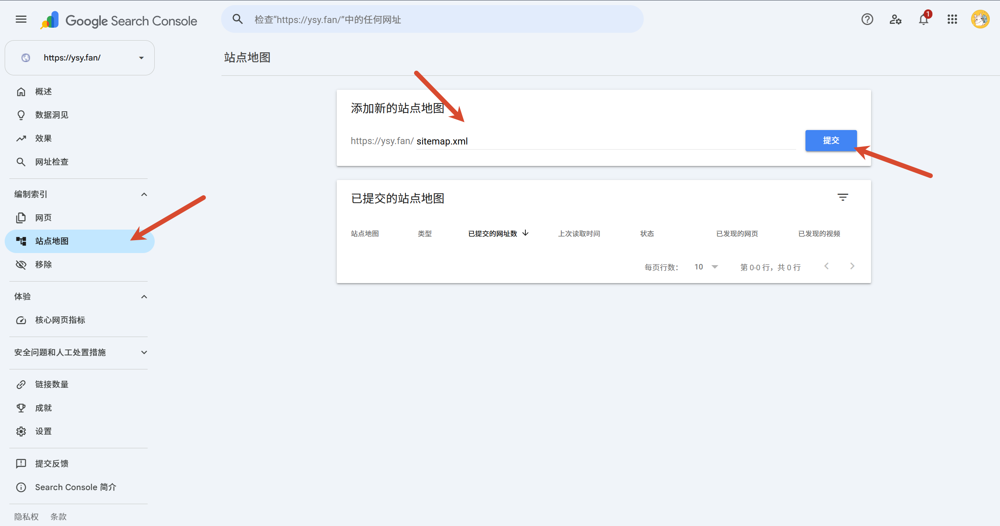 </a>

提交成功后：

<a href="images/2026-08-05-02-27-45.png" target="_blank"> 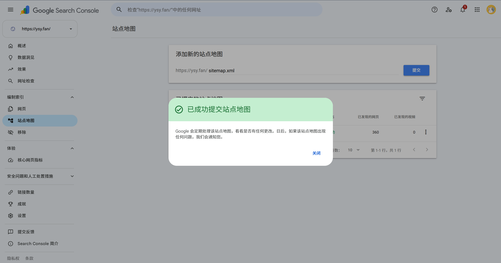 </a>

可以看到抓取几乎瞬间成功，发现了 **380 个页面**，所有页面都被找到了：

<a href="images/2026-08-05-02-28-08.png" target="_blank"> 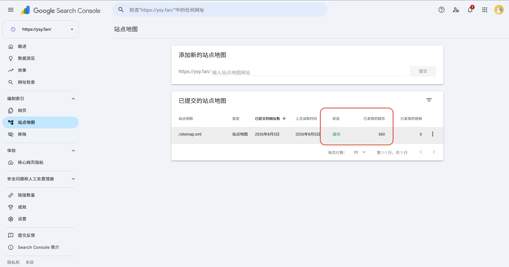 </a>

## 4. 拓展阅读

- [在 Bing Webmaster Tools 提交站点地图](/p/bing-webmaster-sitemap-submit/)