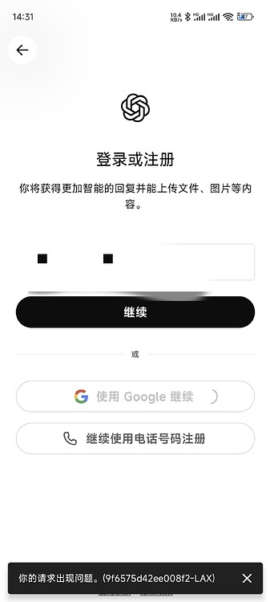

安卓手机登录 ChatGPT App 时提示「您的手机出现问题」，错误码结尾为 `LAX`（也有人遇到 `LAS`），重装、清数据、换节点都不一定有效。本文记录的解决办法很简单甚至有些草率，但经过实测确实可行：**疯狂连点登录按钮**。

## 1. 问题现象

- 安卓手机打开 ChatGPT App，点击登录后提示「您的手机出现问题」，后面跟着一串错误码，结尾常见 `LAX`（或 `LAS`）。
- 重装 App、清除数据、重启手机、切换节点后，问题依旧。
- 网页端可以正常登录，说明账号本身没有问题。

## 2. 原因说明

具体原因未知。社区里有说法认为与谷歌框架 / 应用商店升级后的风控或兼容性有关，甚至有人猜测是商店的锅，但目前没有官方定论，也没有可靠的一次性修复参数。

## 3. 解决办法（已实测）

**疯狂连点登录按钮**：

1. 在登录界面，对着登录按钮**快速连续点击**。
2. 如果弹出验证码，验证码那一步也继续疯狂连点。
3. 一般点几十次到上百次后就能进去；如果一直过不去，可以多试几轮。

> 建议配合**全局代理**使用，成功率更高。

## 4. 验证结果

按照上面的方法连点后，成功进入 ChatGPT，登录正常，问题解决。

## 5. 参考链接

- [Android chatgpt 你的请求出现问题解决方案！ - LINUX DO](https://linux.do/t/topic/2058346)
- [相关讨论（第 10 楼，LAX 结尾狂点成功）- LINUX DO](https://linux.do/t/topic/2058346/10)
- [另一相关帖子 - LINUX DO](https://linux.do/t/topic/2107524)
