## 第一步：下载安装 IDM

访问 [IDM 官方网站](https://www.internetdownloadmanager.com/)，点击页面上的绿色按钮开始下载。

<a href="images/2026-07-29-00-18-15.png" target="_blank"> 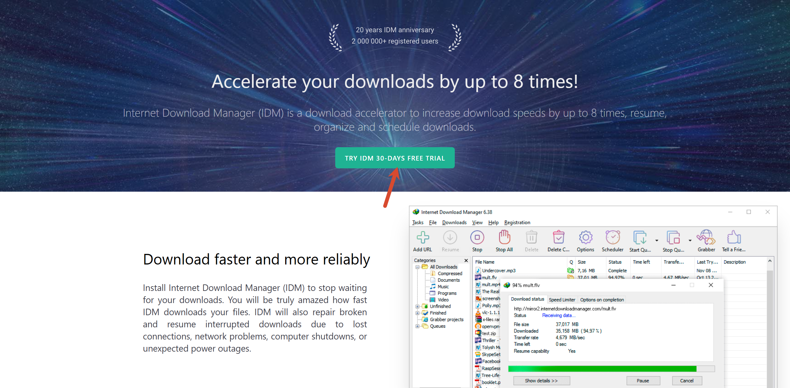 </a>

双击运行下载的安装程序，按照提示一路点击"下一步"直至安装完成。

<a href="images/2026-07-29-00-18-53.png" target="_blank"> 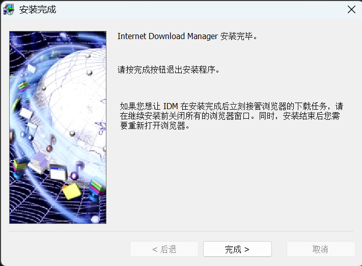 </a>

> 💡 **提示**：如果您想让 IDM 在安装完成后立刻接管浏览器的下载任务，请在继续安装前关闭所有的浏览器窗口。同时，安装结束后您需要重新打开浏览器。

## 第二步：启用 IDM 浏览器扩展程序

打开 Chrome 浏览器，点击右上角的扩展程序图标（拼图形状），选择"IDM Integration Module"并点击"启用扩展程序"按钮。

<a href="images/2026-07-29-00-19-48.png" target="_blank"> 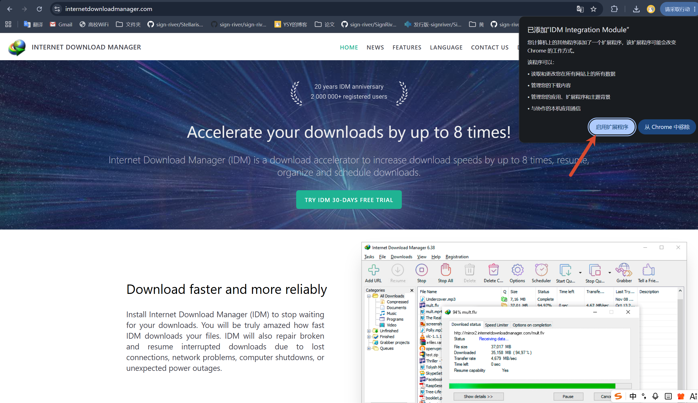 </a>

## 第三步：下载激活脚本

前往 [IDM 激活脚本 GitHub 项目](https://github.com/tytsxai/IDM-Activation-Script-Chinese) 的 Release 页面，点击右侧"Releases"区域的最新版本（v1.4.2）。

<a href="images/2026-07-29-00-21-04.png" target="_blank"> 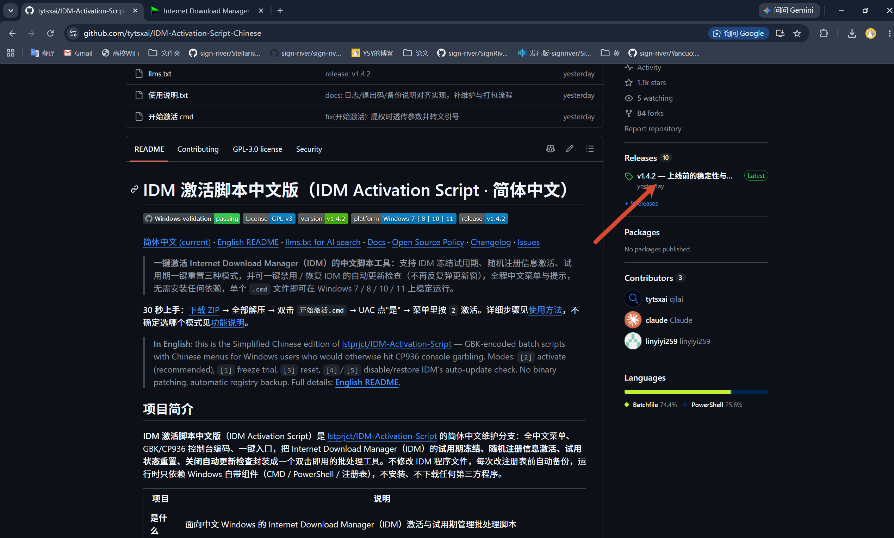 </a>

在 Release 页面右侧的 **Assets**（资源）区域，点击下载 `IDM-Activation-Script.zip` 压缩包：

<a href="images/2026-07-29-00-23-53.png" target="_blank"> 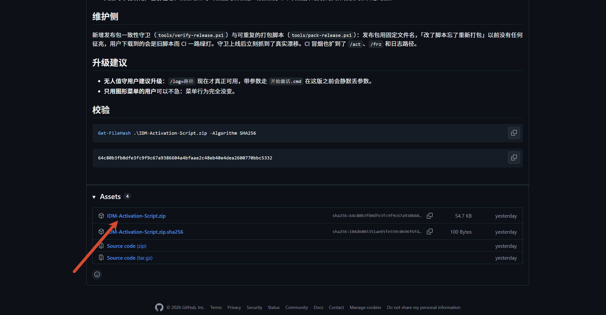 </a>

## 第四步：运行激活脚本

下载并解压压缩包后，您会看到以下两个核心命令文件（原 Release 中还包含其他文档，但这两个是必需的）：

<a href="images/2026-07-29-00-24-55.png" target="_blank"> 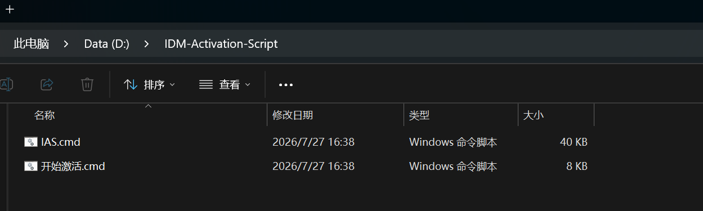 </a>

双击运行 `开始激活.cmd` 文件，当系统提示授予权限时点击"是"，进入命令行菜单界面：

<a href="images/2026-07-29-00-25-44.png" target="_blank"> 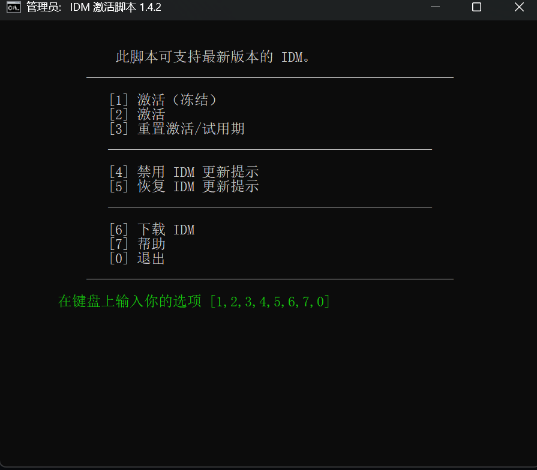 </a>

## 第五步：执行激活操作

在菜单中输入 **`2`**（激活模式），系统将自动处理激活流程，进入如下界面显示激活结果：

<a href="images/2026-07-29-00-26-24.png" target="_blank"> 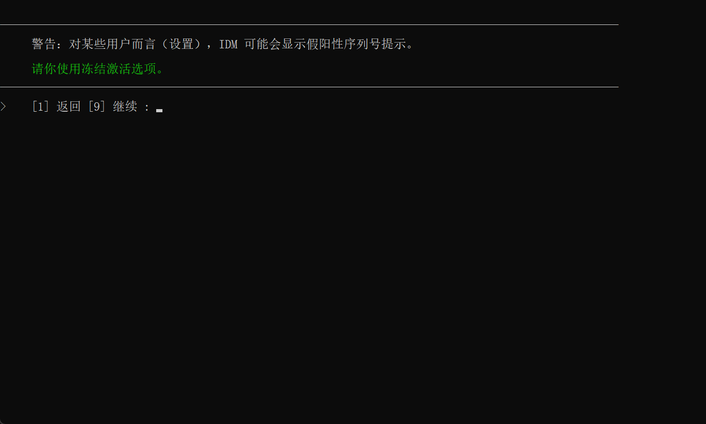 </a>

> ⚠️ **警告**：对某些用户而言（设置），IDM 可能会显示假阳性序列号提示。如果你遇到这种情况，请使用冻结激活选项（输入 `1`）。

继续执行直到如下界面：

<a href="images/2026-07-29-00-27-11.png" target="_blank"> 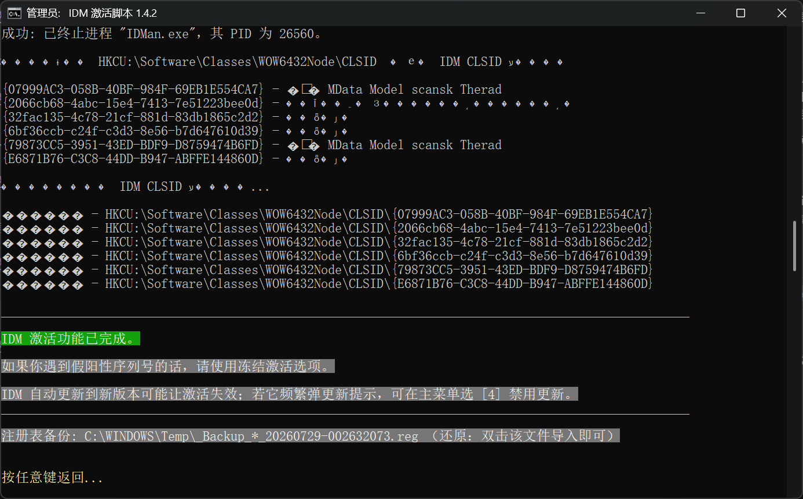 </a>

## 第六步：禁用 IDM 自动更新

返回主菜单，选择 **`4`**（禁用 IDM 更新）选项：

<a href="images/2026-07-29-00-27-57.png" target="_blank"> 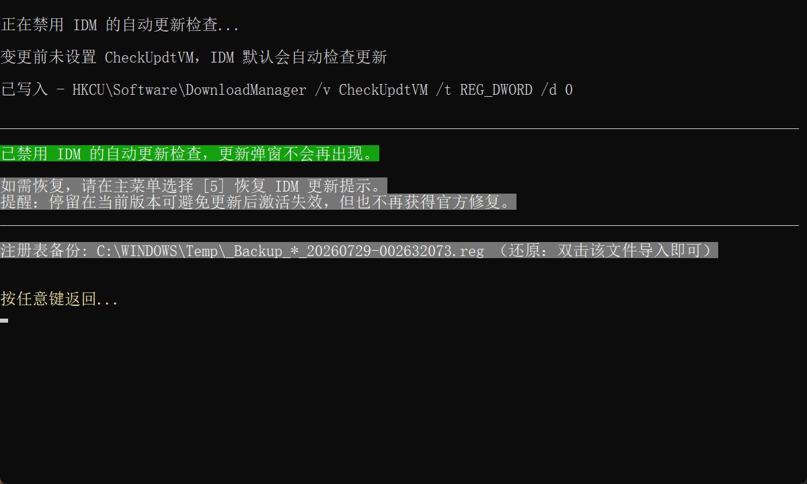 </a>

> 💡 **提示**：停留在当前版本可避免更新后激活失效，但也不再获得官方修复。如需恢复更新检查，请在主菜单选择 `5`（恢复 IDM 更新提示）。

## 第七步：验证激活状态

激活完成后，重新启动 IDM 软件即可看到授权信息弹窗，确认激活成功：

<a href="images/2026-07-29-00-28-32.png" target="_blank"> 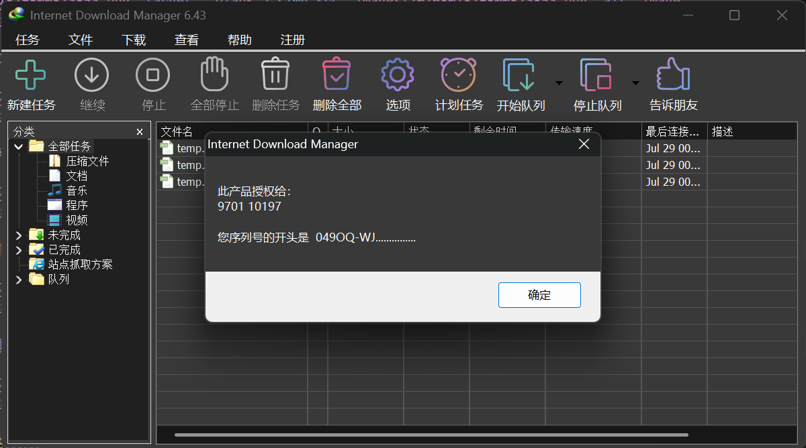 </a>

---

**激活完成！** 现在您可以正常使用 IDM 的所有功能了。