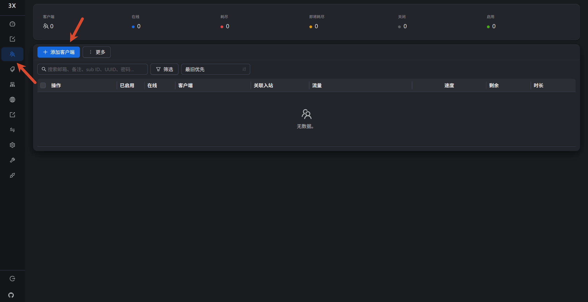

新版 3x-ui 中，点击「入站 → 导出链接」时弹窗内容为空、无法复制，并不是面板坏了，而是新版采用了**客户端（Client）设定**：入站不再自带可导出的账号，需要先在入站下创建一个客户端并关联，导出链接才会生成内容。

## 1. 问题现象

- 3x-ui 版本 3.1 / 3.2.5 / 3.2.6（以及更新的版本）都存在该问题。
- 点击 **入站** 进入入站管理页，对某个入站点击 **导出链接**。
- 弹出的「导出入站链接」窗口内容为空，无法复制，导致该功能不可用。

## 2. 原因

新版 3x-ui 把账号从「入站自带」改成了「客户端关联」：

- 入站本身只负责监听和协议参数；
- 真正的账号（UUID 等）由 **客户端（Client）** 承载，并关联到入站；
- 没有客户端时，入站没有账号，自然导不出链接。

## 3. 解决办法

1. 进入 **入站列表**，打开对应入站的 **客户端（Clients）** 界面。
2. 点击 **添加客户端（Add Client）**，在 **关联入站（Inbounds）** 中选中当前入站，保存。
3. 回到 **入站列表**，再次点击该入站的 **导出链接**。
4. 此时导出内容不再为空，可以正常复制。

## 4. 验证结果

- 创建客户端并关联入站后，导出入站链接能正常生成并复制。
- 复制出的链接可直接用于 Clash Verge、v2rayN 等客户端。

## 5. 参考链接

- GitHub Issue：[3x-ui #4813 - 入站-->导出入站链接内容为空，导致该功能无法使用](https://github.com/MHSanaei/3x-ui/issues/4813)
