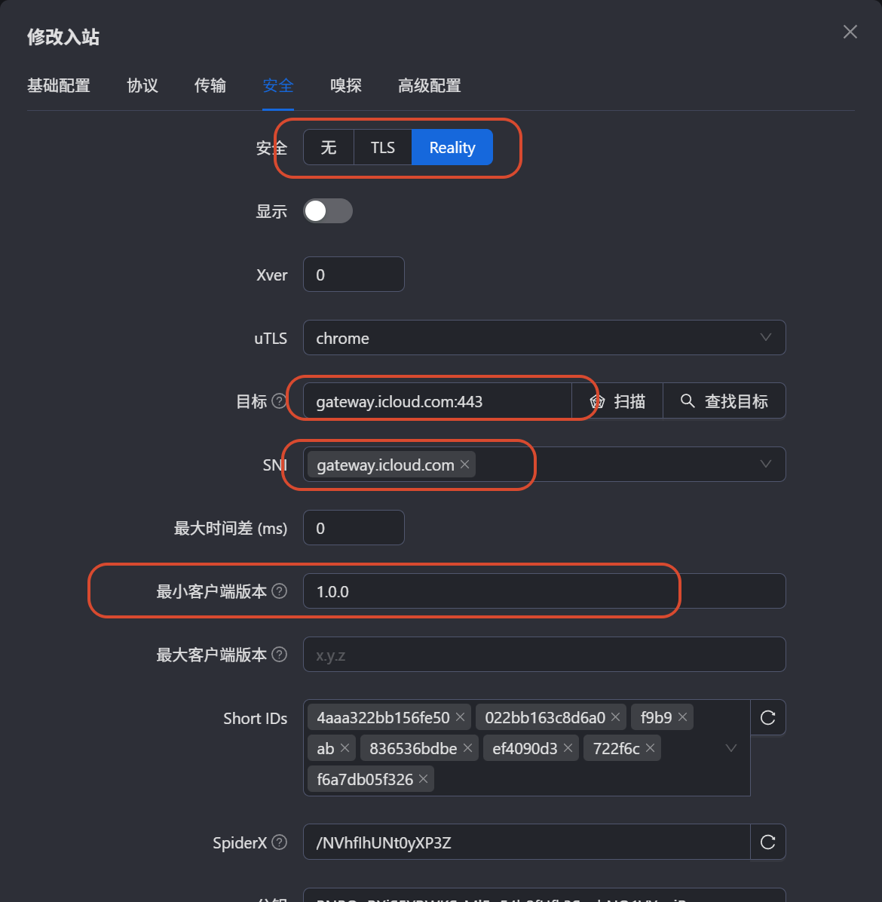

本文记录 3x-ui 从 v3.4.2 升级到 v3.5.0 后，VLESS + TCP + Reality 节点在 Clash Verge Rev / Mihomo 中全部连接失败的排查与解决过程：根因是 3x-ui v3.5.0 的 Reality 入站增加了客户端版本校验，把「最小客户端版本」改为 `1.0.0` 即可解决（方案已实践验证）。

## 1. 问题现象

- 3x-ui 从 v3.4.2 升级到 v3.5.0 后，VLESS + TCP + Reality 节点在 Clash Verge Rev / Mihomo 中无法使用。
- Clash 订阅生成的 YAML 正常、Mihomo 也能正常加载，但所有连接都失败，报错：

```text
connect error: REALITY authentication failed
```

- 同一个节点在 Xray-core 客户端和 v2rayN 中测速、访问均正常。

## 2. 排查方向

- 核对 UUID、Reality 公钥、Short ID、SNI、flow、客户端指纹，均与 Xray 配置一致。
- 端口可达、Reality 目标站可达、Xray 配置校验通过。

结论：不是订阅参数或网络问题，而是 3x-ui v3.5.0 服务端 Reality 握手对客户端版本的校验导致。

## 3. 解决办法

1. 打开 3x-ui 面板，进入 **入站列表**。
2. 找到对应的 VLESS + Reality 入站，点击 **修改**（编辑）。
3. 切到 **安全** 标签页，Reality 类型下找到 **最小客户端版本（Minimum Client Version）**。
4. 将其改为 `1.0.0`，点击保存并让配置生效。

<a href="images/2026-08-12-3xui-min-client-version.png" target="_blank">  </a>

## 4. 验证结果

- 修改后在 Clash Verge Rev / Mihomo 中重新测延迟，节点恢复可用。
- 可正常访问 HTTPS 网站，问题解决。

## 5. 参考链接

- GitHub Issue：[3x-ui #5957 - Clash subscription for VLESS TCP REALITY fails in Mihomo with "REALITY authentication failed" after upgrading to v3.5.0](https://github.com/MHSanaei/3x-ui/issues/5957)