## 1. 引言

在互联网日益复杂的今天，拥有一台属于自己的远程服务器（VPS）不仅是程序员的练手必备，更是探索更广阔网络世界的基石。相比于购买现成的机场服务，自建节点最大的优势在于独享带宽、数据安全以及完全的可控性。

本教程将手把手教你如何从零开始，搭建一套稳定、高速且现代化的节点服务。我们将采用目前主流且配置简便的方案，即使你对 Linux 命令不熟悉，也能轻松完成。

## 2. 服务器选购与基础环境部署

一切的开始，我们需要拥有一台位于海外的虚拟服务器（VPS）。本章将指导你完成账号注册、充值以及服务器的各项配置选择。

### 2.1. 平台选择与账号注册

在众多 VPS 服务商中，本教程首选 Vultr 作为演示平台，主要基于以下几点核心优势：

支付便捷：直接支持 支付宝 (Alipay) 扫码付款，无需准备境外信用卡或 PayPal，这是对国内用户最友好的功能之一。

性价比高：提供“共享 CPU (Shared CPU)”的基础方案，价格低廉，完全满足个人节点的性能需求。

线路优势：拥有洛杉矶 (Los Angeles) 等优质数据中心，作为国际网络枢纽，其信号连接相对畅通，延迟较低。

新手福利：新用户注册往往会获赠一定额度的体验金（例如 $300），虽然通常有有效期限制（如 30 天），但足以让你免费完成初期的搭建和测试。

注册账号：访问 Vultr 官网（<https://my.vultr.com/）进行注册并登录> 。
<a href="images/2026-02-11-11-59-25.png" target="_blank"> 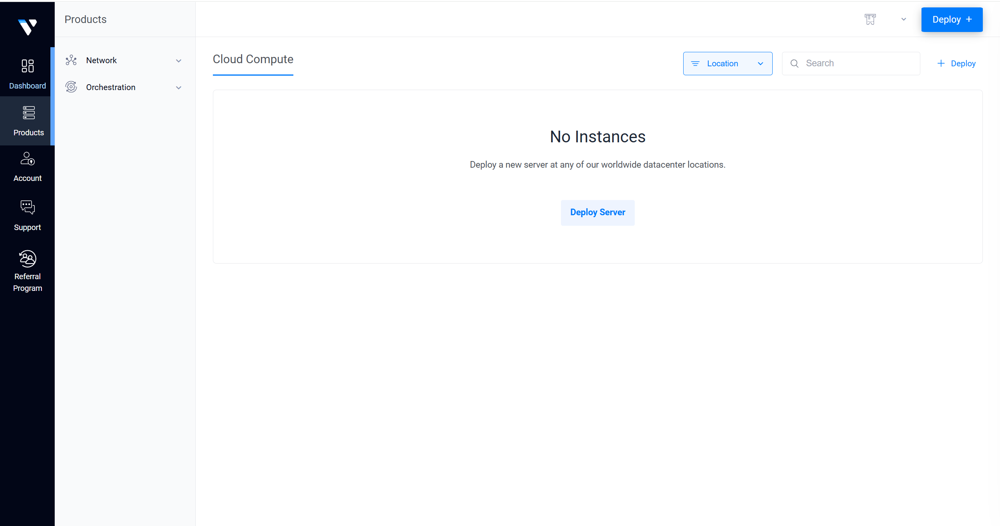 </a>
账号充值：

登录后点击左侧菜单栏的 Account（账户）。

在支付方式中选择 Alipay（支付宝），这对国内用户非常方便。
<a href="images/2026-02-11-12-02-41.png" target="_blank"> 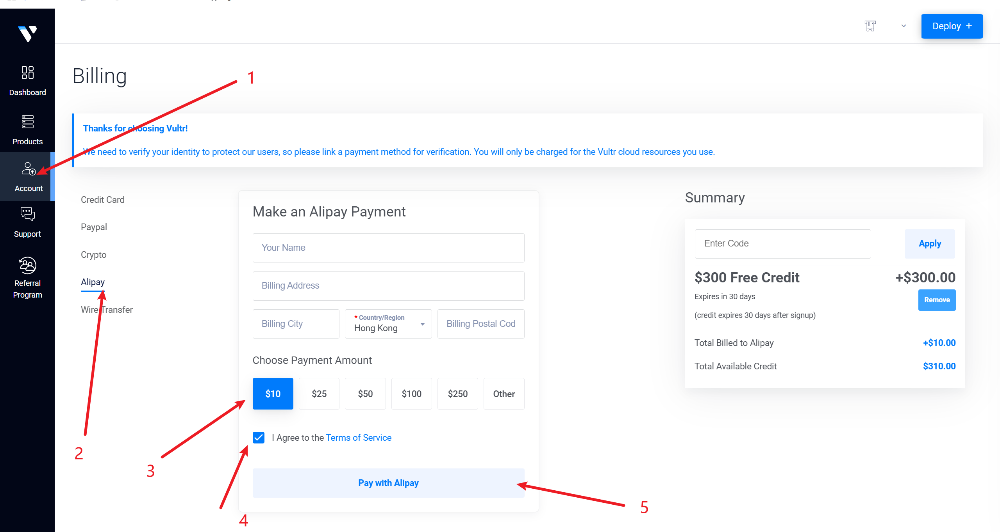 </a>
填写必要的账单信息（可用拼音），选择充值金额（例如 $10 或 $25），勾选同意条款并点击 Pay with Alipay 完成支付。

注：新用户注册有时会获赠 $300 的体验金（有效期通常为一个月），这属于新手福利，过期后会自动失效，不必惊慌。
<a href="images/2026-02-11-12-03-09.png" target="_blank"> 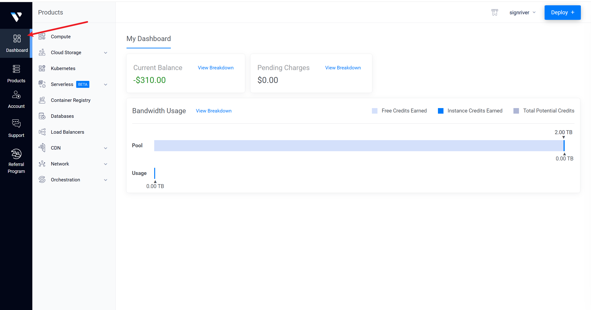 </a>

### 2.2. 部署服务器 (Deploy Instance)

充值到账后，点击页面右上角的蓝色按钮 Deploy + -> Deploy New Server 开始创建服务器。下面会推荐配置，以确保性价比和兼容性：
<a href="images/2026-02-11-12-03-21.png" target="_blank"> 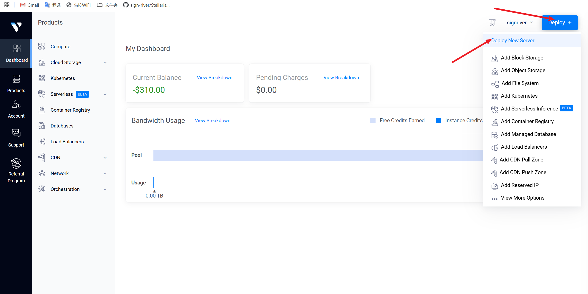 </a>
Choose Type（服务器类型）：选择 Shared CPU（共享 CPU）。对于个人节点而言，共享核心的性能完全足够，且价格最实惠。

Choose Location（地区选择）：建议选择 Americas -> Los Angeles（洛杉矶）。这里是中美海底光缆的登陆点之一，作为网络枢纽，通常能提供较好的连接速度和信号稳定性。

Choose Plan（配置套餐）：根据个人预算选择。通常选择 $5.00/month（1 vCPU, 1GB Memory）的配置即可满足日常 4K 视频浏览等需求。

Additional Features（附加功能）：重要提示：请务必找到 Automatic Backups（自动备份）选项并点击 Disable（关闭）。

理由：自动备份需要额外收费。对于这种随时可以销毁重建的节点服务器，开启备份不仅浪费钱，也没有太大的实际意义。
<a href="images/2026-02-11-12-04-37.png" target="_blank"> 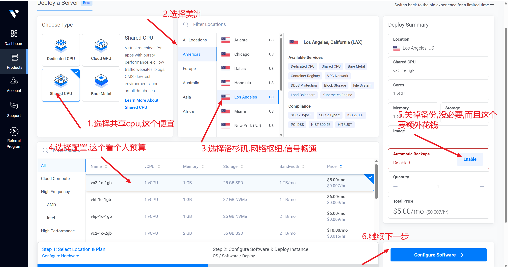 </a>
Choose Image（操作系统）：选择 Debian，版本建议选择 12 x64。Debian 系统以轻量、稳定著称，相比其他系统更节省服务器资源。
<a href="images/2026-02-11-12-06-09.png" target="_blank"> 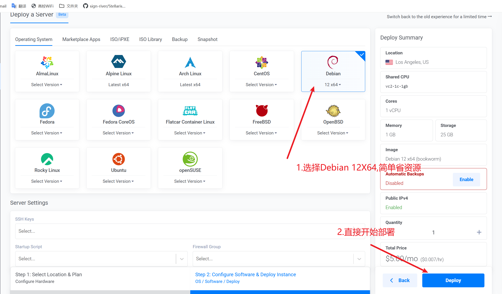 </a>

### 2.3. 获取服务器信息

点击底部的 Deploy Now 部署后，等待服务器状态从 Installing 变为 Running。点击服务器名称（如 Cloud Instance）进入详情页，请记录下以下两项关键信息，稍后连接服务器时必须用到：
<a href="images/2026-02-11-12-06-48.png" target="_blank"> 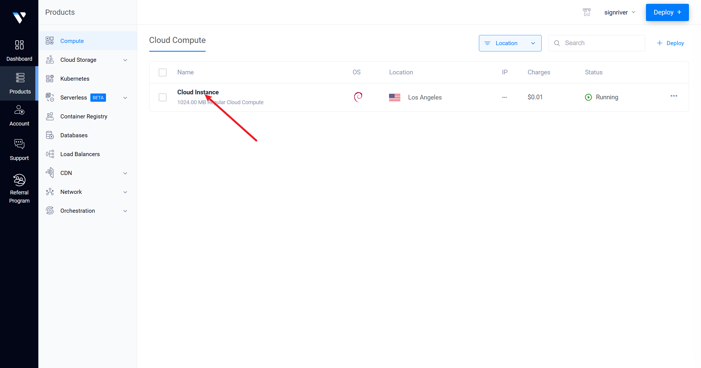 </a>
IP Address：服务器的公网 IP 地址。

Password：root 账户的初始密码（点击眼睛图标可显示，点击复制图标可直接复制）

<a href="images/2026-02-11-12-07-00.png" target="_blank"> 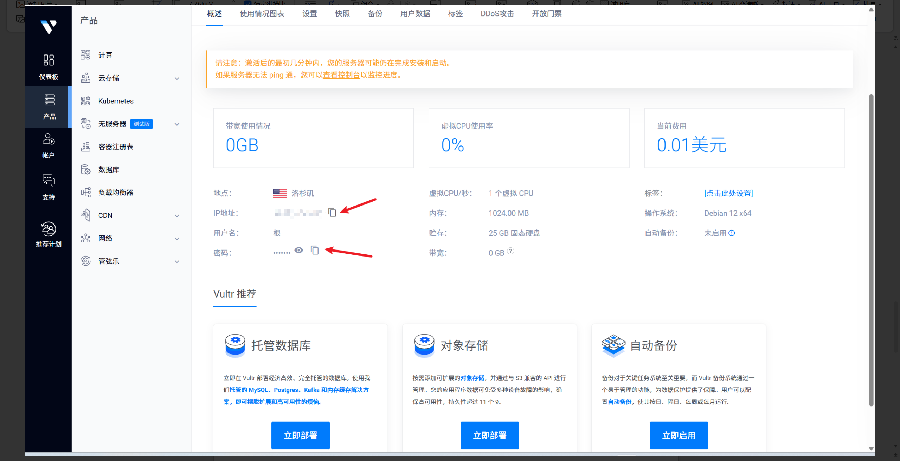 </a>

## 3. 服务器连接与面板安装

购买好服务器后，我们需要通过 SSH（Secure Shell）远程连接到它，并安装可视化的管理面板 3x-ui。

### 3.1. 建立 SSH 连接

我们需要使用电脑自带的终端工具连接服务器。

右键点击“开始”菜单，选择 Windows PowerShell 或 终端。

<a href="images/2026-02-11-12-26-07.png" target="_blank"> 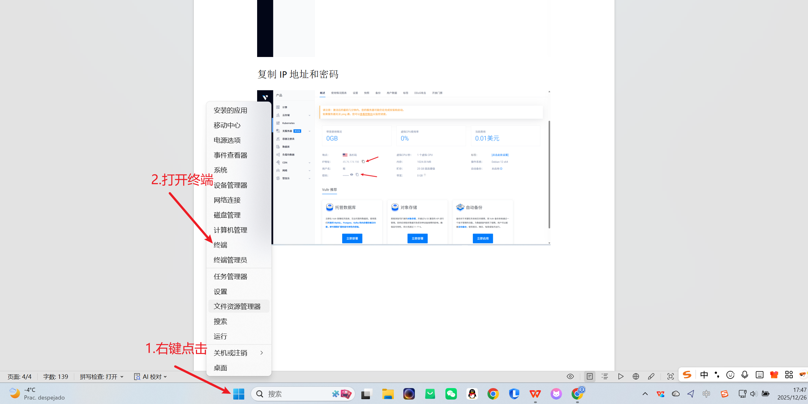 </a>

在终端中输入以下指令（请将 xx.xx.xxx.xxx 替换为你刚才在 Vultr 后台复制的 IP 地址）：

```
ssh root@xx.xx.xxx.xxx
```

连接过程中的注意事项：

首次连接确认：输入指令回车后，若提示 Are you sure you want to continue connecting (yes/no/[fingerprint])?，请输入 yes 并回车。

输入密码：系统会提示 root@... password:。此时输入你刚才复制的服务器密码。注意：Linux 系统为了安全，输入密码时屏幕上不会显示任何字符（包括星号），光标也不会移动。这完全正常，输完密码后直接按回车即可。
<a href="images/2026-02-11-12-29-20.png" target="_blank"> 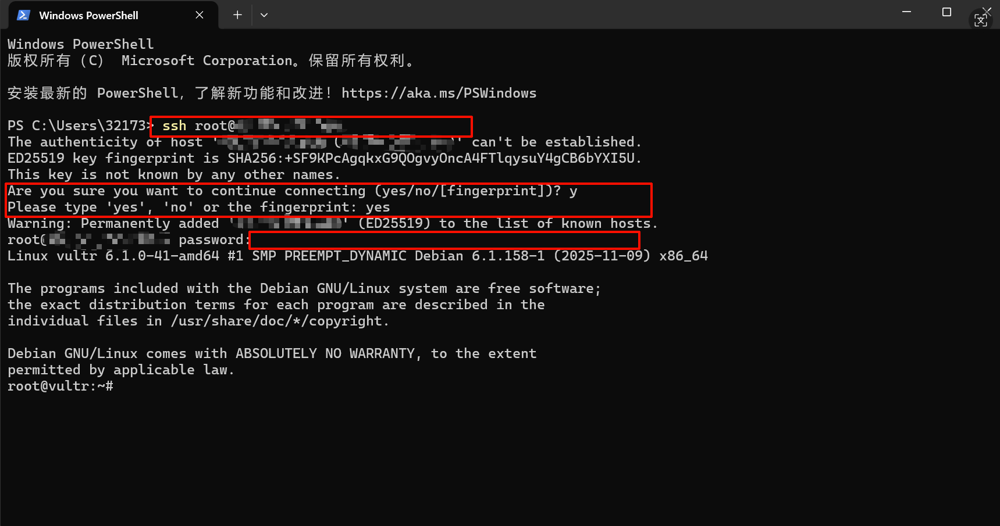 </a>

### 3.2. 优化连接稳定性（防断连）

默认情况下，如果 SSH 连接长时间无操作会自动断开。为了避免安装过程中断，建议先执行以下指令设置“心跳包” 。

请依次复制以下三行指令，在终端中粘贴并回车执行：

Bash
echo "ClientAliveInterval 60" >> /etc/ssh/sshd_config
echo "ClientAliveCountMax 3" >> /etc/ssh/sshd_config
systemctl restart ssh
<a href="images/2026-02-11-12-29-35.png" target="_blank"> 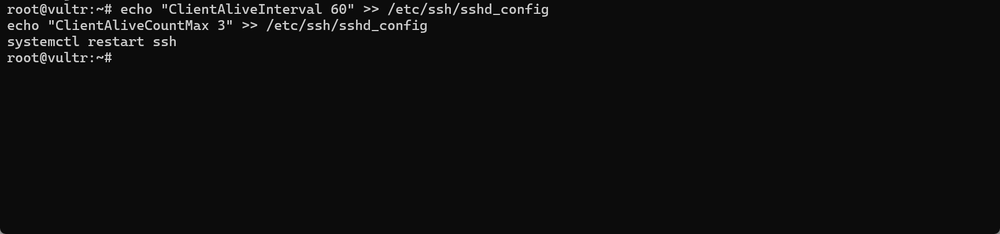 </a>

### 3.3. 安装 3x-ui 管理面板

接下来，我们将安装 3x-ui 面板，它能让我们通过网页轻松管理节点。

复制以下一键安装脚本到终端并回车：

```
bash <(curl -Ls https://raw.githubusercontent.com/mhsanaei/3x-ui/master/install.sh)
```

<br>
<a href="images/2026-02-11-12-30-45.png" target="_blank"> 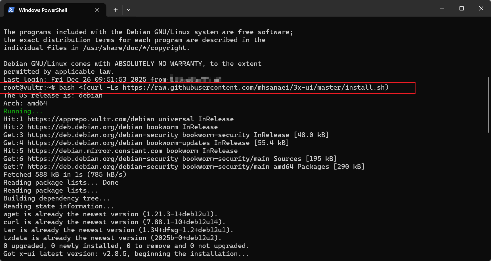 </a>
安装引导设置：

脚本启动后，会询问是否自定义端口。输入 y 并回车。

设置面板端口：建议输入一个好记的数字，例如 54321，然后回车。

<a href="images/2026-02-11-12-31-07.png" target="_blank"> 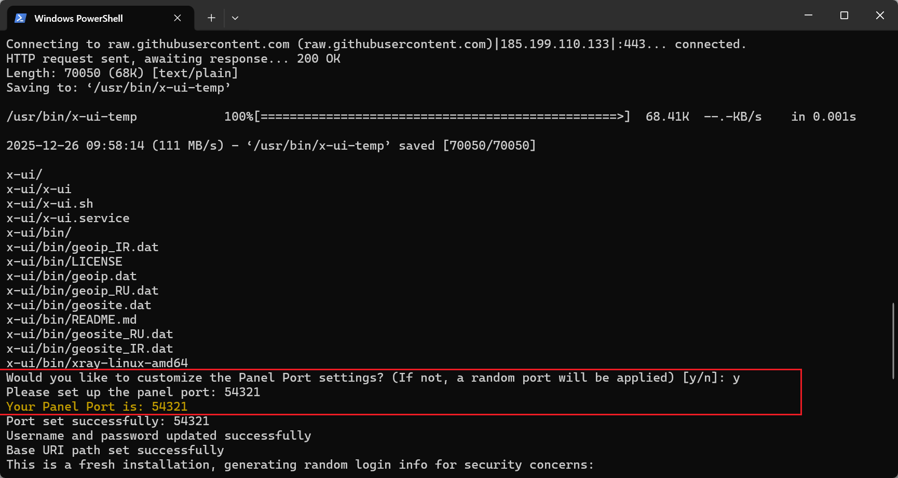 </a>
安装完成后，终端会显示你的登录信息，包括访问地址（http://IP: 端口） 。

<a href="images/2026-02-11-12-31-30.png" target="_blank"> 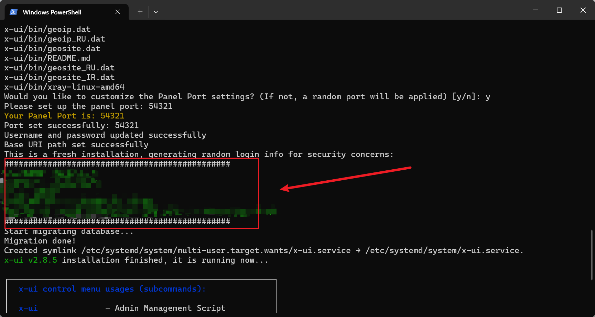 </a>

### 3.4. 配置防火墙（开放端口）

为了让外部网络能访问我们的面板和节点，必须配置服务器防火墙开放相应的端口。

请依次执行以下指令：

#### 3.4.1. 更新软件源并安装 UFW 防火墙工具

```
apt update && apt install ufw -y
```

#### 3.4.2. 开放必要端口

```
ufw allow ssh      # 开放 SSH 连接端口，防止自己被锁在外面 [cite: 34]
ufw allow 54321    # 开放刚才设置的面板端口 [cite: 35]
ufw allow 443      # 开放节点传输端口（后续配置节点时会用到） [cite: 36]
```

#### 3.4.3. 启用防火墙

```
ufw enable
```

（如果提示 Command may disrupt existing ssh connections，输入 y 确认即可）
<a href="images/2026-02-11-12-32-39.png" target="_blank"> 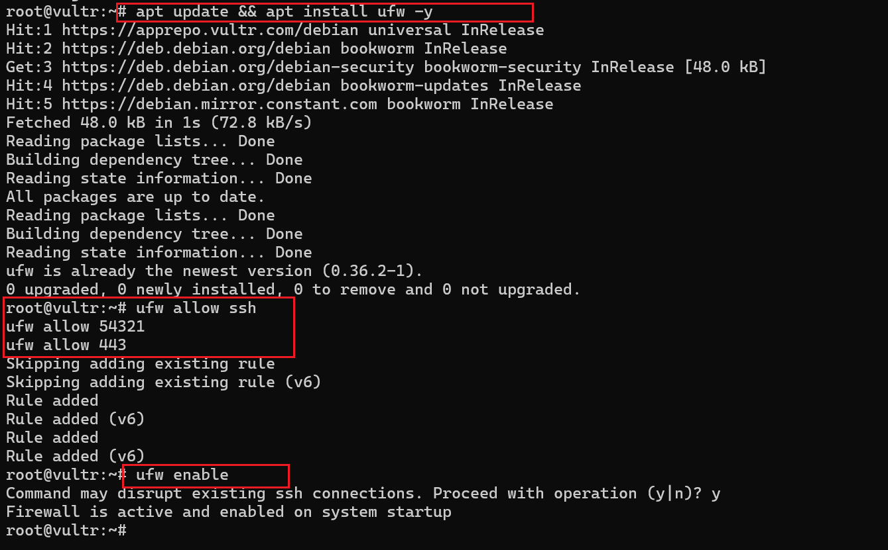 </a>
至此，服务器端的底层环境已经搭建完毕。

## 4. 面板配置与节点创建

环境搭建完毕后，我们将离开黑色的命令行界面，转到浏览器中进行可视化的操作。本章的核心任务是配置目前业界公认“隐蔽性”最强、且被封锁概率最低的协议组合：**VLESS + TCP + Reality**。

### 4.1. 登录管理面板

打开您电脑上的浏览器，在地址栏输入访问地址。格式为 `http://你的服务器 IP: 端口号`。

例如，如果您的 IP 是 `192.168.1.1`，安装时设置的端口是 `54321`，则完整地址为：

> <http://192.168.1.1:54321>

进入登录页面后，输入我们在上一章安装过程中设置的**用户名**和**密码**，点击登录进入系统仪表盘。
<a href="images/2026-02-11-12-43-54.png" target="_blank"> 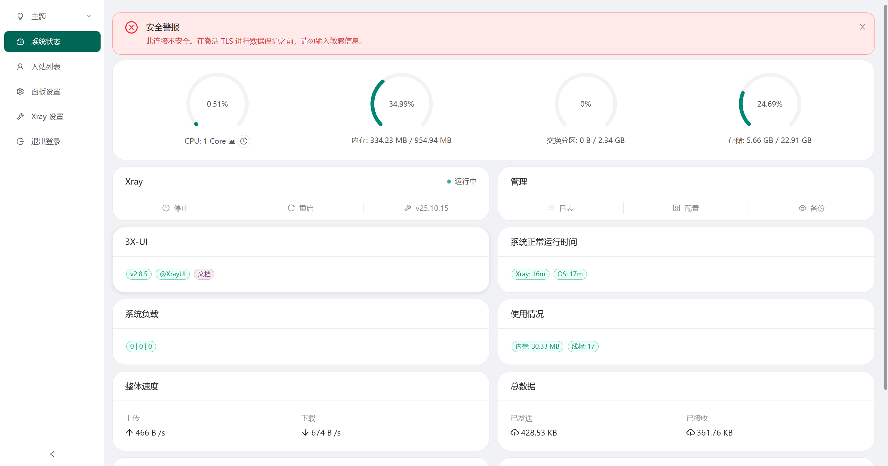 </a>

### 4.2. 添加并配置入站节点

在左侧菜单栏中找到 **入站列表 (Inbound List)**，点击进入后，选择页面中的绿色按钮 **添加入站 (Add Inbound)**。
<a href="images/2026-02-11-12-44-07.png" target="_blank"> 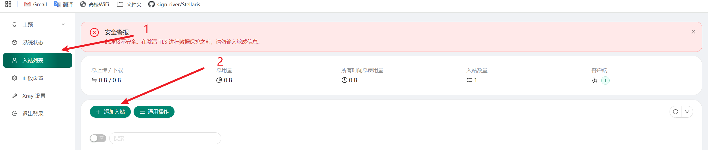 </a>
此时会弹出一个详细的配置窗口，这是整个教程最关键的一步。请严格按照以下参数进行设置，未提及的选项保持默认即可：

- **备注 (Remark)**：`MyVPN` （或者任何您喜欢的名字）
- **协议 (Protocol)**：`vless`
- **端口 (Port)**：`443`
  - _注意：这里必须填 443，因为我们在配置防火墙时专门开放了这个端口。_
- **传输 (Network)**：`tcp`
- **安全 (Security)**：`reality`
  - _重要：选择此项后，下方会出现更多关于伪装的设置选项。_
- **uTLS**：`chrome`
- **目标网站 (Target)**：`www.microsoft.com:443`
- **SNI 域名 (SNI)**：`www.microsoft.com`
  - _原理：Reality 协议会将您的流量伪装成访问微软官网，从而在防火墙面前“隐身”。_
- **公钥/私钥 (Public/Private Key)**：点击输入框下方的 **`Get New Cert`** 按钮，系统会自动生成一串密钥。
  <a href="images/2026-02-11-12-44-19.png" target="_blank"> 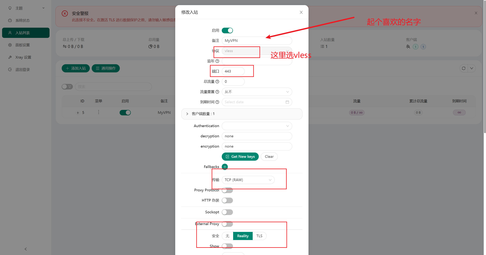 </a>
  <a href="images/2026-02-11-12-44-27.png" target="_blank"> 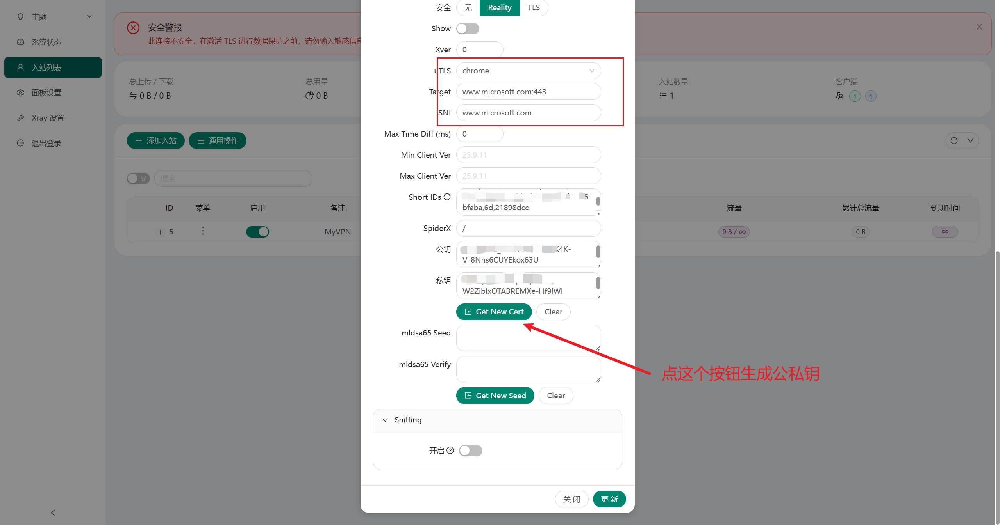 </a>

### 4.3. 保存并生效

确认上述所有信息（尤其是端口和协议）填写无误后，点击窗口底部的 **添加 (Create)** 或**更新 (Create)** 按钮。

添加成功后，您会在列表中看到刚才创建的节点。此时，您的服务器端配置已全部完成，它正静静地等待客户端的连接

## 5. 客户端配置与连通性测试

服务端（VPS）配置完成后，我们还需要在电脑上安装专门的客户端软件，才能将网络流量通过节点进行转发。本教程将以开源、免费且功能强大的 **Clash Verge** 为例进行演示。

### 5.1. 下载并安装客户端

首先，请下载适配您操作系统的 Clash Verge 客户端。

- **GitHub 官方下载**（推荐）：

  > <https://github.com/clash-verge-rev/clash-verge-rev/releases>
  - _Windows 用户请下载 `.exe` 安装包（通常为 x64-setup.exe），Mac 用户请下载 `.dmg` 文件。_

### 5.2. 导出并转换节点配置

由于 Clash 软件无法直接识别原始的 VLESS 链接，我们需要借助工具将其转换为 Clash 专用的配置文件（.yaml 格式）。

#### 5.2.1. **获取节点链接**

回到浏览器中的 **3x-ui 管理面板**，在 **入站列表** 中找到刚才创建的节点。
点击节点左侧的 **菜单图标**（三个点），选择 **导出链接**，然后点击复制。
<a href="images/2026-02-11-12-51-16.png" target="_blank"> 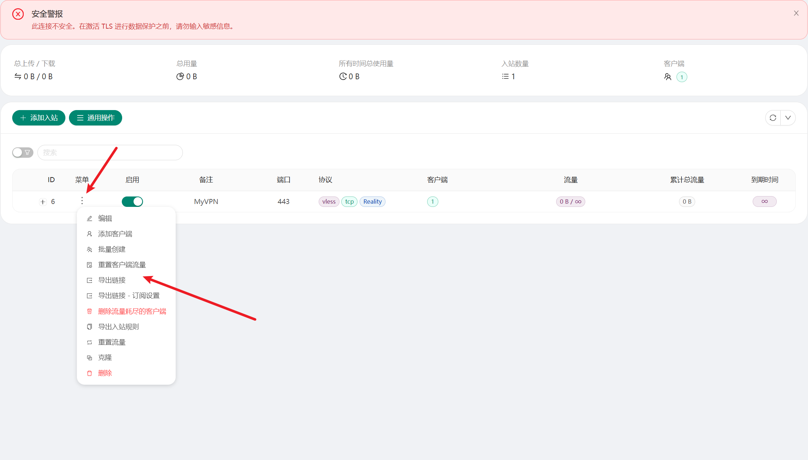 </a>

#### 5.2.2. **手动创建配置文件**

> 可按照以下方法手动创建 `.yaml` 配置文件。

**第一步：解析 vless 链接**

复制到的节点链接格式如下：

```
vless://{uuid}@{server}:{port}?type={network}&...&pbk={public-key}&fp={fingerprint}&sni={servername}&sid={short-id}#{name}
```

以实际链接为例：

```
vless://b71c4e29-d0c6-4906-b6a4-956e7ec2d005@64.64.242.65:443?type=tcp&encryption=none&security=reality&pbk=jJZt-0pxC42THHzelBlhE6ObF_bKkmE_5P3sjdLRpz8&fp=chrome&sni=www.microsoft.com&sid=fe69b17bb8440e&spx=%2F#MyVPN
```

各参数含义如下：

| 链接中的位置      | 参数示例            | 含义                 |
| ----------------- | ------------------- | -------------------- |
| `://` 与 `@` 之间 | `b71c4e29-...`      | UUID（用户身份凭证） |
| `@` 与 `:` 之间   | `64.64.242.65`      | 服务器 IP            |
| IP 后的 `:` 之后  | `443`               | 端口号               |
| `type=`           | `tcp`               | 传输协议             |
| `pbk=`            | `jJZt-0p...`        | Reality 公钥         |
| `fp=`             | `chrome`            | 客户端指纹           |
| `sni=`            | `www.microsoft.com` | 伪装域名             |
| `sid=`            | `fe69b17bb8440e`    | Reality Short ID     |
| `#` 之后          | `MyVPN`             | 节点备注名           |

**第二步：填入模板**

新建一个文本文件，将后缀命名为 `.yaml`（例如 `MyVPN.yaml`），复制以下模板内容，然后将各占位符替换为上表中解析出的对应值：

```yaml
port: 7890
socks-port: 7891
allow-lan: true
mode: rule
log-level: info
external-controller: :9090

rule-providers:
  google:
    type: http
    behavior: domain
    url: "https://raw.githubusercontent.com/Loyalsoldier/clash-rules/release/google.txt"
    path: ./ruleset/google.yaml
    interval: 86400
  proxy:
    type: http
    behavior: domain
    url: "https://raw.githubusercontent.com/Loyalsoldier/clash-rules/release/proxy.txt"
    path: ./ruleset/proxy.yaml
    interval: 86400
  direct:
    type: http
    behavior: domain
    url: "https://raw.githubusercontent.com/Loyalsoldier/clash-rules/release/direct.txt"
    path: ./ruleset/direct.yaml
    interval: 86400

proxies:
  - name: "MyVPN" # 节点名称，可自定义
    type: vless
    server: { server } # ← 替换为服务器 IP
    port: { port } # ← 替换为端口号
    uuid: { uuid } # ← 替换为 UUID
    network: { network } # ← 替换为传输协议（如 tcp）
    tls: true
    udp: true
    flow: ""
    servername: { sni } # ← 替换为 sni= 的值
    client-fingerprint: { fp } # ← 替换为 fp= 的值
    reality-opts:
      public-key: { public-key } # ← 替换为 pbk= 的值
      short-id: { short-id } # ← 替换为 sid= 的值

proxy-groups:
  - name: "节点选择"
    type: select
    proxies:
      - "MyVPN"
      - DIRECT

rules:
  - RULE-SET,google,节点选择
  - RULE-SET,proxy,节点选择
  - RULE-SET,direct,DIRECT
  - GEOIP,CN,DIRECT
  - MATCH,节点选择
```

_请务必保存好填写完毕的 `.yaml` 文件，下一步导入 Clash Verge 时会用到。_

### 5.3. 导入配置到 Clash Verge

#### 5.3.1. 打开安装好的 **Clash Verge** 软件

#### 5.3.2. 点击左侧菜单栏的 **订阅 (Subscription)**，然后点击右上角的 **新建 (New)** 按钮

<a href="images/2026-02-11-12-53-42.png" target="_blank">  </a>

#### 5.3.3. 在弹出的窗口中进行如下设置

- **类型 (Type)**：选择 `Local`（本地文件）。
- **名称 (Name)**：填写 `MyVPN`（或你喜欢的任何名字）。
- **文件 (File)**：点击 **选择文件** 按钮，选中刚才下载的 `MyVPN.yaml` 文件。
  <a href="images/2026-02-11-12-53-59.png" target="_blank"> 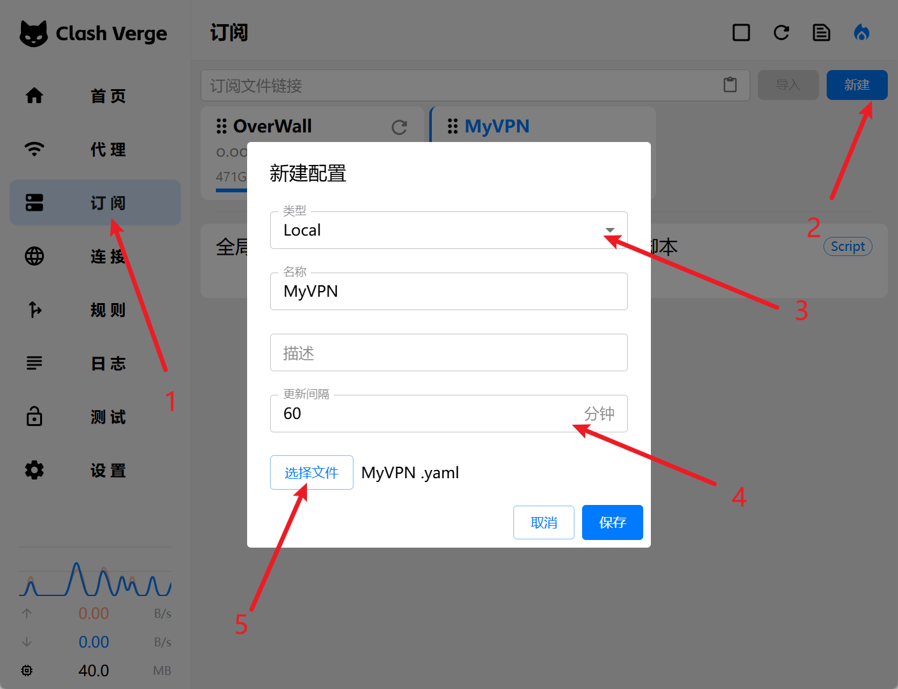 </a>

#### 5.3.4. 点击 **保存 (Save)** 按钮

### 5.4. 开启代理与连接测试

#### 5.4.1. **选择节点**

点击软件左侧菜单栏的 **代理 (Proxies)**。在顶部的模式切换中选择 **规则 (Rule)**。此时你应该能在下方列表中看到的节点 `MyVPN`。

#### 5.4.2. **连通性测试**

点击节点名称旁边的 **测试图标**（通常是一个类似 WiFi 信号的图标）。
**\*成功**：如果显示绿色的数字（例如 `187 ms`），代表节点已连通。\* **失败**：如果显示 `Timeout`，请检查 VPS 的防火墙端口是否已开放，或配置步骤是否有误。

<a href="images/2026-02-11-12-54-19.png" target="_blank"> 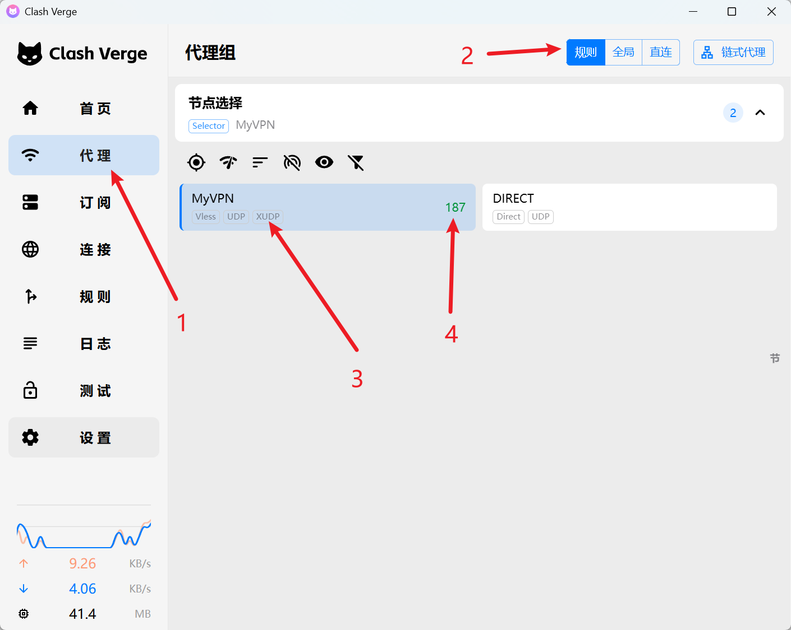 </a>

#### 5.4.3. **开启系统代理**

确认连接成功后，点击左侧菜单栏的 **设置 (Settings)**，找到 **系统代理 (System Proxy)** 开关并将其**打开**（变为蓝色）。
<a href="images/2026-02-11-12-53-09.png" target="_blank"> 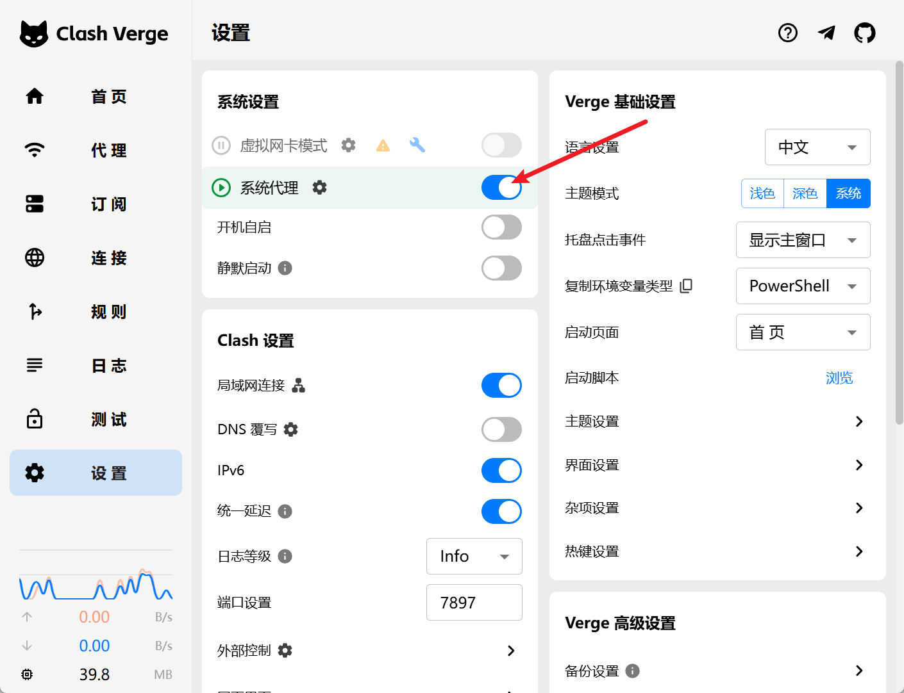 </a>
此时，打开浏览器访问 Google 或 YouTube，如果能顺利加载，恭喜你！你已经成功从零开始搭建了属于自己的高速节点。
