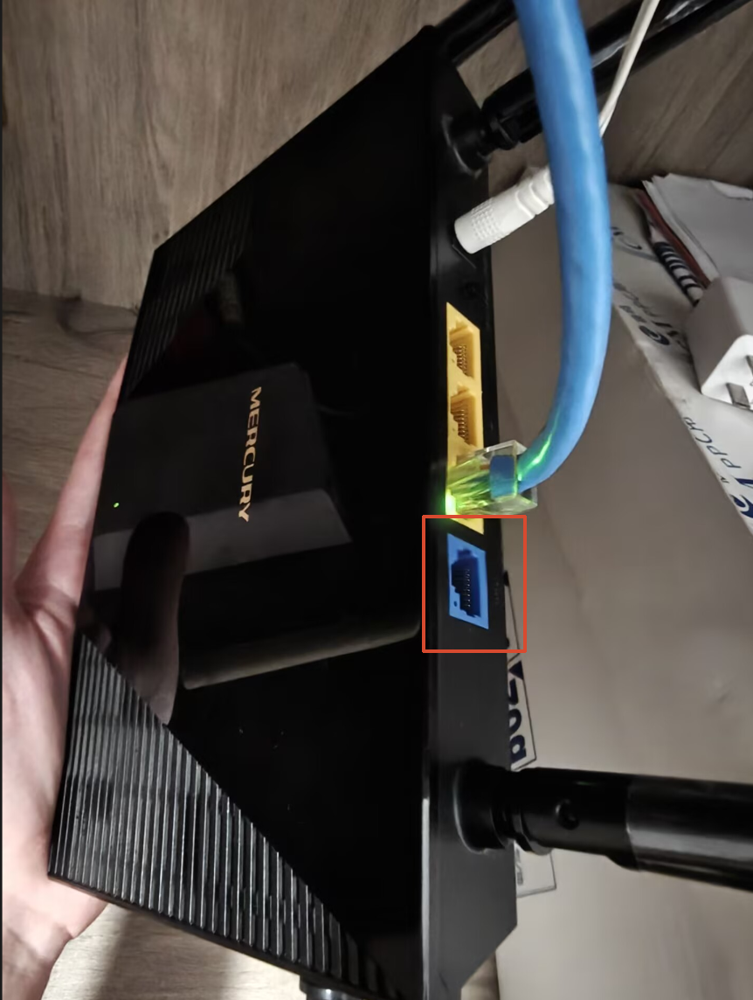
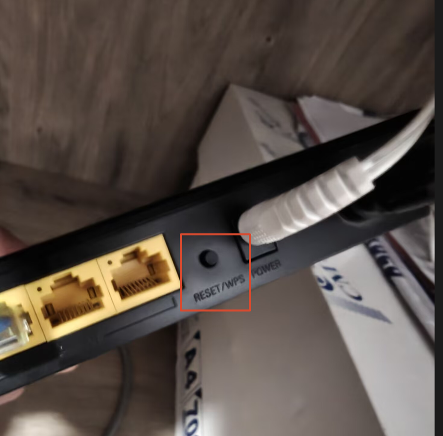
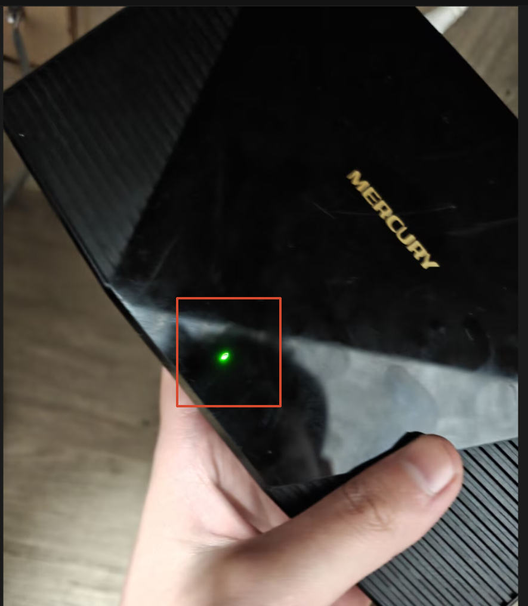
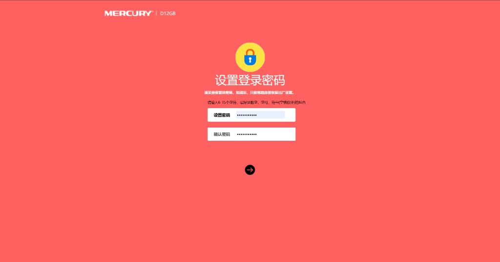
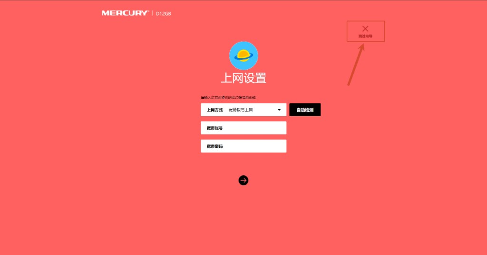
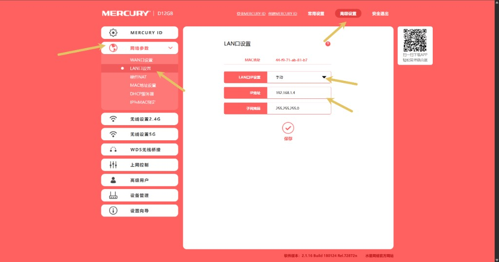
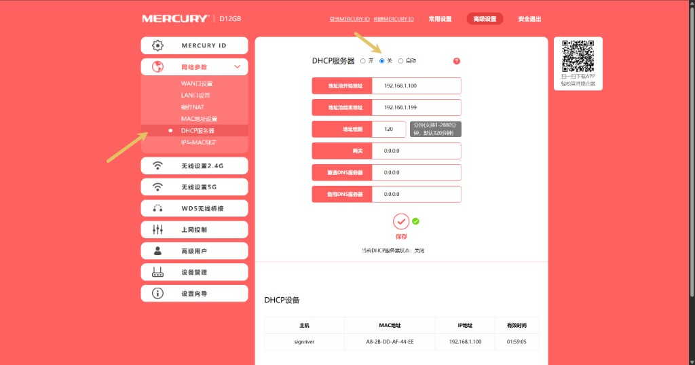
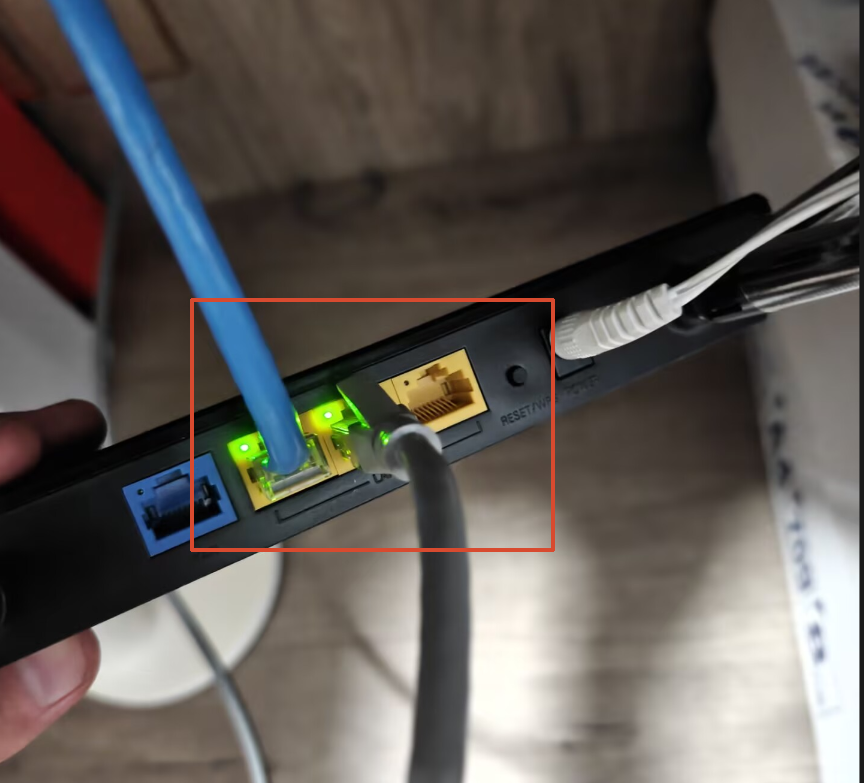

## 1. 重置路由器

1. 拔出路由器 **WAN 口**上的网线

2. **长按**路由器上的复位键，重置路由器

3. 等到指示灯**绿灯闪烁**，说明复位成功

## 2. 进入管理页面

用网线或 Wi-Fi 将电脑与路由器连接。**此时不要把墙上的网线插进 WAN 口。**

在浏览器地址栏输入路由器管理地址（如水星路由器一般为 `192.168.1.1`），回车进入设置页面。

## 3. 设置密码并跳过向导

1. 设置路由器**登录密码**，点击确认进入下一步

2. 在上网设置页面，点击右上角**跳过向导**

## 4. 修改 LAN 口 IP

进入 **高级设置 → 网络参数 → LAN 口设置**，将 IP 设置改为**手动**，并将 IP 地址改为与主路由器不冲突的地址。

例如主路由器 IP 为 `192.168.1.1`，子路由可设为 `192.168.1.2`、`192.168.1.3` 或 `192.168.1.4`。改好后点击**保存**，页面会自动重启。

## 5. 关闭 DHCP

进入 **高级设置 → 网络参数 → DHCP 服务器**，将 DHCP 服务器设为**关**，点击**保存**。

## 6. 网线接入 LAN 口

将墙上那根网线插到路由器的 **LAN 口**（不是 WAN 口）。

若路由器会自动识别 WAN 口，需先在设置里**关闭自动识别 WAN 口**选项，再插网线。

插上网线后，组网流程结束。
