## 写在前面

本文将从零开始，在搬瓦工（BandwagonHost）VPS 上搭建一个 **VLESS + Reality** 节点，并把它接入 Clash Verge 使用。Reality 是目前隐蔽性最强、被封锁概率最低的协议组合之一，**全程不需要域名**，尤其适合个人节点。

> **准备清单**
>
> - 一台搬瓦工 VPS（其他海外 VPS 亦可）
> - 一个 SSH 终端（Windows 终端 / PowerShell / Xshell / FinalShell 均可）
> - 本机已安装 Clash Verge（Clash Verge Rev / Mihomo）

## 一、购买服务器并记录连接信息

VPS 开通后，先在服务商后台记下两个关键信息：**公网 IP** 和 **SSH 端口**（默认 22）。后面每一步都会用到它们。

<a href="images/2026-08-11-03-00-24.png" target="_blank"> 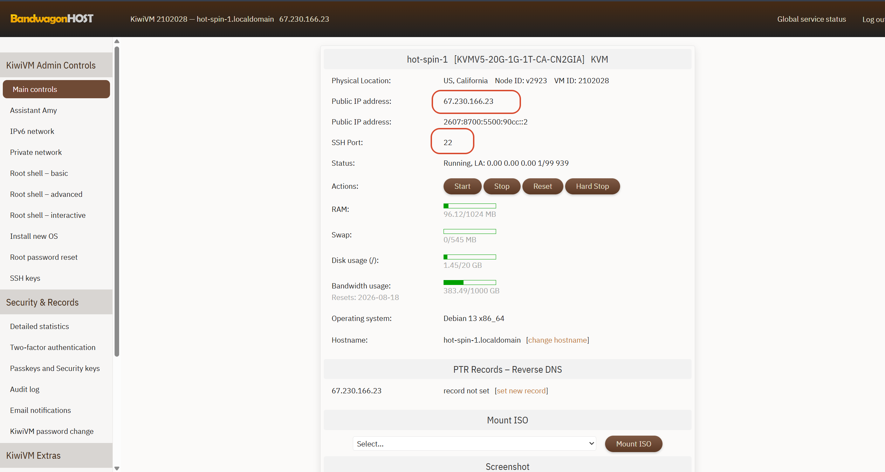 </a>

使用任意 SSH 工具连接服务器。如果你本机开着代理软件（Clash / Mihomo 等），**建议先关闭它的 TUN 模式**，避免到服务器的连接被本地代理拦截而出现"假通 / 超时"。

<a href="images/2026-08-11-03-00-50.png" target="_blank"> 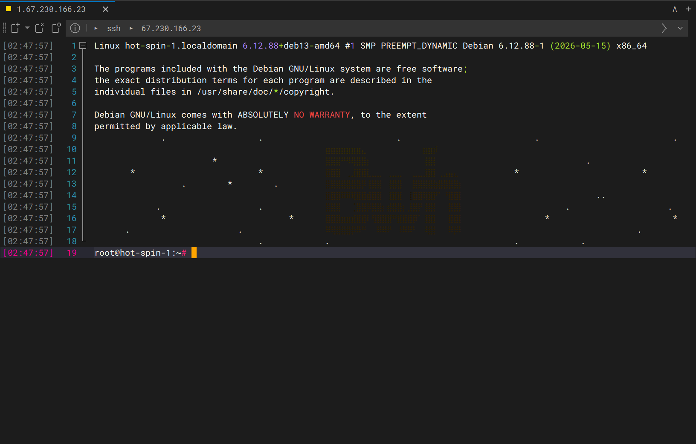 </a>

## 二、安装 3x-ui 面板

3x-ui 是一个图形化节点管理面板，通过网页就能创建和管理 Xray 节点。

### 2.1 安装并选择数据库

SSH 登录后执行官方一键安装脚本：

```bash
bash <(curl -Ls https://raw.githubusercontent.com/mhsanaei/3x-ui/master/install.sh)
```

安装过程中会询问数据库类型。**个人使用选默认的 SQLite 即可，直接回车**（PostgreSQL 面向大量客户端的大规模场景）。

<a href="images/2026-08-11-03-03-16.png" target="_blank"> 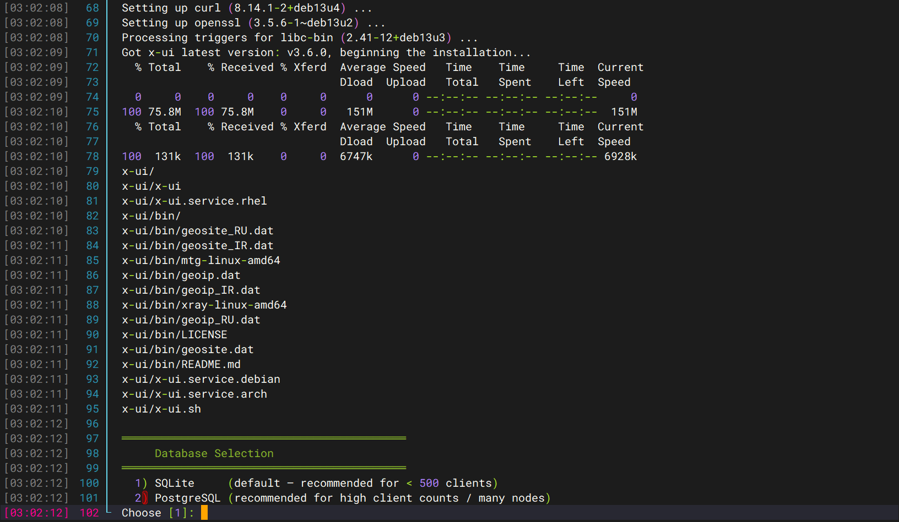 </a>

### 2.2 自定义面板端口

接下来询问是否自定义面板端口，输入 `y` 回车：

<a href="images/2026-08-11-03-03-47.png" target="_blank"> 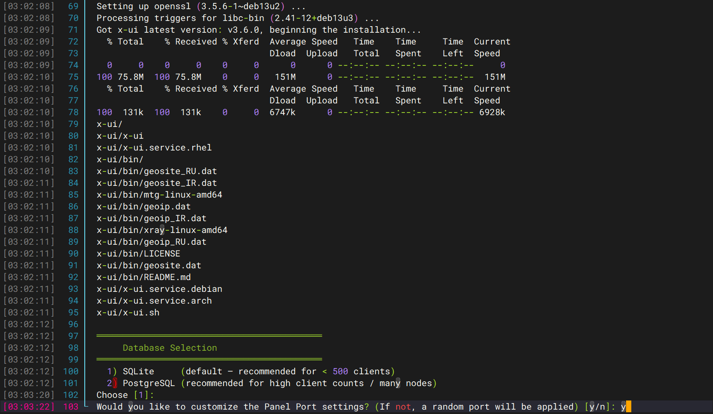 </a>

输入一个好记的端口，例如 **54321**：

<a href="images/2026-08-11-03-04-14.png" target="_blank"> 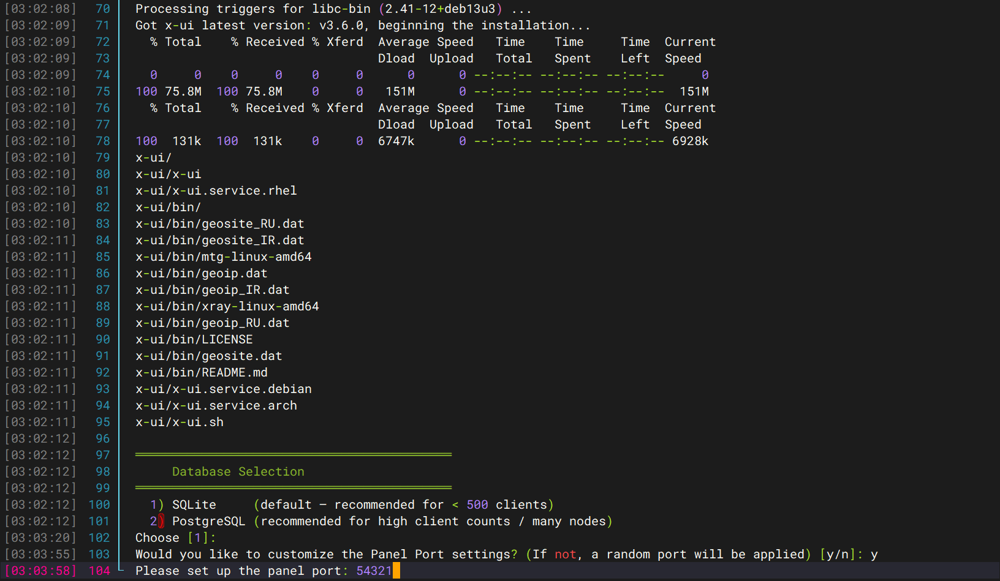 </a>

### 2.3 配置 SSL 证书（推荐）

在 SSL 证书设置中选择 **2. Let's Encrypt for IP Address**（按 IP 签发证书、自动续期，无需域名）：

<a href="images/2026-08-11-03-05-43.png" target="_blank"> 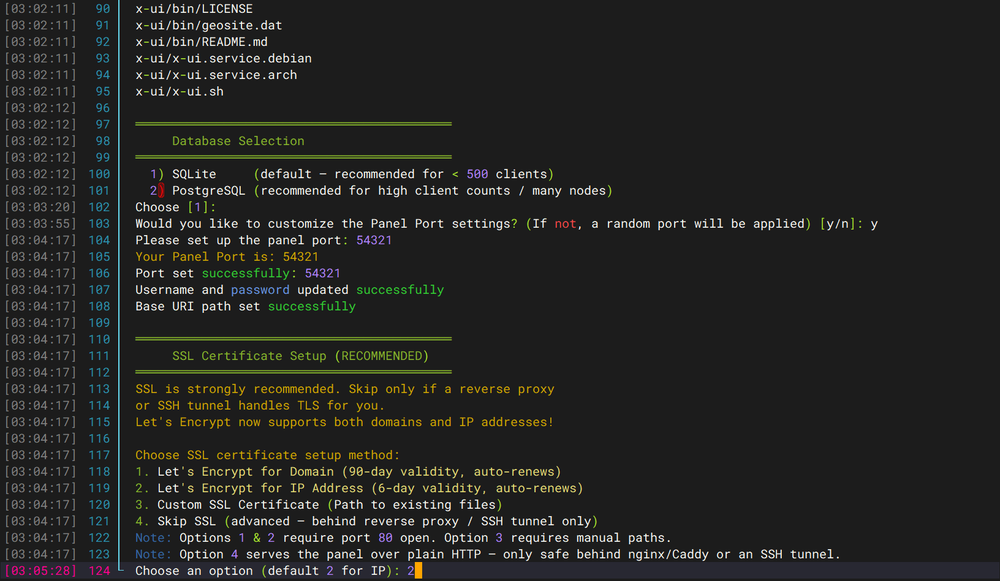 </a>

后面两个确认类问题（确认公网 IP、是否包含 IPv6 等）**直接回车跳过**：

<a href="images/2026-08-11-03-09-23.png" target="_blank"> 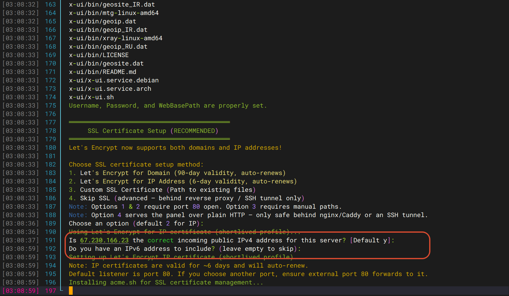 </a>

证书签发的 HTTP 端口保持默认 **80**，直接回车：

<a href="images/2026-08-11-03-10-33.png" target="_blank"> 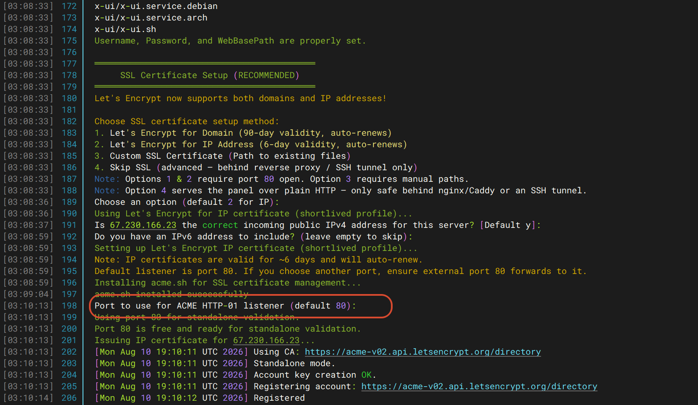 </a>

> **提示**：选项 2 需要服务器的 80 端口开放，用于证书签发与续期。如果后续证书申请失败，请放行 80 端口。

### 2.4 获取面板登录地址

安装完成后，执行：

```bash
x-ui settings
```

输出中的 **Access URL** 就是面板地址。注意它通常带一个**隐藏的随机路径尾缀**（形如 `https://IP:54321/xxxx/`），后面登录要用完整地址。

<a href="images/2026-08-11-03-20-14.png" target="_blank"> 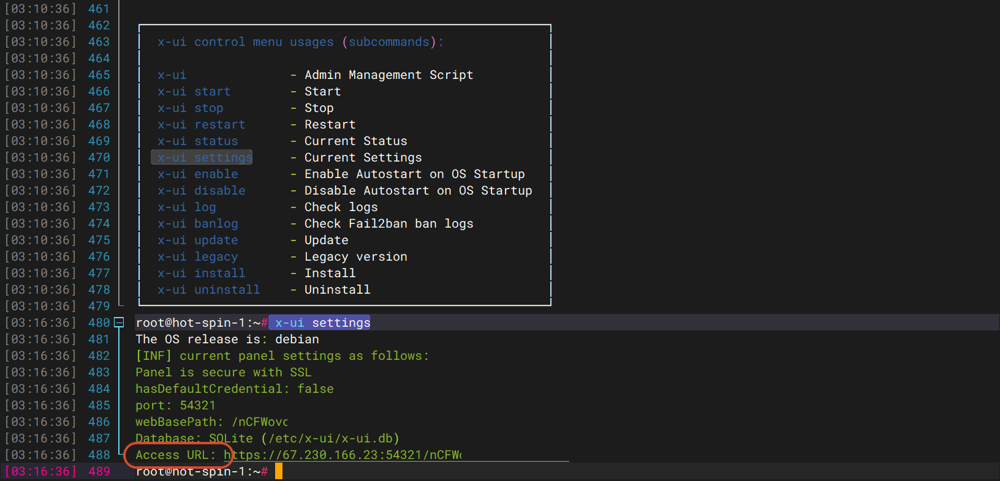 </a>

### 2.5 重置面板账号密码

新装面板的默认账号密码不可靠，最稳妥的做法是手动重置。执行 `x-ui` 打开管理菜单，选择 **7. Reset Username & Password**：

<a href="images/2026-08-11-03-24-09.png" target="_blank"> 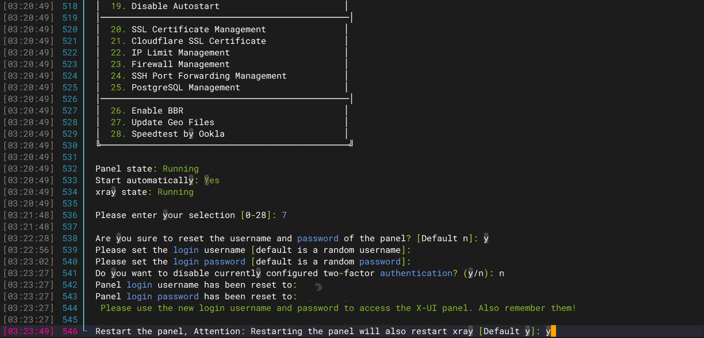 </a>

按提示依次操作：

1. 确认重置，输入 `y`；
2. 设置新的用户名和密码；
3. 询问是否禁用两步验证，输入 `n`；
4. 询问是否重启面板，输入 `y`。

## 三、本机登录面板

回到自己的电脑，**先关闭梯子（尤其 TUN 模式）**，在浏览器打开 `x-ui settings` 显示的完整 Access URL，用刚设置的用户名密码登录。

> **注意**：地址栏一定要带 `https://`。用 http 访问 HTTPS 端口会直接报 `ERR_CONNECTION_CLOSED`。

<a href="images/2026-08-11-03-25-55.png" target="_blank"> 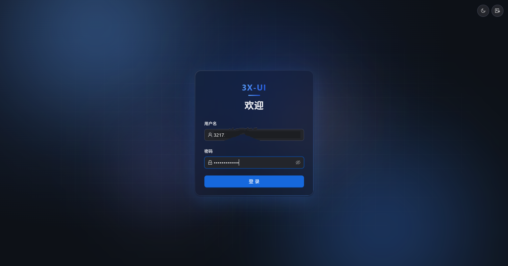 </a>

## 四、创建 VLESS + Reality 入站节点

### 4.1 进入入站列表

登录后点击左侧菜单 **入站列表**：

<a href="images/2026-08-11-03-27-15.png" target="_blank"> 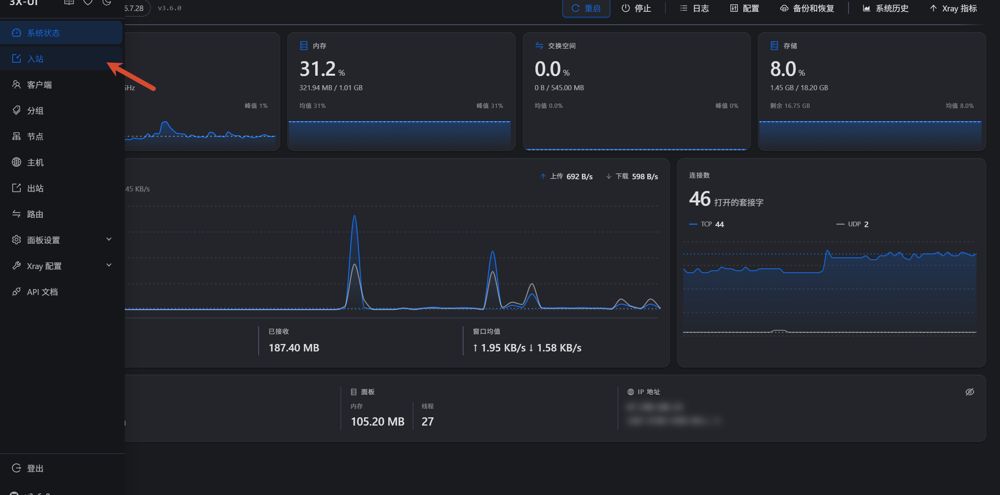 </a>

### 4.2 填写基础配置

点击 **添加入站**，在第一页按以下要求填写，其余保持默认：

| 字段 | 值               |
| ---- | ---------------- |
| 备注 | 任意，如 `MyVPN` |
| 端口 | `443`            |
| 协议 | `vless`          |

<a href="images/2026-08-11-03-30-20.png" target="_blank"> 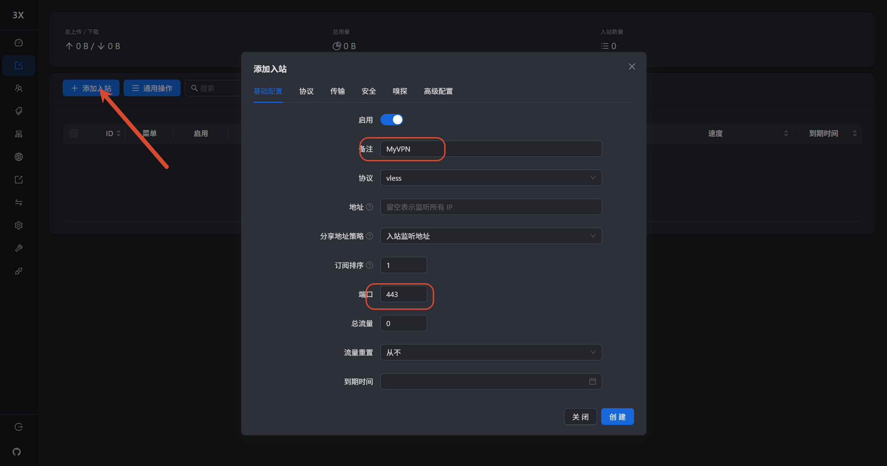 </a>

### 4.3 配置传输与安全

在"协议 / 传输"页选择 **RAW（即 TCP）**——Reality 只支持 TCP 原始传输。

然后进入**安全页**，将安全协议切换为 **Reality**，重点填写下表四个值，一个都不能少：

| 字段           | 值                       |
| -------------- | ------------------------ |
| 目标（Dest）   | `gateway.icloud.com:443` |
| SNI            | `gateway.icloud.com`     |
| 最小客户端版本 | `1.0.0`                  |
| 最大客户端版本 | **留空**                 |
| uTLS / 指纹    | `chrome`                 |

密钥点击 **Get New Cert / 生成** 自动生成即可；回落（Fallback）保持"暂无回落"，不要添加。

<a href="images/2026-08-12-00-43-18.png" target="_blank"> 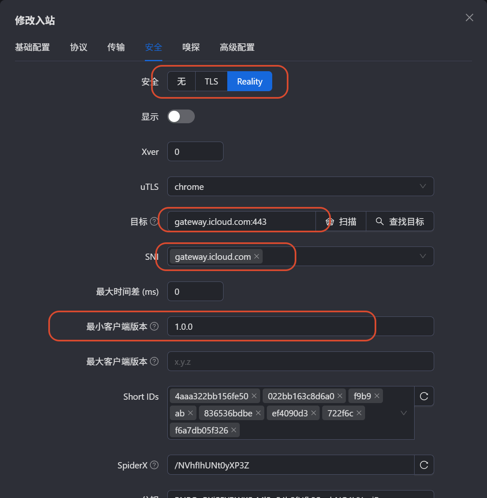 </a>

> **⚠️ 关键坑（必读）**：Xray 26.7.11 之后的版本，Reality 的"最小客户端版本"如果留空，会默认要求客户端核心版本不低于 26.3.27；而 **Clash / Mihomo 不报告核心版本，会被直接拒绝**——表现为节点测速秒超时、日志报 `REALITY authentication failed`（Xray 系客户端如 v2rayN 则正常）。**解决办法就是把最小客户端版本显式填成 `1.0.0`、最大版本留空。**

填写完成后点击 **创建**，面板会自动重启 Xray 使配置生效。

## 五、添加客户端

3x-ui 的"客户端"就是使用节点的账号，每个客户端有独立的 UUID——**没有客户端就无法导出链接**。进入 **客户端** 页面，点击 **添加客户端**：

<a href="images/2026-08-11-03-54-06.png" target="_blank">  </a>

填写时只需关注一处：**关联入站**选中刚创建的入站（如 `MyVPN`），其余保持默认，点击 **创建**。

<a href="images/2026-08-11-03-55-23.png" target="_blank"> 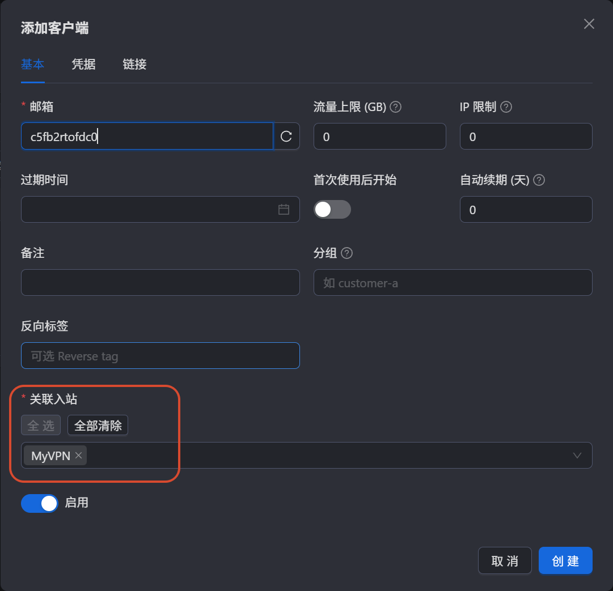 </a>

## 六、导出节点链接

回到**入站列表**，点击入站右侧菜单，选择 **导出入站链接**，复制生成的 `vless://` 链接。

> **提示**：如果导出内容为空，说明还没添加客户端，请先完成第五章。

<a href="images/2026-08-11-03-55-49.png" target="_blank"> 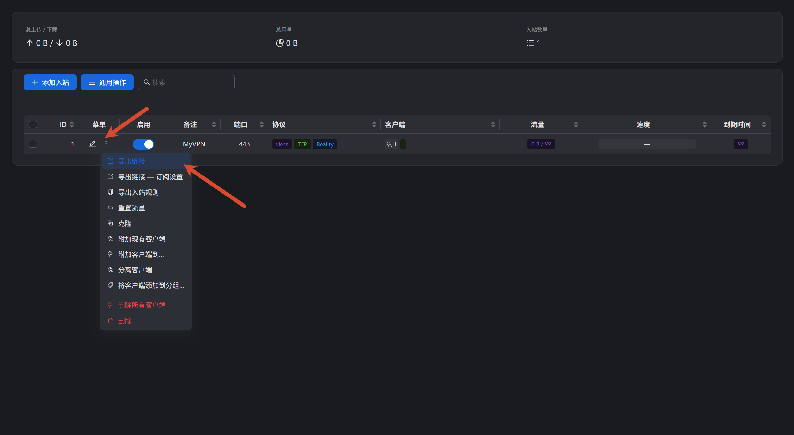 </a>

## 七、将链接转换为 Clash 配置

Clash 无法直接识别 `vless://` 链接，需要转换为 yaml 配置文件。这里使用配套小工具一键完成。

> 辅助工具：[vless2clash.ps1](files/vless2clash.ps1)

下载后在**工具所在目录**打开终端（Windows 可在文件夹地址栏输入 `powershell` 回车）：

<a href="images/2026-08-11-04-10-29.png" target="_blank"> 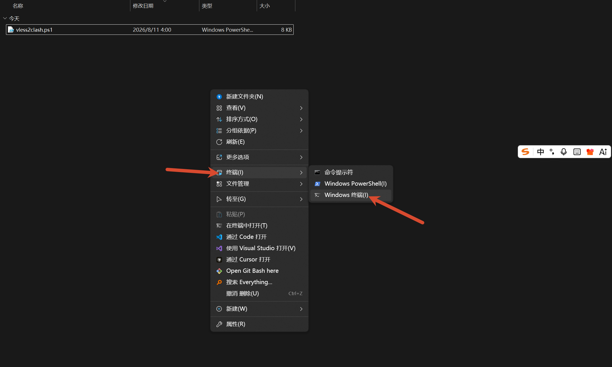 </a>

运行工具，然后粘贴 `vless://` 链接并回车：

```powershell
powershell -ExecutionPolicy Bypass -File .\vless2clash.ps1
```

<a href="images/2026-08-11-04-11-17.png" target="_blank"> 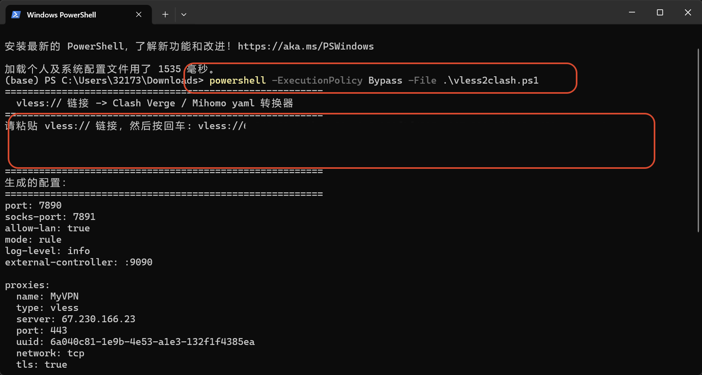 </a>

转换完成后，当前目录会生成与节点同名的 `.yaml` 文件（如 `MyVPN.yaml`），终端同时会打印完整配置：

<a href="images/2026-08-11-04-11-26.png" target="_blank"> 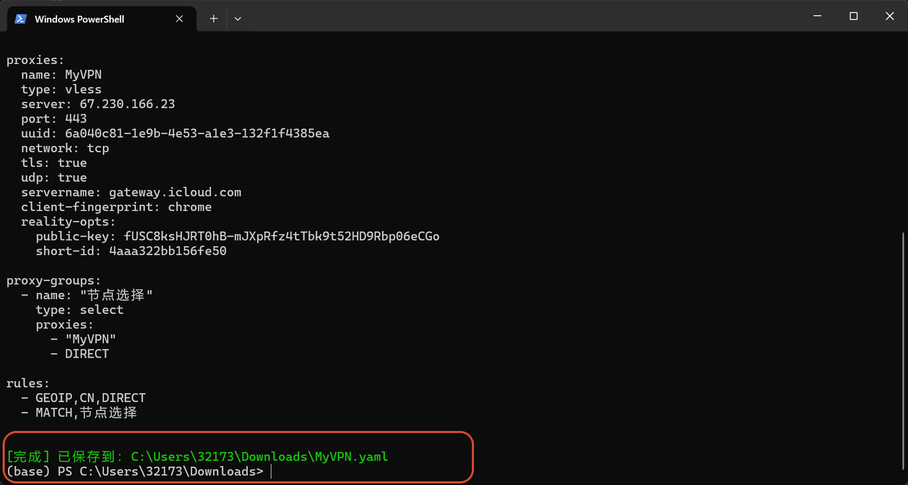 </a>

> **说明**：该工具会解析链接中的 UUID、Reality 公钥、SNI、短 ID 等参数，并输出带远程规则集（google / proxy / direct 智能分流）的完整配置，可直接导入 Clash。

## 八、导入 Clash Verge 并验证

打开 Clash Verge，进入 **订阅** 页，点击 **新建**：

- 类型选择 **Local（本地文件）**；
- 名称随意，如 `MyVPN`；
- 文件选择刚生成的 `MyVPN.yaml`，保存。

<a href="images/2026-08-11-04-13-46.png" target="_blank"> 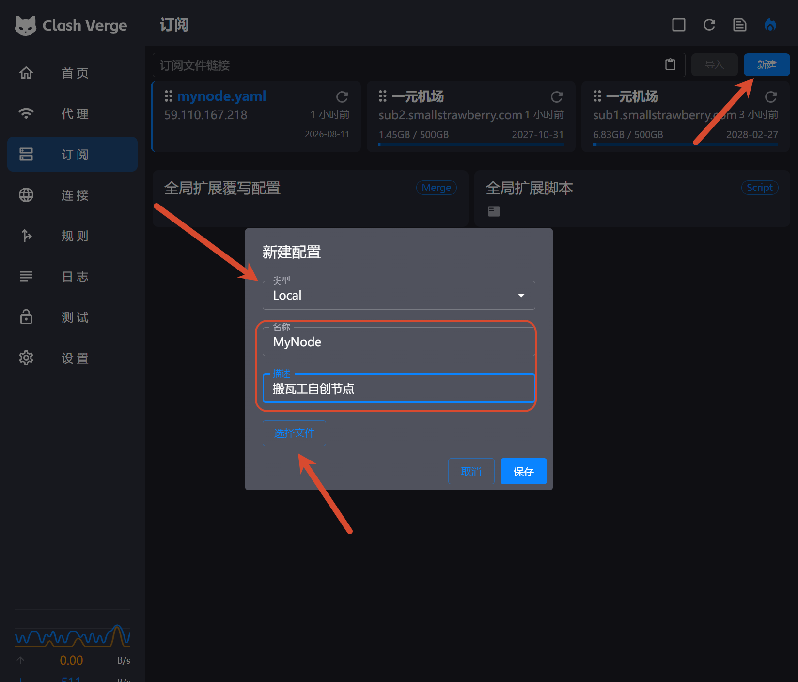 </a>

保存后，到 **代理** 页选择 `MyVPN` 节点并测速，出现绿色延迟数字即表示节点可用；最后在 **设置** 中打开**系统代理**（或 TUN），访问 Google / YouTube 验证即可。

## ⚠️ 特别提醒：搬瓦工迁移机房可能导致的各种"连不上"

搬瓦工后台提供"迁移到其他机房（Migrate to another DC）"功能，但**在节点配置完成之后，请尽量不要使用**。根据实测，迁移会带来一系列非常诡异的问题：

- 迁移完成后，新 IP **从全球都连不上**（22 / 443 / 54321 等端口全部超时），而服务器内部看 IP、路由、防火墙、服务却**全部正常**；
- 服务器的子网网关是通的，说明网络段本身没问题，问题只出在**这一台虚拟机的网络挂载**上；
- **重复迁移到不同机房、不同 IP 段也无法解决**（实测三个不同机房、三个完全不同网段，全部不通）；
- 排查到最后，**唯一有效的解决方法是"重装系统（Reinstall OS）"**——重装会重建虚拟网卡，装完网络立刻恢复；
- 该问题的**根本原理目前未知**（疑似机房侧虚拟网卡挂载缺陷），请把它当作已知的坑来规避。

> **给读者的建议**：迁移前务必先在 KiwiVM 做**快照 / 备份**；迁移后如果发现"服务看着正常但怎么都连不上"，**不要再反复迁移**，直接**重装系统**，并把客户端地址同步更新为新 IP。

## 九、常见问题

| 现象                                                   | 原因与解决                                                                                                           |
| ------------------------------------------------------ | -------------------------------------------------------------------------------------------------------------------- |
| 面板打不开，报 `ERR_CONNECTION_CLOSED`                 | 地址少了 `https://`，或本机梯子 TUN 拦截。补全 `https://`，并先关闭梯子再访问                                        |
| 面板显示 404                                           | 面板有隐藏路径，请用 `x-ui settings` 输出的完整 Access URL（带尾缀）访问                                             |
| 节点测速秒超时，日志报 `REALITY authentication failed` | 最小客户端版本未填 `1.0.0`；或密钥 / UUID 与面板不一致。前者补填，后者重新导出链接并重新生成配置                     |
| 导出入站链接为空                                       | 还没添加客户端，先完成"添加客户端"步骤                                                                               |
| 3X-UI 客户端显示"离线"                                 | 表示尚无流量，连接成功后会变"在线"，属正常现象                                                                       |
| 忘记面板密码                                           | SSH 执行 `x-ui`，选择 `7. Reset Username & Password` 重置                                                            |
| 迁移机房后连不上                                       | 先确认公网 IP 是否变化并更新客户端；若新 IP 全球不可达、服务却正常，**唯一有效解法是重装系统**（详见上文"特别提醒"） |

## 结语

至此，一个属于自己的 VLESS + Reality 节点就搭建完成了。相比现成机场，自建节点带宽独享、数据可控，配合规则分流（国内直连、国外走节点）体验更好。文中提到的"最小客户端版本"是 2026 年 7 月后新版 Xray 引入的默认值变化，遇到 `REALITY authentication failed` 时请优先检查这一项。
