（待填写：简要说明写作背景、适用场景或本文目标）

**前置条件：**

- 已有一个可用国外代理节点（本文：搬瓦工 VLESS+Reality）
- 已装 Clash Verge（Windows）
- 腾讯云账号（已实名）

## 1. 问题背景

（待填写）

## 2. 诊断：确认是按国外 IP 封禁

（待填写）

## 3. 方案原理：国内中转

（待填写）

## 4. 服务器选购

首先购买一个国内服务器，这里根据自己的需求来，因为我只是需要在一定时间段内下载一定资源，所以我选择便宜实惠的轻量级服务器共享带宽

<a href="images/2026-08-10-22-56-20.png" target="_blank"> 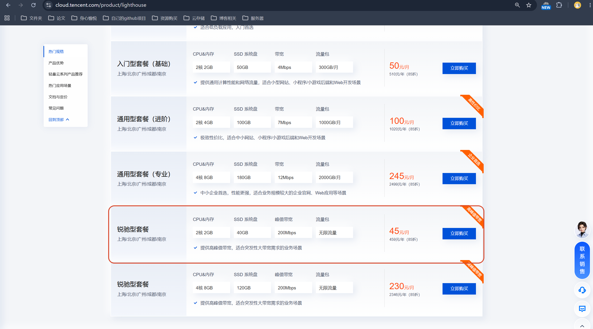 </a>

因为我目前在安徽，所以地域选 南京
镜像选 Ubuntu 24.04 LTS，套餐切换锐驰型，完善其他信息后付款即可

<a href="images/2026-08-10-23-01-33.png" target="_blank"> 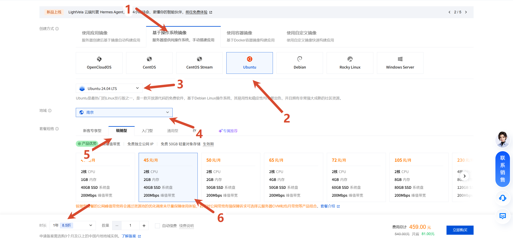 </a>

购买完成后回到服务台查看公网 ip 并记录，比如我是 146.56.224.148

<a href="images/2026-08-10-23-06-23.png" target="_blank"> 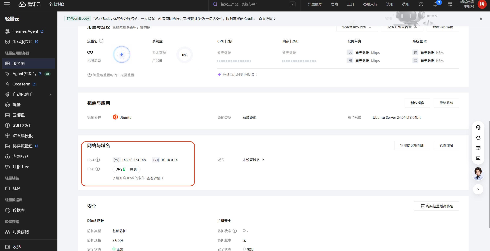 </a>

然后用任意 ssh 工具，如果没有直接用终端也行，通过 ssh 登录服务器，比如 腾讯云的 Ubuntu 镜像默认不允许 root 直接 SSH 登录，系统用户是 ubuntu，ssh ubuntu@146.56.224.148，然后输入密码，
我选择用 windterm，直接填写对应字段点击登录即可

链接成功后如图：

<a href="images/2026-08-10-23-15-41.png" target="_blank"> 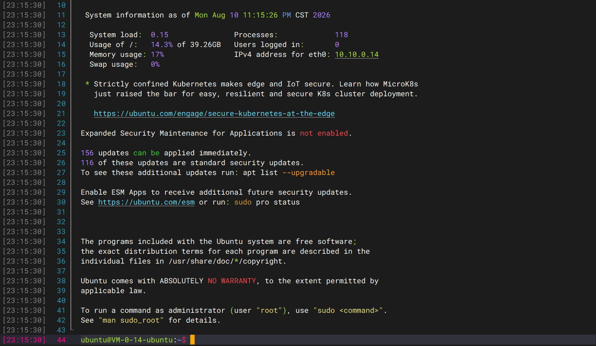 </a>

切换到 root，sudo -i，如果要再输入密码就再输一次，如果不用就直接下一步

<a href="images/2026-08-10-23-16-12.png" target="_blank"> 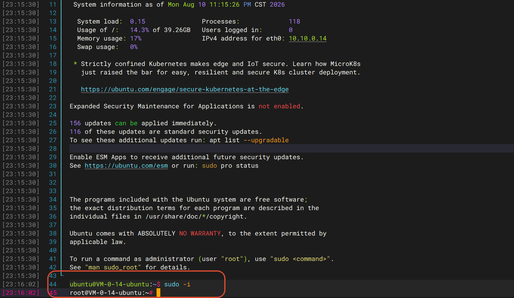 </a>

紧接着执行指令装工具和把转发变成开机自启的服务，记得直接粘贴后直接点击粘贴或者粘贴整段，不要逐行粘贴

apt update && apt install -y socat

cat > /etc/systemd/system/relay443.service <<'EOF'
[Unit]
Description=TCP relay 443 -> 64.64.242.65:443
After=network.target
[Service]
Type=simple
ExecStart=/usr/bin/socat TCP4-LISTEN:443,fork,reuseaddr TCP4:64.64.242.65:443
Restart=always
RestartSec=3
[Install]
WantedBy=multi-user.target
EOF

systemctl daemon-reload
systemctl enable --now relay443
systemctl status relay443 --no-pager | head -15
ss -tlnp | grep ':443'

如图服务 active (running)、443 端口在监听、开机自启已设置。
<a href="images/2026-08-10-23-21-27.png" target="_blank"> 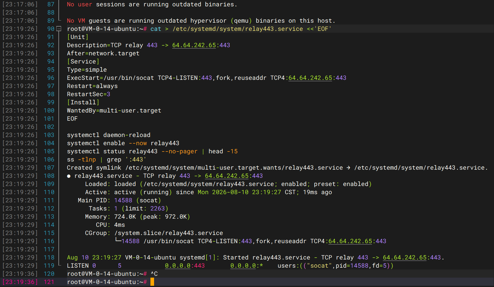 </a>

在 Clash Verge 里编辑之前已有的直连订阅文件

<a href="images/2026-08-10-23-22-41.png" target="_blank"> 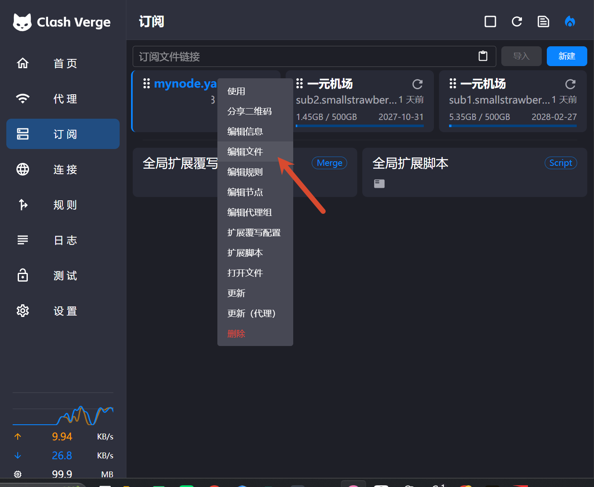 </a>
找到第一个直连节点
<a href="images/2026-08-10-23-26-21.png" target="_blank"> 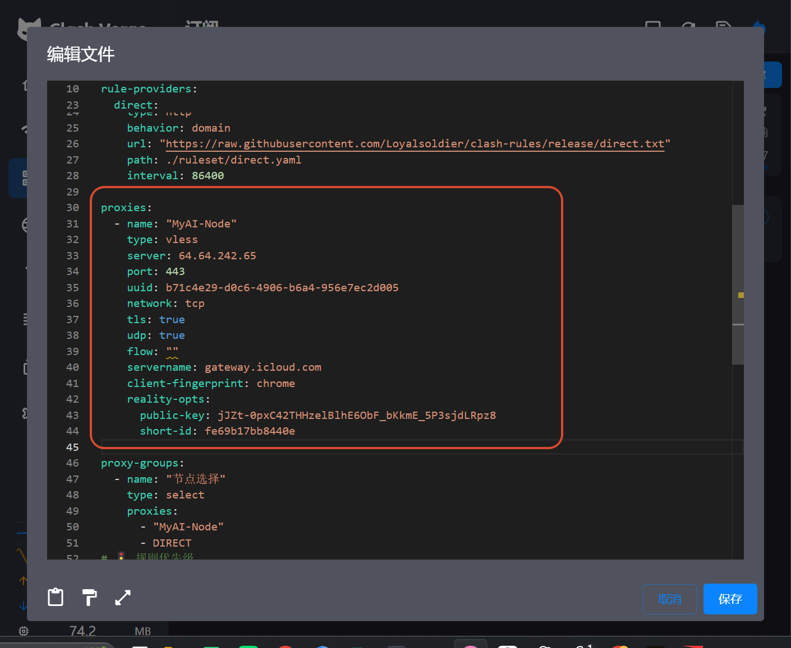 </a>
在下面站贴一下代码创建中转节点

- name: "MyAI-Relay"
  type: vless
  server: 146.56.224.148
  port: 443
  uuid: b71c4e29-d0c6-4906-b6a4-956e7ec2d005
  network: tcp
  tls: true
  udp: true
  flow: ""
  servername: gateway.icloud.com
  client-fingerprint: chrome
  reality-opts:
  public-key: jJZt-0pxC42THHzelBlhE6ObF_bKkmE_5P3sjdLRpz8
  short-id: fe69b17bb8440e

如图：
<a href="images/2026-08-10-23-28-02.png" target="_blank"> 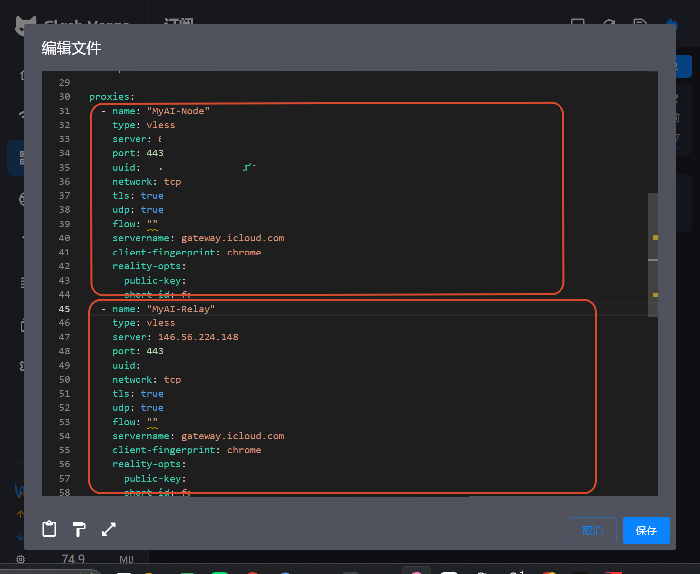 </a>

然后在下方列表把新节点名字加上
<a href="images/2026-08-10-23-30-04.png" target="_blank"> 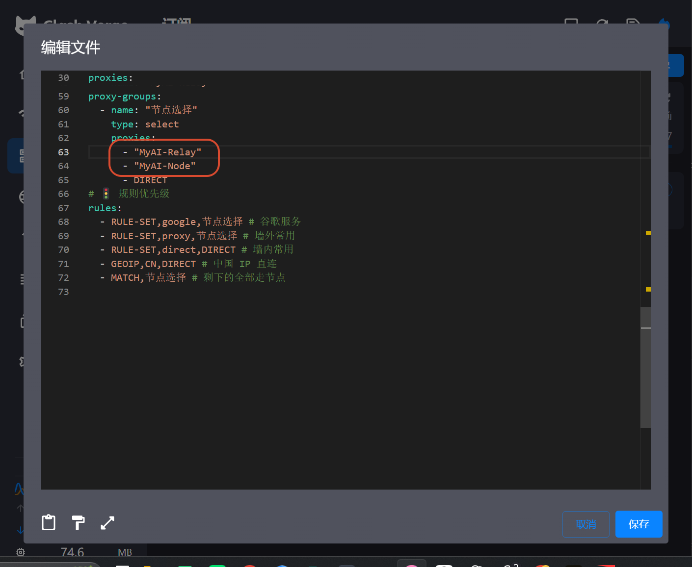 </a>

然后回到服务器控制台去放行端口

<a href="images/2026-08-10-23-30-32.png" target="_blank"> 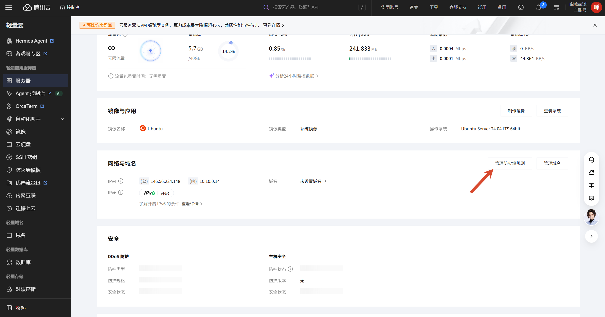 </a>

点击添加规则
应用类型 选 HTTPS (443)
协议 TCP
端口 443
来源 0.0.0.0/0（即全部 IPv4）
策略 允许

<a href="images/2026-08-10-23-34-40.png" target="_blank"> 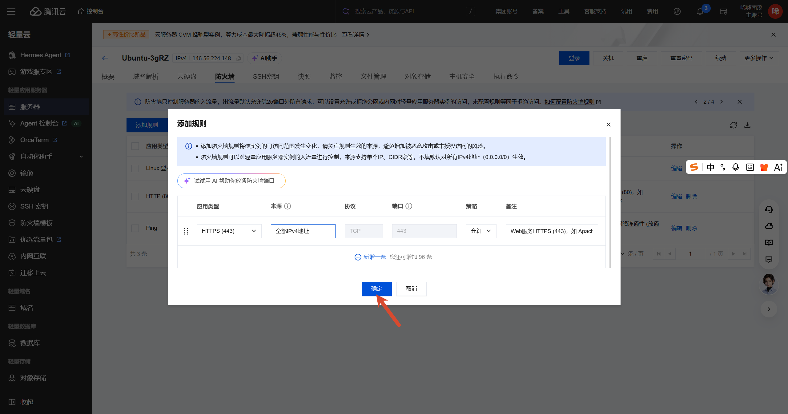 </a>
