## 写在前面

本文面向**本机网络封锁了所有国外节点**的场景：无论你是直连自建节点（如搬瓦工 VLESS+Reality），还是直连机场节点，全部超时连不出去。解决方案是**在国内大陆服务器上架一台"中转机"**，让流量先到国内服务器，再由它转发到海外出口。

相比直接购买机场的"国内中转入口"，自己养一台中转机的优势是：出口可以自由组合（自建节点 / 任意机场）、线路可控、不依赖机场附带的入口。

> **效果说明**
>
> 中转搭建成功，首先只能说明本机已经能够通过国内入口连接到海外出口，并不代表所有海外服务都会接受该出口 IP。实际可用性与所选机场的线路、机房和出口 IP 质量强相关。以一元机场为例，搭建完成后通常可以正常访问 Google、YouTube 等外网服务，但 Steam 等会拒绝数据中心或代理机房 IP 的服务，可能仍显示无连接、登录失败或无法进入商店。这属于出口 IP 的服务限制，不是国内中转链路搭建失败；遇到这种情况应更换机场节点或出口线路，再进行测试。

如果你已经有自建节点，或者希望搭建一个出口质量更可控、较少遇到 Steam 等服务拒绝机房 IP 的节点，可以阅读[国内中转绕开网络封锁：阿里云 + 搬瓦工 FRP 完整教程](/p/frp-aliyun-bandwagon-relay/)；

> **前置条件**
>
> - 一个可用的海外出口：机场订阅（本文以一元机场为例）
> - 一台国内大陆服务器（本文以阿里云轻量为例，月付试水）
> - 本机已安装 Clash Verge（Windows）

## 1. 问题背景

在部分网络环境（校园网、企业网、特定宽带）中，**到国外 IP 的代理流量会被整段封锁**：

- 直连国外节点：TCP 能握手，但认证后数据流被掐断 / 直接超时；
- 网页还能上，但梯子永远连不上；
- 手机开热点却可以连——说明封锁针对的是当前网络出口，而不是节点本身。

这种情况下，唯一靠谱的办法是**让流量先走一条国内可达的路径**：本机 → 国内服务器 → 海外出口。

## 2. 诊断：确认是"按出口封禁"

在动手前先确认问题出在本机网络，而不是节点配置：

| 测试                 | 方法                             | 结果含义                  |
| -------------------- | -------------------------------- | ------------------------- |
| 本机直连节点         | Clash 直连节点测速               | 超时/被断 → 本机网络问题  |
| 手机热点直连同一节点 | 手机开热点，电脑连热点再测       | 能连 → 确认是本机网络封禁 |
| 国外节点连通性       | 用国外在线端口检测工具测节点 443 | 通 → 节点本身正常         |

如果"手机热点能连、本机网络不能连"，就基本确认是本机出口被封，可以继续往下读。

## 3. 方案原理：国内中转

```
本机 Clash ──socks5──▶ 国内中转机(mihomo) ──▶ 机场/自建出口 ──▶ 目标网站
```

- **中转机**：一台大陆服务器，运行 mihomo。它既是"入口"（对外开 7890 端口，供本机连接），又是"出口客户端"（自己连机场/自建节点）；
- **本机**：Clash 里只配置一个 **socks5 节点**指向中转机，不关心出口细节；
- **出口**：机场订阅或自建节点，由中转机决定。

**为什么用 mihomo 而不是简单的 socat 端口转发？** 两个实战结论：

1. socat 是四层裸转发，对机场的 xhttp 协议可用，但**对自建节点的 VLESS+Reality 不兼容**（握手成功但数据流被掐断）；
2. **大厂云（阿里云/腾讯云）对部分境外 IP 存在"数据层封锁"**：TCP、ping、TLS 握手都通，但真实代理数据流被丢弃——例如阿里云实测连不上搬瓦工节点，但连一元机场正常。所以**出口选机场**（或换一家不封锁的小厂中转机）。

本文最终方案：**阿里云轻量 + mihomo + 机场订阅（自动更新）**。

## 4. 服务器选购

进入阿里云轻量应用服务器页面购买：

<a href="images/2026-08-12-01-51-22.png" target="_blank"> 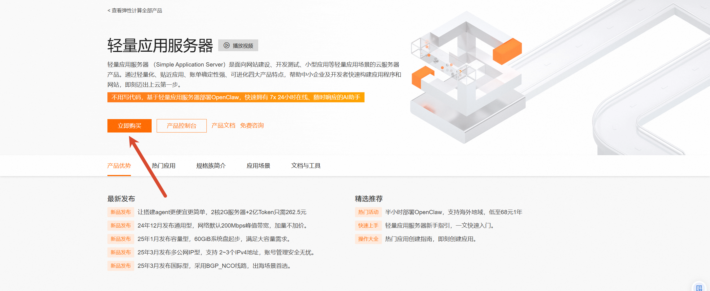 </a>

购买时注意：

- **类型**：轻量应用服务器，通用型；
- **系统镜像**：Ubuntu 24.04；
- **地域**：选离你最近的国内地域（作者在安徽，选上海，延迟约 15ms）；
- **付费**：先**买一个月**试试，测试不行马上退款（5 天无理由）；
- **配置**：最低配即可（中转吃带宽，CPU/内存不是瓶颈），带宽选 3Mbps 以上。

<a href="images/2026-08-12-01-56-10.png" target="_blank"> 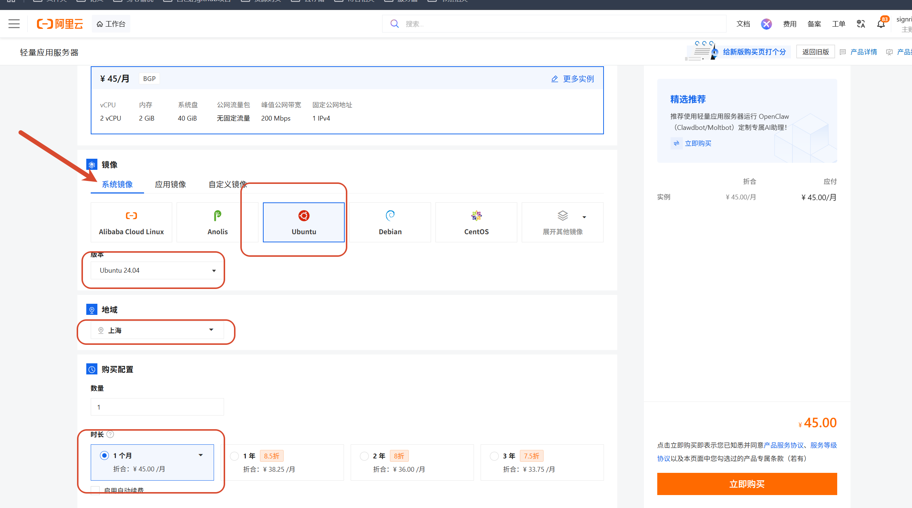 </a>

买完后先**设置 root 密码**（用于 SSH 登录）：

<a href="images/2026-08-12-02-07-16.png" target="_blank"> 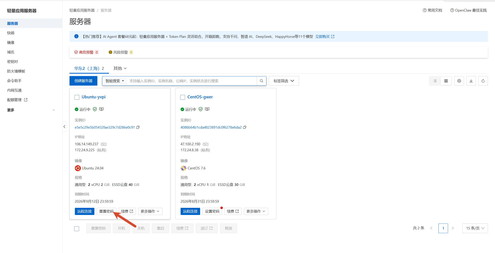 </a>

使用**远程连接 / SSH** 登录服务器，选择**密码登录**（"立即登录"那种有权限限制，不推荐）：

<a href="images/2026-08-12-02-09-03.png" target="_blank"> 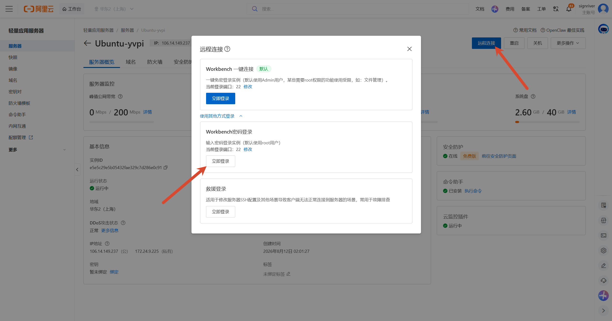 </a>

## 5. 连通性测试（第一关）

先测国内服务器到海外出口的**网络层连通性**。以作者的自建节点为例：

```bash
# 到海外出口 443
timeout 5 bash -c 'echo > /dev/tcp/67.230.166.23/443' && echo "可达" || echo "不可达"

# 延迟/丢包
ping -c 5 -W 2 67.230.166.23

# 自己出网正常
curl -s -o /dev/null -w "baidu=%{http_code}\n" --max-time 8 https://www.baidu.com
```

<a href="images/2026-08-12-02-13-11.png" target="_blank"> 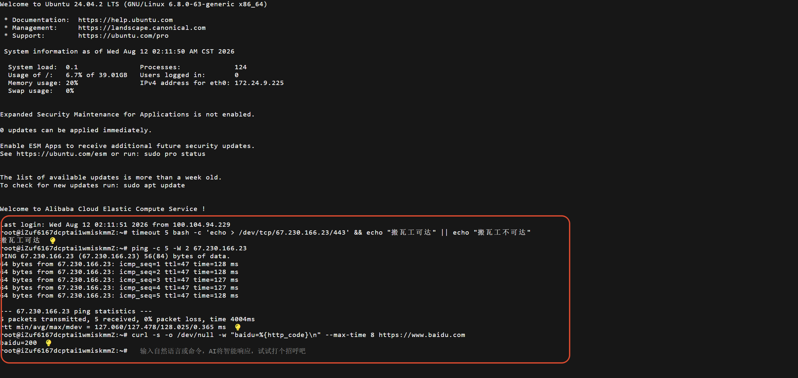 </a>

> **⚠️ 重要：网络层可达 ≠ 真实流量能通。** 作者曾因"TCP 通、ping 通、握手通"误判阿里云能连搬瓦工，结果部署后真实代理数据全被掐断（大厂对部分境外 IP 的数据层封锁）。**所以连通性测试只是第一关，最终以"真实代理流量"是否通过为准**——如果发现某出口不通，就换一个（比如换成机场节点再测）。

## 6. 安装 mihomo

在服务器上安装 mihomo（自带重试，国内服务器直连 GitHub 可能超时，失败会自动重试）：

```bash
VER=$(curl -s --retry 5 --retry-all-errors https://api.github.com/repos/MetaCubeX/mihomo/releases/latest | grep -oP '"tag_name":\s*"v\K[0-9.]+')
curl -L --retry 10 --retry-all-errors --retry-delay 3 -o /tmp/mihomo.gz "https://github.com/MetaCubeX/mihomo/releases/download/v${VER}/mihomo-linux-amd64-v${VER}.gz"
gzip -t /tmp/mihomo.gz && echo "下载完整" || echo "下载失败，请重试"
cd /tmp && gunzip -f mihomo.gz
mv -f /tmp/mihomo /usr/local/bin/mihomo
chmod +x /usr/local/bin/mihomo
mihomo -v
```

<a href="images/2026-08-12-03-32-06.png" target="_blank"> 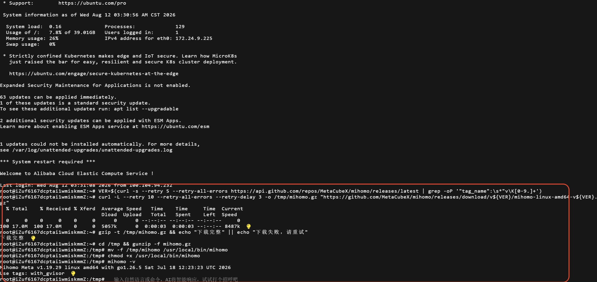 </a>

## 7. 创建服务器端配置

用 heredoc 创建配置文件。**出口是机场节点**（本文为一元机场 xhttp 节点），从机场的节点链接/订阅中提取对应字段，替换占位符：

```bash
mkdir -p /etc/mihomo
cat > /etc/mihomo/config.yaml <<'EOF'
mixed-port: 7890
allow-lan: true
bind-address: '*'
mode: rule
log-level: info
authentication:
  - "relay:<设置一个密码>"
proxies:
  - name: "机场HK"
    type: vless
    server: <机场节点服务器域名>
    port: 443
    uuid: <机场节点UUID>
    network: xhttp
    tls: true
    udp: true
    skip-cert-verify: true
    servername: update.microsoft.com
    xhttp-opts:
      path: /path
      mode: stream-up
      download-settings:
        path: /path
        server: <机场下载服务器域名>
        port: 443
        servername: update.microsoft.com
proxy-groups:
  - name: "PROXY"
    type: select
    proxies:
      - "机场HK"
rules:
  - MATCH,PROXY
EOF
```

粘贴后**最后补一个回车**回到命令行即可：

<a href="images/2026-08-12-03-40-03.png" target="_blank"> 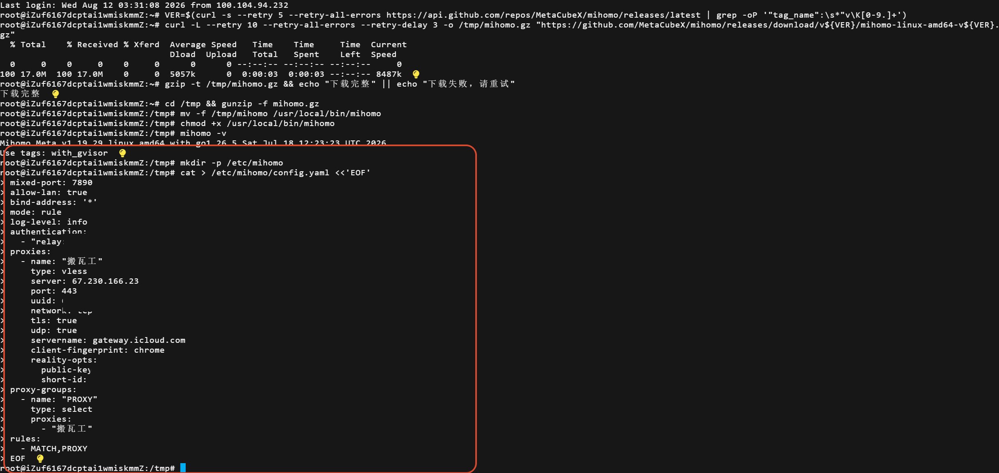 </a>

> 如果想用**自建节点**做出口（VLESS+Reality），配置里改成 `network: tcp` + `reality-opts`，但请先确认你的中转机到该节点**真实代理流量能通**（见第 5 节警告）。

## 8. 注册服务并启动

```bash
cat > /etc/systemd/system/mihomo.service <<'EOF'
[Unit]
Description=Mihomo relay
After=network.target

[Service]
Type=simple
ExecStart=/usr/local/bin/mihomo -d /etc/mihomo
Restart=always
RestartSec=5
LimitNOFILE=1048576

[Install]
WantedBy=multi-user.target
EOF
systemctl daemon-reload
systemctl enable --now mihomo
systemctl status mihomo --no-pager | head -8
```

<a href="images/2026-08-12-03-41-09.png" target="_blank"> 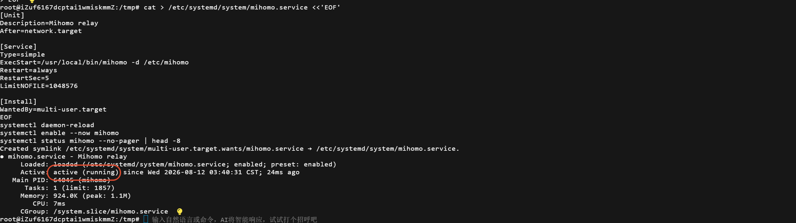 </a>

确认 mihomo 监听 7890：

```bash
ss -tlnp | grep ':7890'
```

<a href="images/2026-08-12-03-41-31.png" target="_blank"> 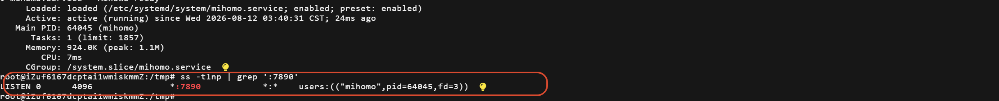 </a>

## 9. 放行防火墙端口

进入服务器防火墙页面：

<a href="images/2026-08-12-02-19-05.png" target="_blank"> 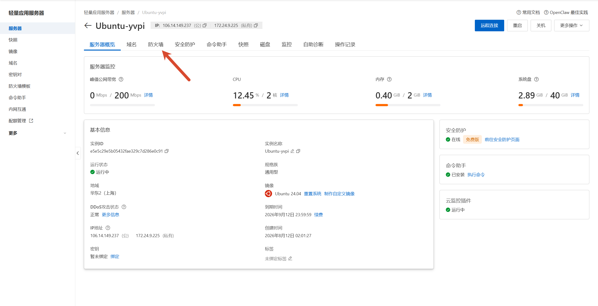 </a>

放行 **TCP 7890**（来源 IP 建议只填你自己的公网 IP，更安全）：

<a href="images/2026-08-12-03-43-12.png" target="_blank"> 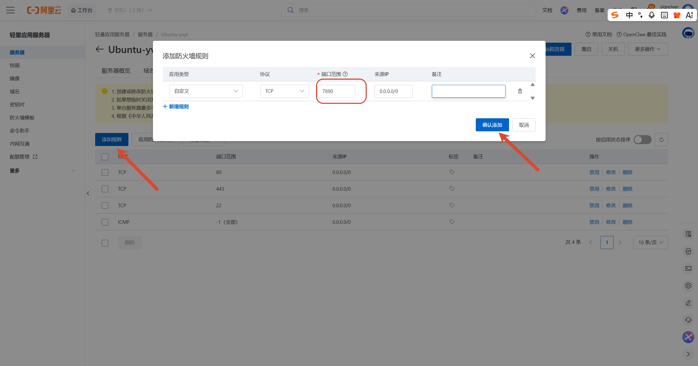 </a>

## 10. 让节点自动更新（重要）

机场会不定期**更换节点参数**（域名、UUID、路径），如果中转机配置是写死的，一换就断。本文提供一套**自动更新方案**：

- [gen_config.py](files/gen_config.py)：从机场 Clash 订阅 (yaml) 解析出全部 vless+xhttp 节点，生成带"自动选择 (url-test)"的中转机配置；
- [mihomo-update.sh](files/mihomo-update.sh)：拉取订阅 → 生成配置 → 有变化就重启 mihomo。

**部署**（把两个文件上传到服务器，如 `/etc/mihomo/`）：

```bash
# 上传后
chmod +x /etc/mihomo/mihomo-update.sh
# 修改两个文件里的占位符：
#   gen_config.py     → AUTH 密码
#   mihomo-update.sh  → URL 机场订阅链接
```

**首次执行 + 定时任务（每 6 小时自动检查）**：

```bash
/etc/mihomo/mihomo-update.sh
crontab -l 2>/dev/null | grep -v update.sh; echo "0 */6 * * * /etc/mihomo/mihomo-update.sh" | crontab -
```

之后：

| 事件                 | 自动行为                                     |
| -------------------- | -------------------------------------------- |
| 机场换节点/UUID/域名 | 最多 6 小时自动同步（配置有变化才重启）      |
| 某个节点变慢/挂掉    | url-test 每 5 分钟测速，自动切到最快可用节点 |
| 节点数量增删         | 自动同步                                     |

## 11. 制作本地 Clash 配置

从中转机配置里记下**密码**和**中转机公网 IP**。新建一个 txt，粘贴下面的模板：

```yaml
# 极简智能版 Clash Meta 配置（国内中转）

port: 7890
socks-port: 7891
allow-lan: true
mode: rule
log-level: info
external-controller: :9090

# 远程规则集（智能分流，每天自动更新）
rule-providers:
  google:
    type: http
    behavior: domain
    url: "https://raw.githubusercontent.com/Loyalsoldier/clash-rules/release/google.txt"
    path: ./ruleset/google.yaml
    interval: 86400
  proxy:
    type: http
    behavior: domain
    url: "https://raw.githubusercontent.com/Loyalsoldier/clash-rules/release/proxy.txt"
    path: ./ruleset/proxy.yaml
    interval: 86400
  direct:
    type: http
    behavior: domain
    url: "https://raw.githubusercontent.com/Loyalsoldier/clash-rules/release/direct.txt"
    path: ./ruleset/direct.yaml
    interval: 86400

# 节点：socks5 指向国内中转机
proxies:
  - name: "中转"
    type: socks5
    server: <中转机公网 IP>
    port: 7890
    username: relay
    password: <与服务器配置一致的密码>
    udp: true

proxy-groups:
  - name: "节点选择"
    type: select
    proxies:
      - "中转"
      - DIRECT

rules:
  - RULE-SET,google,节点选择
  - RULE-SET,proxy,节点选择
  - RULE-SET,direct,DIRECT
  - GEOIP,CN,DIRECT
  - MATCH,节点选择
```

只需替换两个字段（**不要保留 `<>`**，保持 `key: value` 格式，如 `password: xxxxx`）：

```yaml
server: <中转机公网 IP>
password: <与服务器配置一致的密码>
```

创建 txt，把模板粘贴进去并修改字段，然后 `Ctrl+S` 保存：

<a href="images/2026-08-12-03-48-24.png" target="_blank"> 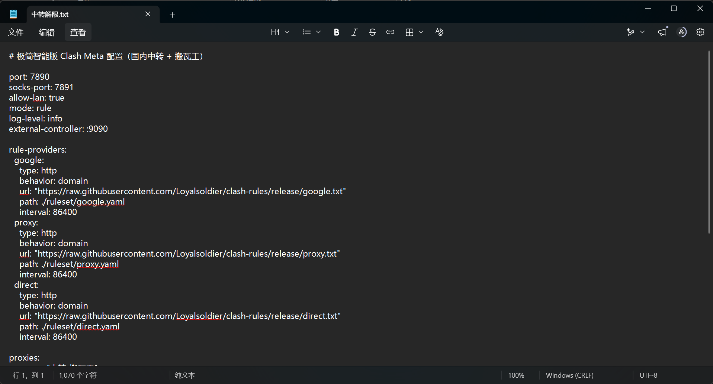 </a>

在 Windows"查看"中确保**显示文件扩展名**是打开的：

<a href="images/2026-08-12-03-48-54.png" target="_blank"> 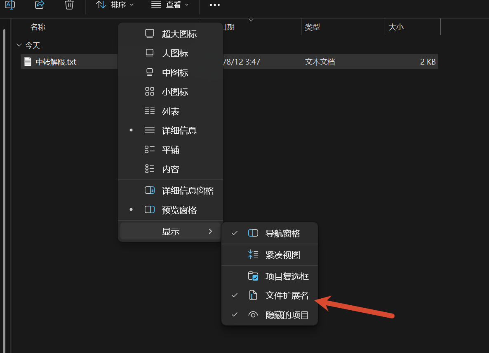 </a>

按 `F2` 重命名，把后缀改成 `.yaml`（文件名随意，如 `relay.yaml`）：

<a href="images/2026-08-12-03-49-15.png" target="_blank"> 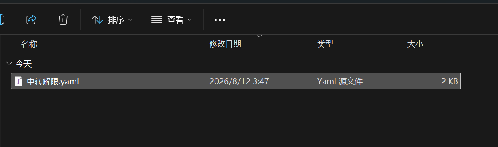 </a>

在 Clash Verge 中：**订阅 → 新建 → 本地文件 → 选择刚才的 yaml → 保存**：

<a href="images/2026-08-12-02-43-38.png" target="_blank"> 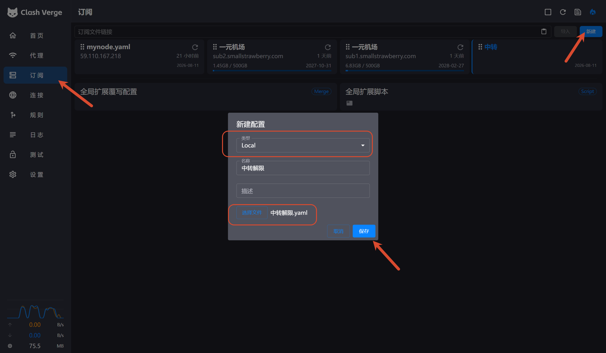 </a>

## 12. 使用与排错

**① 日常使用：用"系统代理"，别开 TUN（或给中转机 IP 加排除）**

实测开着 TUN 时，Clash 内核连中转机的数据流会被 TUN 绕回自己，**小请求能过、大流量卡死**。两个方案：

- 简单：Clash 设置里**关闭 TUN**，只用系统代理；
- 进阶：保留 TUN，在"全局扩展配置"里排除中转机 IP：

```yaml
tun:
  enable: true
  stack: mixed
  dns-hijack:
    - any:53
  route-exclude-address:
    - <中转机公网IP>/32
```

**② 验证中转机是否正常（服务器上自测）**

```bash
curl -x socks5h://relay:<密码>@127.0.0.1:7890 -s -o /dev/null -w "HTTP %{http_code}\n" --max-time 10 https://cp.cloudflare.com/generate_204
```

返回 `204` 说明中转机出口正常。

**③ 常见问题**

| 现象                                 | 原因与解决                                                                                            |
| ------------------------------------ | ----------------------------------------------------------------------------------------------------- |
| 中转机自测 204，本机却连不上         | ① 阿里云防火墙 7890 没放行；② 本机开了 TUN 导致大流量卡死（见①）；③ 密码/用户名填错                   |
| 网页能上，某些应用（Steam 等）无连接 | 机场机房出口 IP 可能被对方服务拒（Steam 会封机房 IP）。Steam 可加启动参数 `-tcp` 试，或换自建节点出口 |
| 某个节点很慢/经常断                  | 机场节点质量参差，url-test 会自动切；或手动在"自动选择"里锁一个实测最快的节点                         |
| 机场换了节点参数                     | 6 小时内自动更新（见第 10 节）；没生效就手动跑 `/etc/mihomo/mihomo-update.sh`                         |
| 中转机到某出口"握手通但数据断"       | 大概率是大厂对目标 IP 的数据层封锁，换出口（机场/小厂）                                               |

## 结语

至此，一套"本机 → 国内中转 → 机场出口"的链路就搭建完成，并且节点自动更新、故障自动切换。核心经验一句话：**网络层通不等于数据层通，部署前一定要用真实代理流量实测出口；大厂云对部分境外 IP 有数据层封锁，出口要选实测能通的**。
