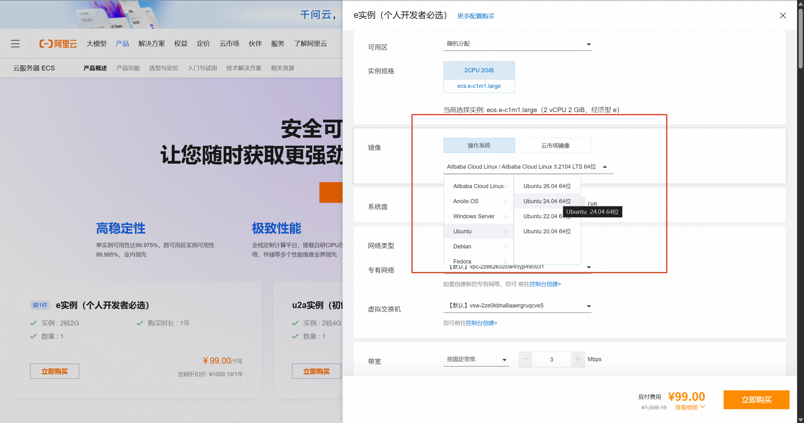
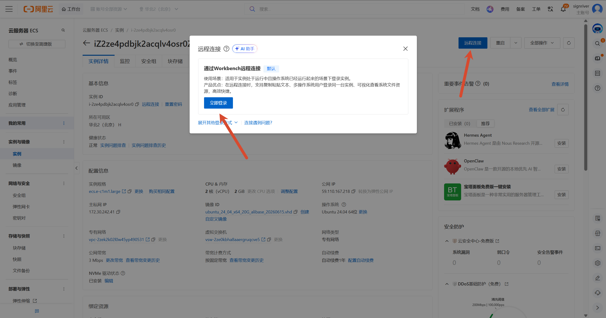
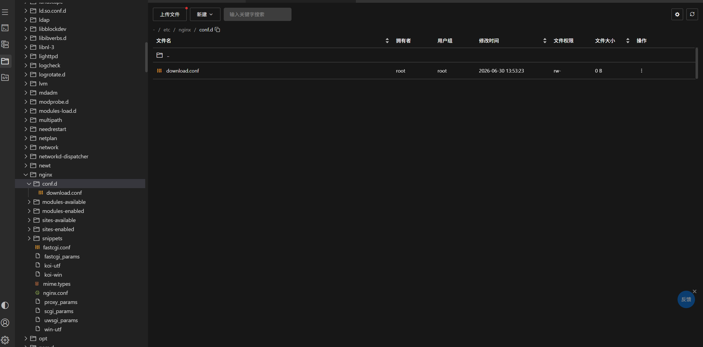
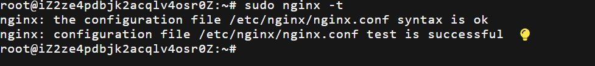
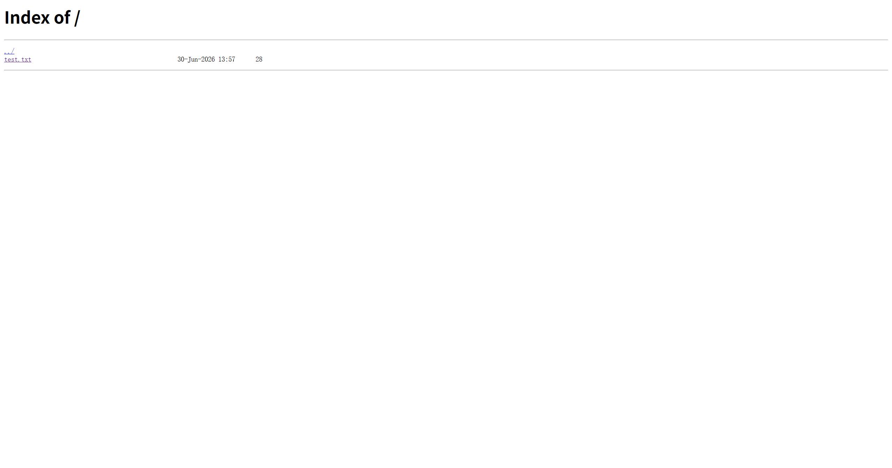
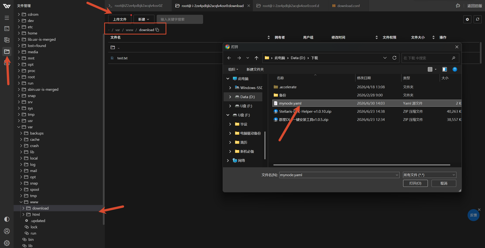
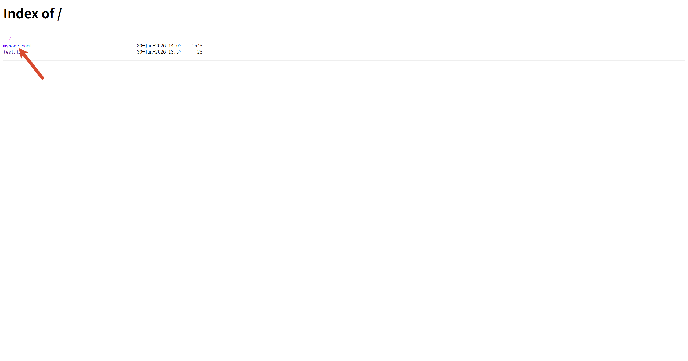

## 1. 概述

本文记录在阿里云 ECS 上搭建文件下载服务的完整流程：购买服务器、安装 Nginx、配置目录浏览，最后通过公网 IP 访问下载页面。

## 2. 购买服务器

### 2.1. 打开产品页并选择优惠套餐

打开 [阿里云 ECS 产品页](https://www.aliyun.com/product/ecs?spm=5176.30275541.J_ZGek9Blx07Hclc3Ddt9dg.2.3c872f3dr4kUFP&scm=20140722.S_card@@%E4%BA%A7%E5%93%81@@163972.S_new~UND~card.ID_card@@%E4%BA%A7%E5%93%81@@163972-RL_%E6%9C%8D%E5%8A%A1%E5%99%A8-LOC_2024SPSearchCard-OR_ser-PAR1_0bc059b717827943826333110e2327-V_4-RE_new13-P0_0-P1_0)，选择 **99 元/年** 的优惠套餐并点击购买。

<a href="images/2026-06-30-13-00-11.png" target="_blank">  </a>

### 2.2. 服务器配置与下单

操作系统选择 **Ubuntu 24.04 64 位**。

<a href="images/操作系统选择截图.png" target="_blank">  </a>

勾选 **自动续费**，避免到期后实例被释放。

<a href="images/自动续费选项截图.png" target="_blank">  </a>

### 2.3. 连接服务器

实例创建完成后，进入 ECS 控制台，找到对应实例，点击 **远程连接**，使用阿里云自带的远程连接功能接入。

<a href="images/阿里云远程连接截图.png" target="_blank">  </a>

## 3. 部署相关软件

### 3.1. 基础环境准备

接入服务器后，依次执行以下命令。

#### 3.1.1. 更新系统软件包

```bash
sudo apt update && sudo apt upgrade -y
```

#### 3.1.2. 创建下载目录

```bash
sudo mkdir -p /var/www/download
```

#### 3.1.3. 设置目录权限

将目录所有权赋予当前用户和 Nginx 组：

```bash
sudo chown -R $USER:www-data /var/www/download
sudo chmod -R 755 /var/www/download
```

### 3.2. 安装 Nginx

```bash
sudo apt install nginx -y
```

### 3.3. 删除默认站点

删除 Nginx 自带的默认页面，避免与后续配置冲突：

```bash
sudo rm -f /etc/nginx/sites-enabled/default
```

### 3.4. 配置 Nginx

在远程连接界面左侧的 **文件管理** 中，依次展开 `/etc` → `nginx` → `conf.d`。

<a href="images/进入%20conf.d%20目录截图.png" target="_blank">  </a>

右键点击 `conf.d` 文件夹，选择 **新建文件**，命名为 `download.conf`。

<a href="images/新建%20download.conf%20文件截图.png" target="_blank">  </a>

双击打开 `download.conf`，写入以下配置：

<a href="images/2026-06-30-13-53-46.png" target="_blank">  </a>

```nginx
server {
    listen 80 default_server;
    listen [::]:80 default_server;

    server_name _;

    location / {
        root /var/www/download;

        autoindex on;
        autoindex_exact_size off;
        autoindex_localtime on;
        charset utf-8;

        # 核心限速策略：前 5MB 满速，之后限制在 100 KB/s
        limit_rate_after 5m;
        limit_rate 100k;
    }
}
```

按 **Ctrl+S** 保存。

<a href="images/download.conf%20文件编辑截图.png" target="_blank">  </a>

回到终端，检查配置语法：

```bash
sudo nginx -t
```

输出 `syntax is ok` 和 `test is successful` 即表示配置正确。

<a href="images/2026-06-30-13-57-41.png" target="_blank">  </a>

重启 Nginx 使配置生效：

```bash
sudo systemctl restart nginx
```

## 4. 挂载文件供下载

### 4.1. 创建测试文件

```bash
echo "Hello, this is a test file!" | sudo tee /var/www/download/test.txt
```

### 4.2. 访问下载界面

在浏览器访问 `http://<公网IP>/`，将 `<公网IP>` 替换为实例的公网地址。例如 `http://59.110.167.218/`，页面会列出 `/var/www/download` 目录下的文件，其中包含刚创建的 `test.txt`。

<a href="images/文件下载界面截图.png" target="_blank">  </a>

### 4.3. 上传文件

后续如需添加文件，在 **文件管理** 中打开 `/var/www/download`，点击左上角 **上传文件**，选中目标文件即可。上传完成后刷新浏览器页面即可看到新文件。

<a href="images/上传文件截图.png" target="_blank">  </a>

<a href="images/2026-06-30-14-08-35.png" target="_blank">  </a>

## 5. 总结

| 项目       | 路径 / 地址                       |
| ---------- | --------------------------------- |
| 下载目录   | `/var/www/download`               |
| Nginx 配置 | `/etc/nginx/conf.d/download.conf` |
| 访问地址   | `http://<公网IP>/`                |
| 新增文件   | 文件管理上传至下载目录            |
