> 本文以电脑远程协助 Android 手机为例。仅应在设备所有者知情并同意的情况下发起连接；涉及验证码、支付和隐私信息时，建议由手机持有人自行操作。

本次使用 TeamViewer 的“会话”功能实现远程控制：电脑端创建会话并生成会话码，Android 手机端加入会话、完成授权后，即可由电脑操作手机。

## 1. 下载所需客户端

先打开 [TeamViewer 下载页面](https://www.teamviewer.com/en-us/download/portal/windows/)。

<a href="images/2026-07-28-02-36-18.png" target="_blank">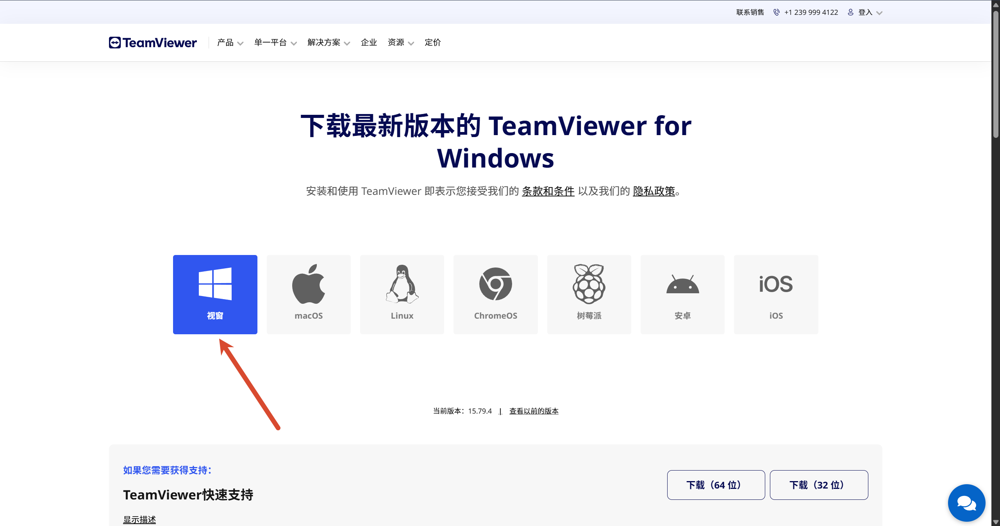</a>

电脑端选择并下载 **TeamViewer Full Client 64 位版**。不要下载 TeamViewer QuickSupport，QuickSupport 用于被协助端，无法按本文流程在电脑上创建会话。

<a href="images/2026-07-28-02-37-04.png" target="_blank">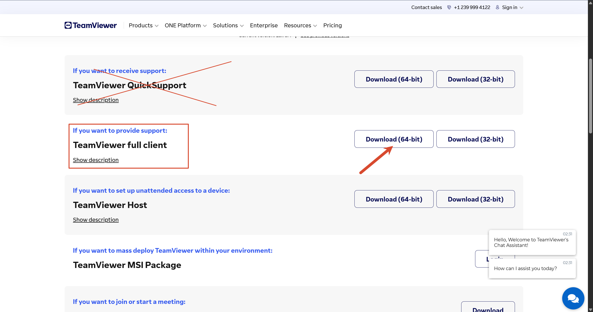</a>

然后切换到 Android 下载页面，下载 **TeamViewer QuickSupport** 的 APK，并将安装包发送到需要被控制的手机上安装。

<a href="images/2026-07-28-02-38-32.png" target="_blank">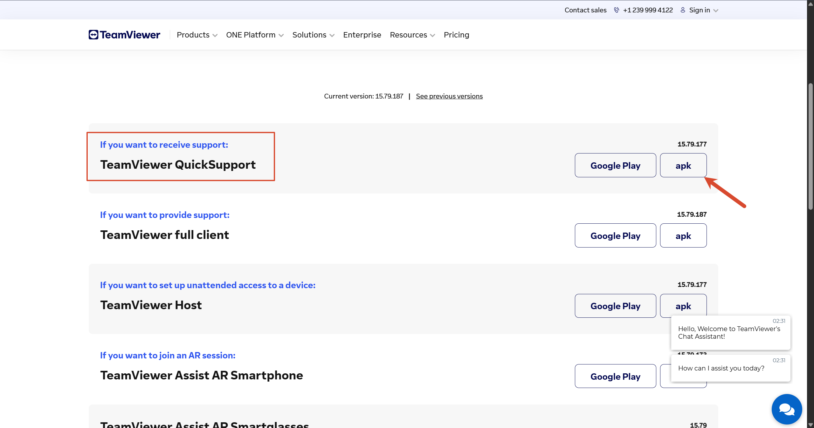</a>

为便于下载，本文也提供了对应文件的国内下载地址：

- [TeamViewer Full Client 64 位版](https://gitlink.org.cn/signriver/file-warehouse/releases/download/TeamViewer/TeamViewer_Setup_x64.exe)
- [TeamViewer QuickSupport APK](https://gitlink.org.cn/signriver/file-warehouse/releases/download/TeamViewer/TeamViewerQS.apk)

从第三方渠道下载 APK 时，请自行核对文件来源和安全性；Android 可能会要求允许浏览器或文件管理器安装未知来源应用。

## 2. 在电脑端创建会话

安装完成后，在电脑上打开 TeamViewer Full Client 并登录或注册账号。创建会话码需要登录账号；若界面与下图差异很大，请确认电脑端没有误装成 TeamViewer QuickSupport。

<a href="images/2026-07-28-02-44-59.png" target="_blank">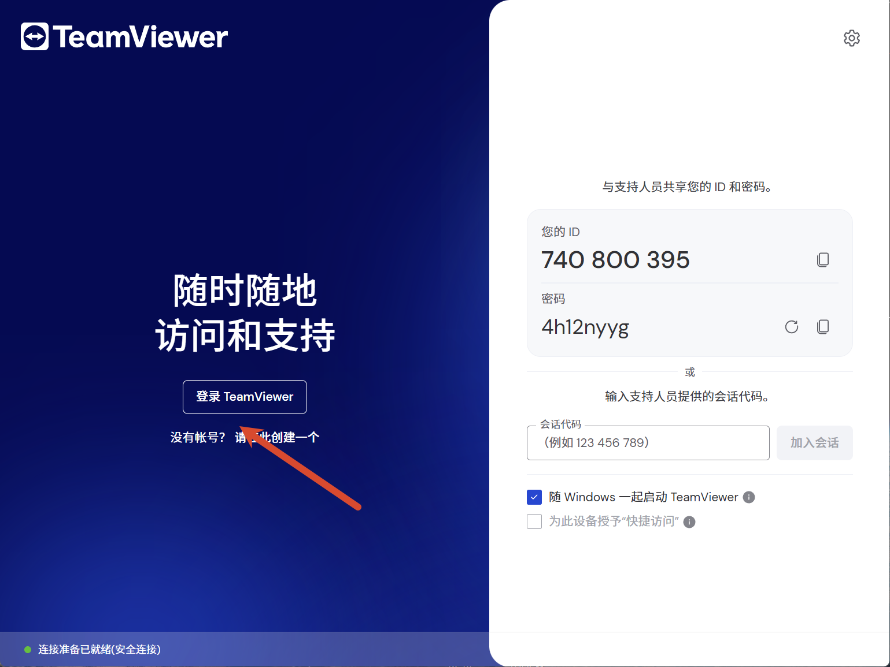</a>

点击“创建新会话”，再点击“开始”创建本次远程协助会话。

<a href="images/2026-07-28-02-47-07.png" target="_blank">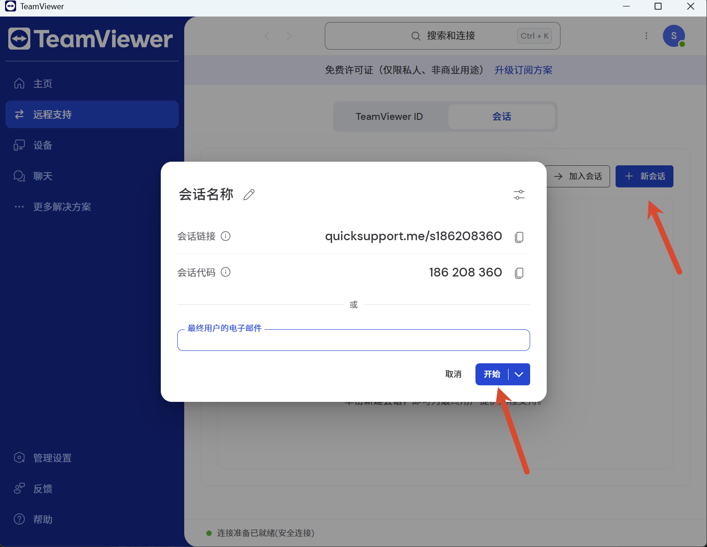</a>

会话创建后，复制生成的会话码，并通过可信渠道发送给手机持有人。

<a href="images/2026-07-28-02-47-40.png" target="_blank">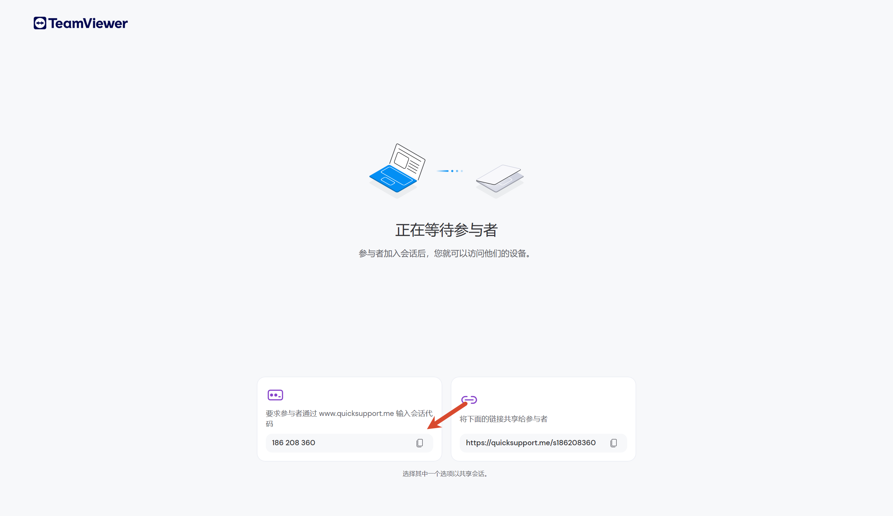</a>

## 3. 在 Android 端安装插件并授权

在手机上打开 TeamViewer QuickSupport，先进入“设置”。

<a href="images/2026-07-28-02-54-50.png" target="_blank">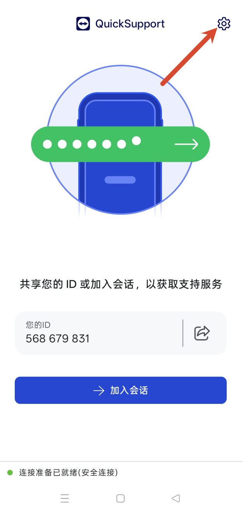</a>

进入“权限”。

<a href="images/2026-07-28-02-55-10.png" target="_blank">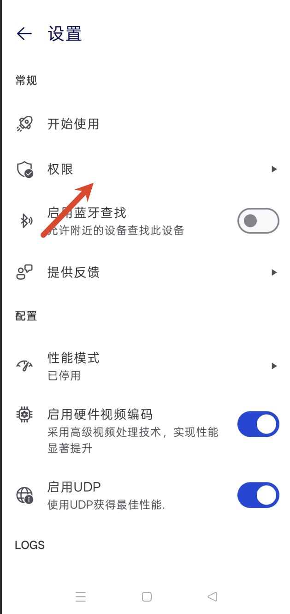</a>

打开“远程控制”功能。

<a href="images/2026-07-28-02-55-32.png" target="_blank">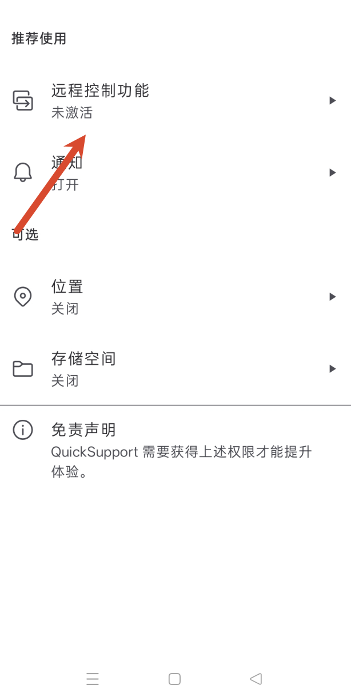</a>

首次启用时，需要按提示安装 TeamViewer 的控制插件。点击“安装”下载并安装插件，完成后选择打开 **Universal Add-On**。

<a href="images/2026-07-28-02-56-29.png" target="_blank">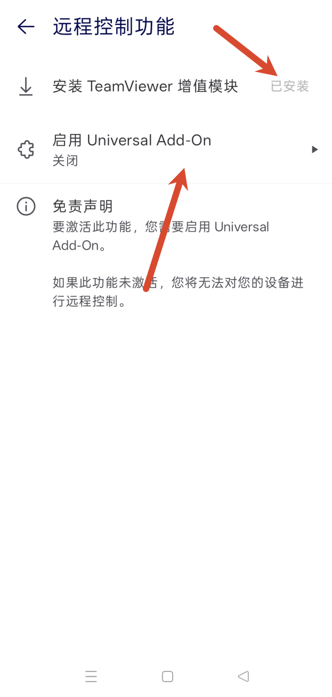</a>

在系统页面中选择“已下载的应用”。

<a href="images/2026-07-28-02-56-47.png" target="_blank">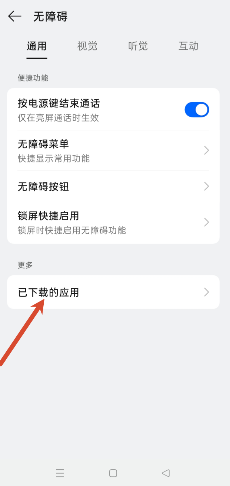</a>

找到并打开 TeamViewer Universal Add-On 的授权项。

<a href="images/2026-07-28-02-57-03.png" target="_blank">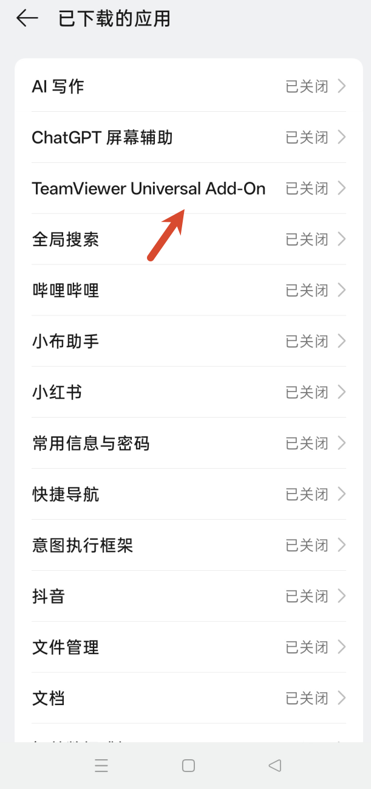</a>

部分手机会提示该应用的权限受到限制。这通常是系统针对侧载应用或无障碍服务的安全保护。请根据手机品牌和系统提示，进入应用权限管理页解除限制，再返回此处完成启用。

<a href="images/2026-07-28-02-58-12.png" target="_blank">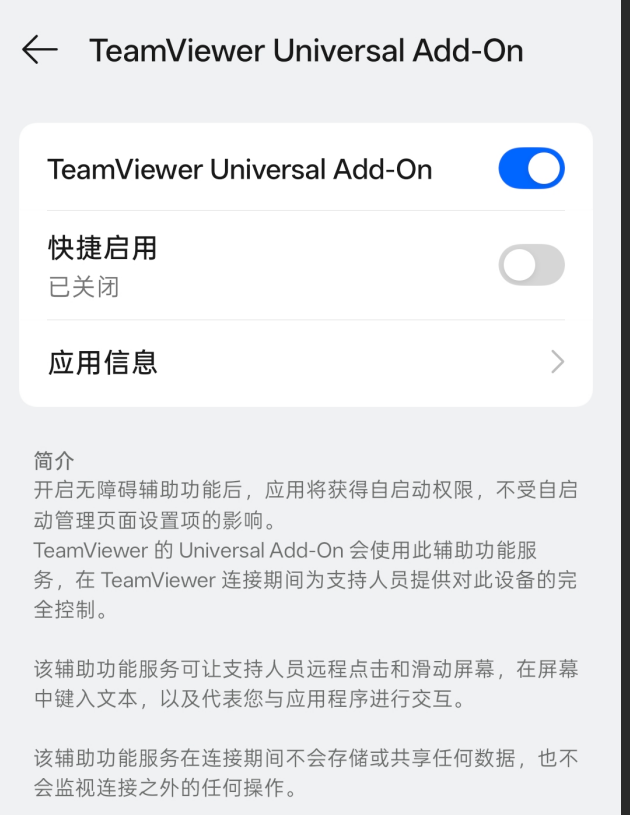</a>

接着返回 QuickSupport 的权限页，进入“存储空间”。

<a href="images/2026-07-28-02-58-57.png" target="_blank">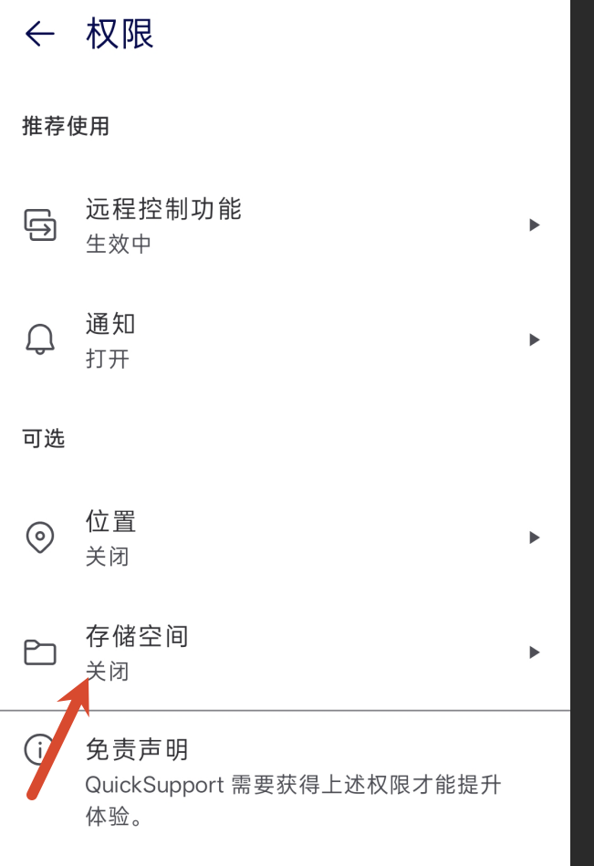</a>

授予所需权限。如果再次出现权限受限提示，按系统页面给出的步骤解除限制后重试即可。

<a href="images/2026-07-28-02-59-41.png" target="_blank">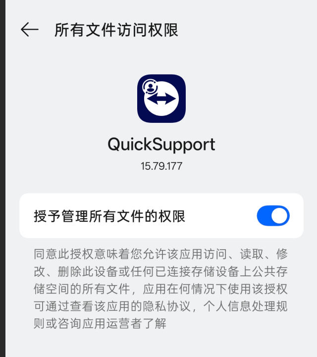</a>

## 4. 加入会话并开始控制

返回 QuickSupport 首页，点击“加入会话”。

<a href="images/2026-07-28-03-00-00.png" target="_blank">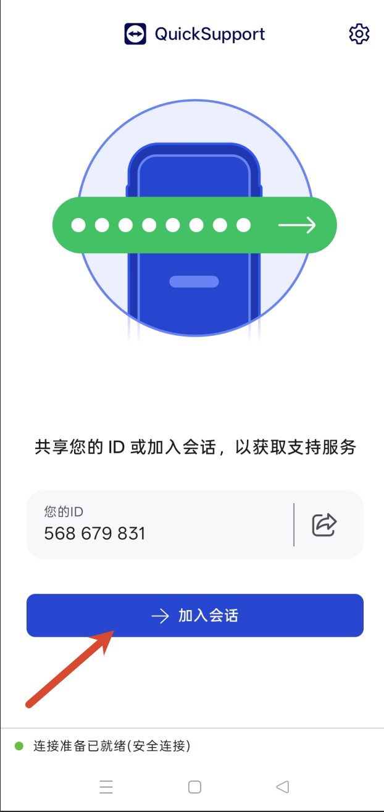</a>

输入电脑端发送的会话码，点击“加入”。

<a href="images/2026-07-28-03-03-22.png" target="_blank">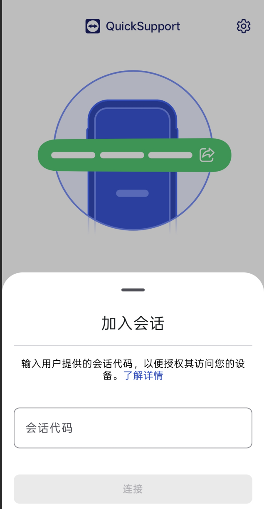</a>

此时回到电脑端，点击“加入会议”。

<a href="images/2026-07-28-03-03-42.png" target="_blank">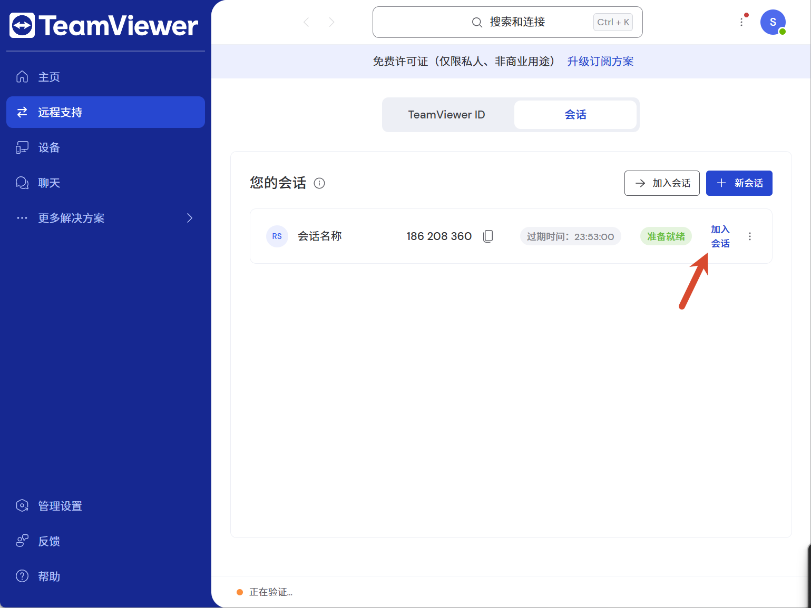</a>

手机端会要求确认身份或允许本次连接。确认协助者身份无误后，点击允许。

<a href="images/2026-07-28-03-04-02.png" target="_blank">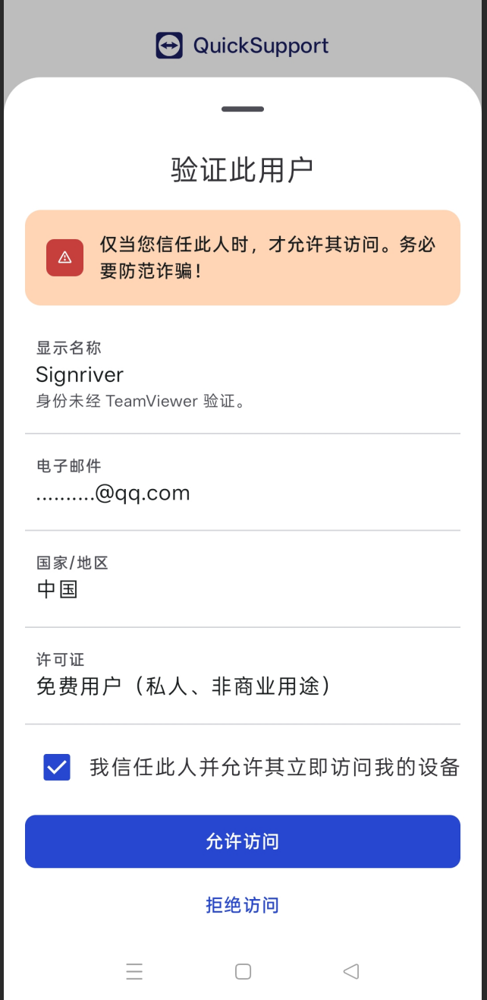</a>

连接建立后，电脑端即可显示并控制手机画面。

<a href="images/2026-07-28-03-04-25.png" target="_blank">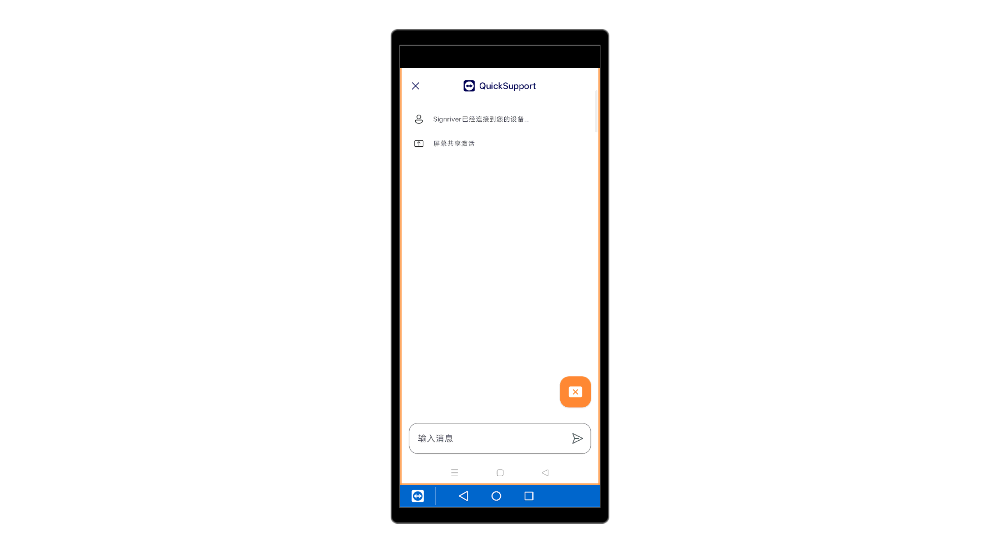</a>

## 5. 使用结束后

协助完成后，在电脑端结束会话，或由手机端退出 QuickSupport。若仅为临时协助，建议同时关闭 Universal Add-On 的无障碍授权，或卸载 QuickSupport 及其插件，避免设备在无人知情时被再次远程访问。
