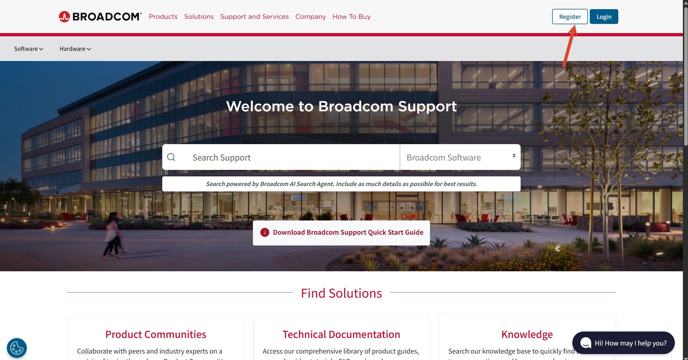
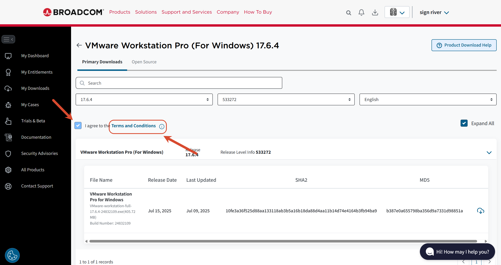
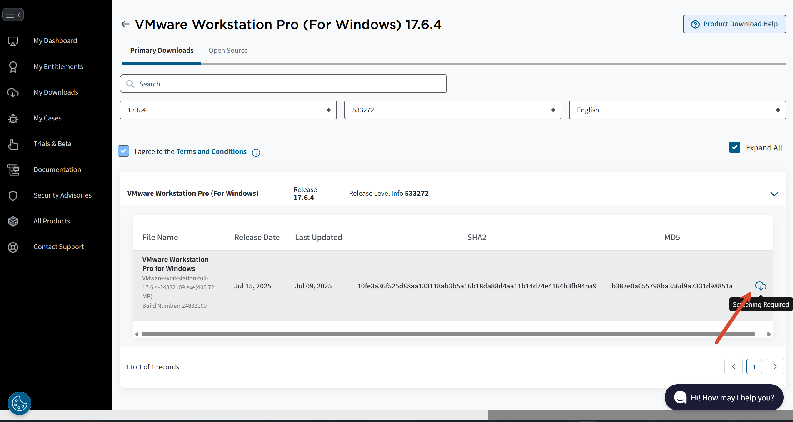
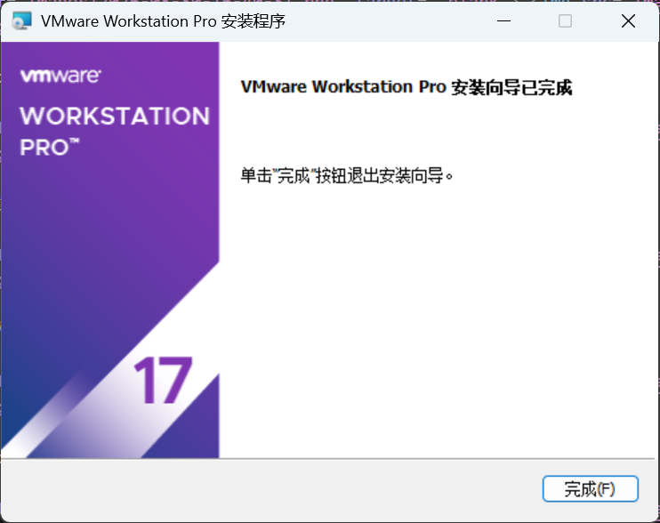
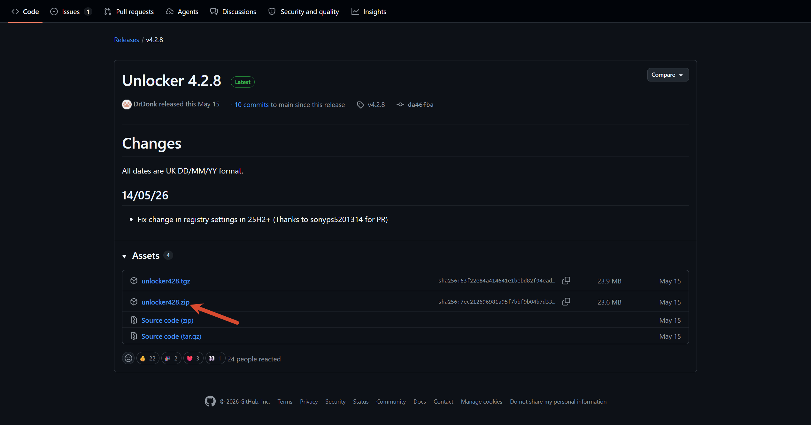
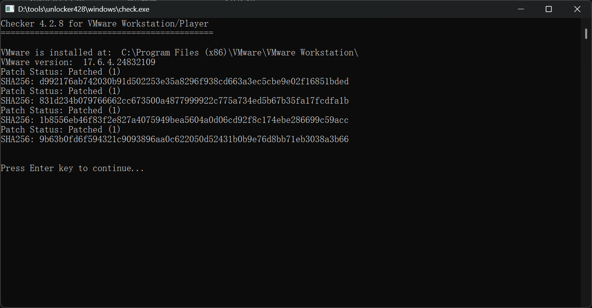
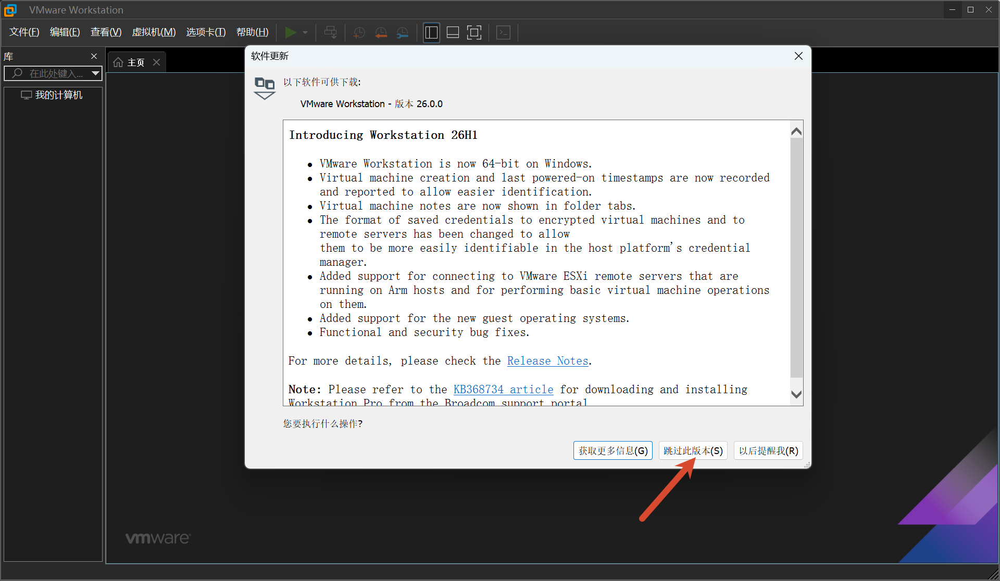
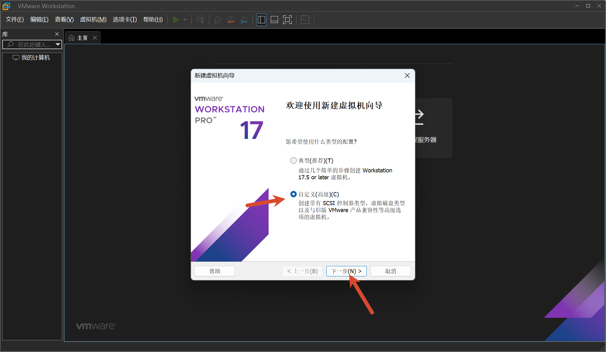
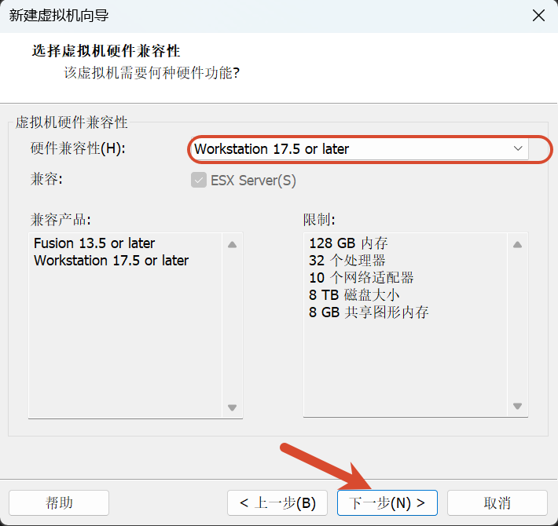
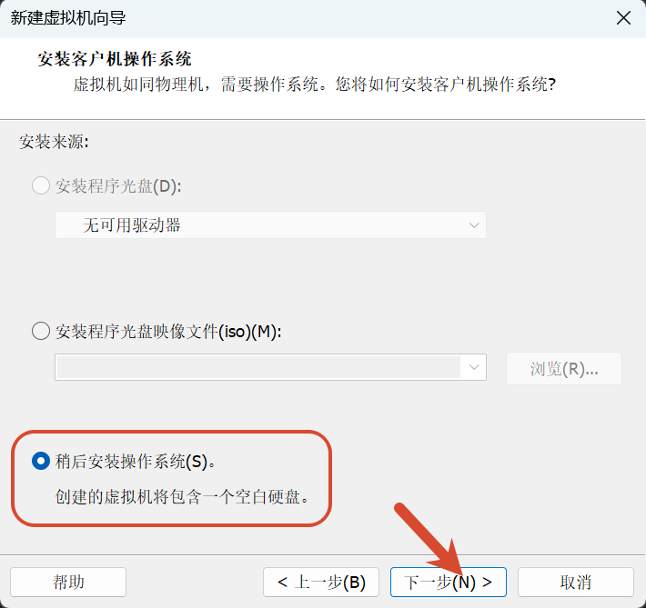

首先是下载 vmare，你可以选择按照下面的教程从官网下载，或是直接从我上传的这里下载 xxx 版本 https://github.com/sign-river/File_warehouse/releases/download/VMware/VMware-workstation-full-17.6.4-24832109.exe

进入 https://support.broadcom.com/，注册

回到主页面登录

然后直接进入 https://support.broadcom.com/group/ecx/productdownloads?subfamily=VMware%20Workstation%20Pro&freeDownloads=true，点击xxx，选择xxx

点击 xxx 后回到界面勾选同意

然后下载

填写个人信息，以下每个框的意思是 xxx，需要填写 xxx。填完后点击 xxx

回到 xxx 界面，重新点击 xxx

双击下载后的 exe，一路上都是傻瓜问题，一路下一步即可，然后安装，直到安装完成

接下来是下载 unlock

打开 https://github.com/DrDonk/unlocker/releases/tag/v4.2.8，下载 zip 包

下载完成后吧他解压到一个全英文的文件夹里

如果之前打开过 wmxxx，先完全退出，然后进入 xxx 文件夹，右键以管理员身份执行 xxx

运行成功后运行 xxx 检查状态

四项都有（1），说明补丁应用成功

接下来启动 VMware Workstation Pro，遇到新版本提示选择跳过，否则可能覆盖我们刚打的补丁

创建虚拟机，高级，下一步

保持当前已经选中的：Workstation 17.5 or later 然后点击 下一步

选择 xxx，然后下一步

