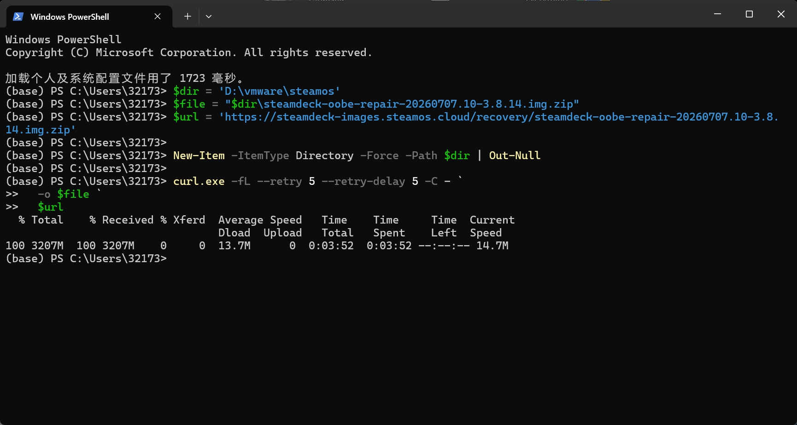
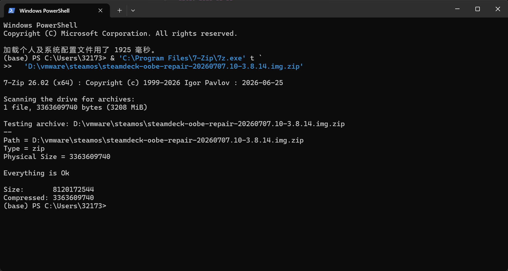
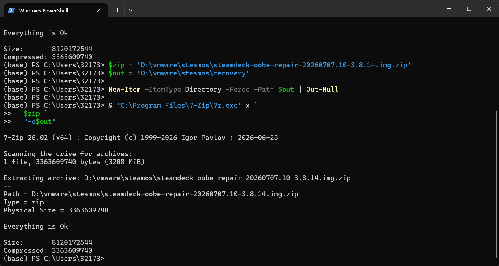
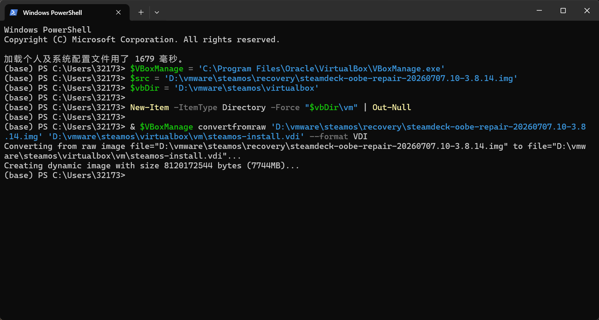
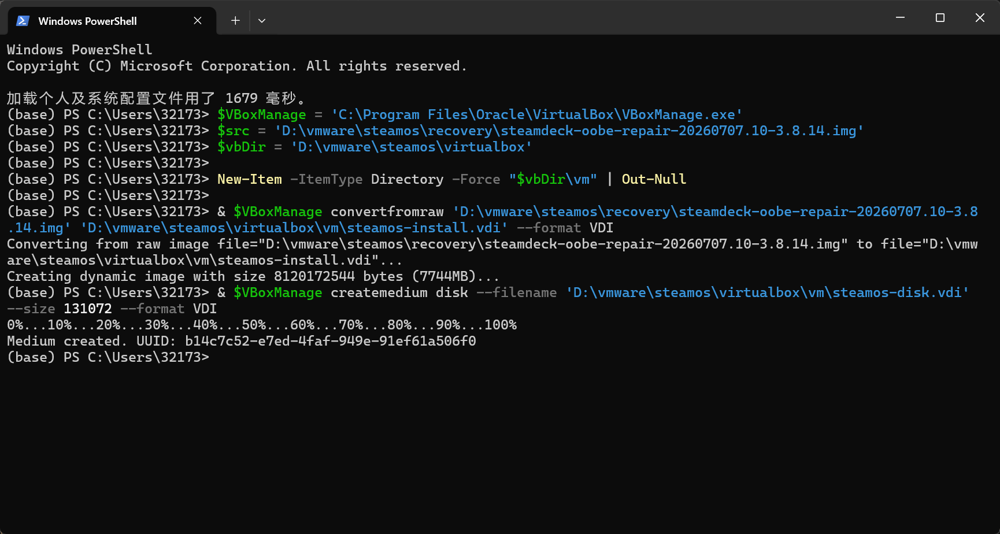
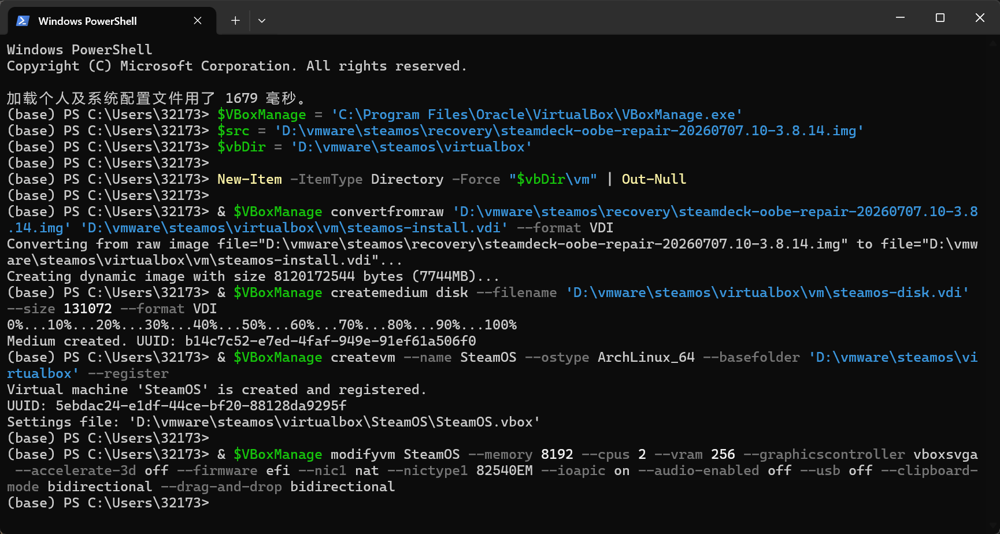
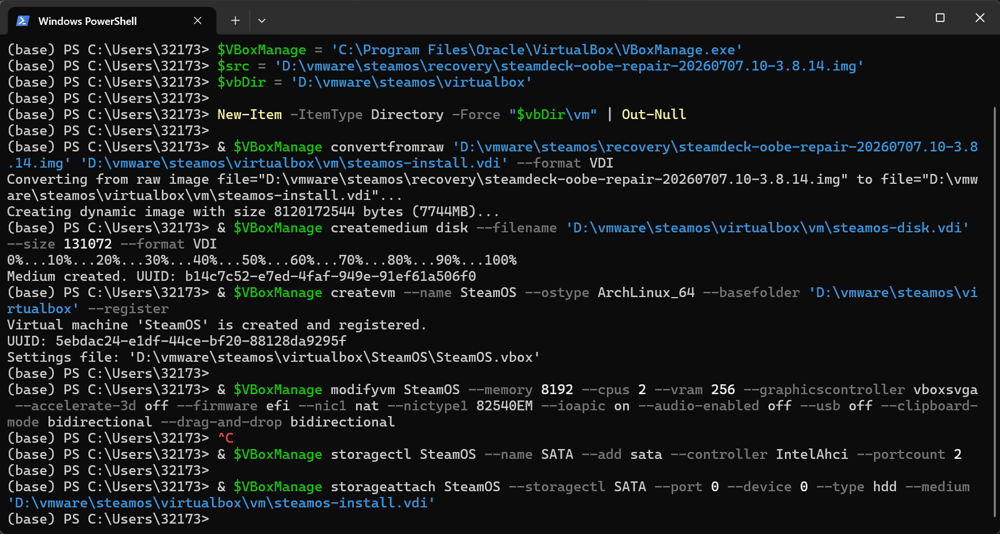
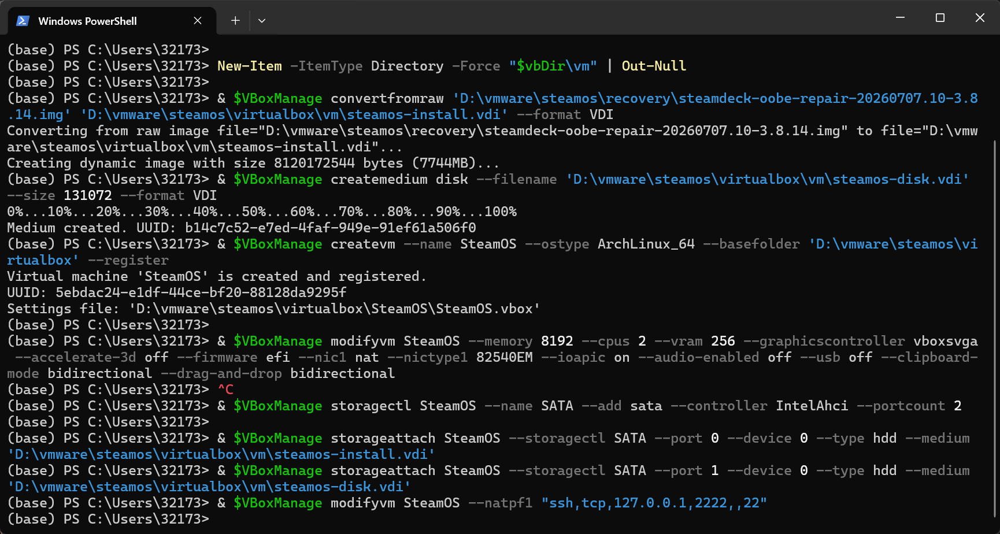
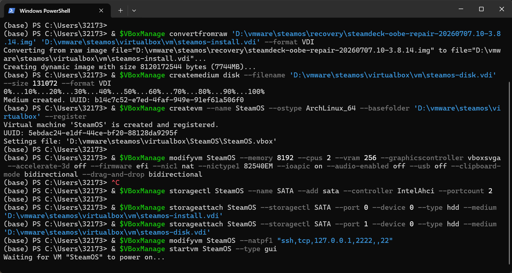
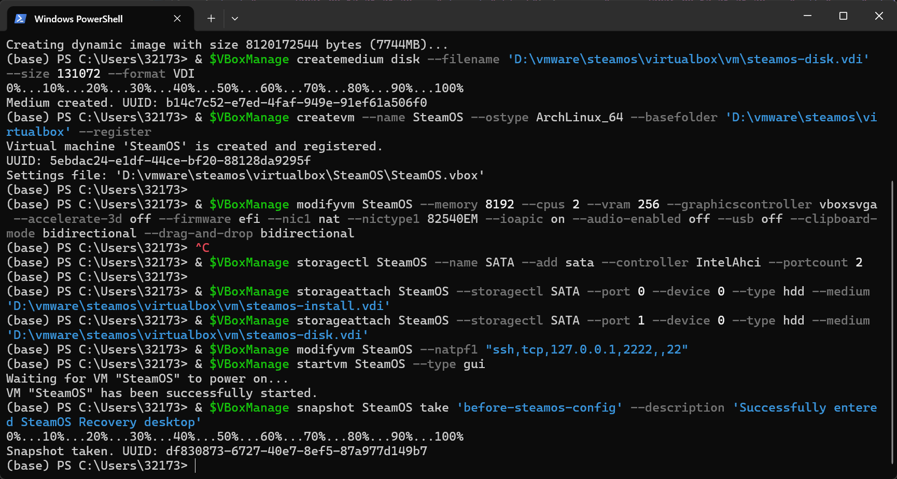

首先从 Oracle 官网下载并安装 VirtualBox。记住下载路径，后面要用。

然后下载 steamos 镜像

<a href="images/2026-09-01-16-40-04.png" target="_blank">  </a>

输入& 'C:\Program Files\7-Zip\7z.exe' t `
'D:\vmware\steamos\steamdeck-oobe-repair-20260707.10-3.8.14.img.zip'
检查下载文件是否正常

输出 Everything is Ok 则为正常
<a href="images/2026-09-13-02-22-36.png" target="_blank">  </a>

下一步解压 Recovery 镜像。在 PowerShell 中执行：

<a href="images/2026-09-13-02-24-25.png" target="_blank">  </a>

现在把 Recovery IMG 转换成 VirtualBox 使用的 VDI

$VBoxManage = 'C:\Program Files\Oracle\VirtualBox\VBoxManage.exe'

$src = 'D:\vmware\steamos\recovery\steamdeck-oobe-repair-20260707.10-3.8.14.img'
$vbDir = 'D:\vmware\steamos\virtualbox'

New-Item -ItemType Directory -Force "$vbDir\vm" | Out-Null

& $VBoxManage convertfromraw 'D:\vmware\steamos\recovery\steamdeck-oobe-repair-20260707.10-3.8.14.img' 'D:\vmware\steamos\virtualbox\vm\steamos-install.vdi' --format VDI

<a href="images/2026-09-13-21-21-25.png" target="_blank">  </a>

下一步创建 128 GiB 动态数据盘，

& $VBoxManage createmedium disk --filename 'D:\vmware\steamos\virtualbox\vm\steamos-disk.vdi' --size 131072 --format VDI
<a href="images/2026-09-13-21-21-39.png" target="_blank">  </a>

下一步创建虚拟机并设置基本硬件。依次执行这两条：

& $VBoxManage createvm --name SteamOS --ostype ArchLinux_64 --basefolder 'D:\vmware\steamos\virtualbox' --register

& $VBoxManage modifyvm SteamOS --memory 8192 --cpus 2 --vram 256 --graphicscontroller vboxsvga --accelerate-3d off --firmware efi --nic1 nat --nictype1 82540EM --ioapic on --audio-enabled off --usb off --clipboard-mode bidirectional --drag-and-drop bidirectional

<a href="images/2026-09-13-21-21-51.png" target="_blank">  </a>

下一步创建 SATA 控制器，并挂载系统盘
& $VBoxManage storagectl SteamOS --name SATA --add sata --controller IntelAhci --portcount 2

& $VBoxManage storageattach SteamOS --storagectl SATA --port 0 --device 0 --type hdd --medium 'D:\vmware\steamos\virtualbox\vm\steamos-install.vdi'

<a href="images/2026-09-13-21-22-14.png" target="_blank">  </a>

下一步挂载数据盘，并设置 SSH 端口转发：
& $VBoxManage storageattach SteamOS --storagectl SATA --port 1 --device 0 --type hdd --medium 'D:\vmware\steamos\virtualbox\vm\steamos-disk.vdi'
& $VBoxManage modifyvm SteamOS --natpf1 "ssh,tcp,127.0.0.1,2222,,22"

<a href="images/2026-09-13-21-22-25.png" target="_blank">  </a>

现在启动虚拟机：
& $VBoxManage startvm SteamOS --type gui

<a href="images/2026-09-13-21-22-39.png" target="_blank">  </a>

现在先创建一个快照
& $VBoxManage snapshot SteamOS take 'before-steamos-config' --description 'Successfully entered SteamOS Recovery desktop'

<a href="images/2026-09-13-21-24-52.png" target="_blank">  </a>

ssh 链接方法

虚拟机内输入

sudo systemctl start sshd

passwd

然后输入密码 123456

宿主机输入

ssh-keygen -R '[127.0.0.1]:2222'

ssh -p 2222 deck@127.0.0.1

为了避免每次虚拟机重启后都要重新启动 SSH，在虚拟机中执行：

```bash
sudo systemctl enable --now sshd
```

执行后可以用下面的命令检查：

```bash
systemctl is-enabled sshd
systemctl is-active sshd
```

输出 `enabled` 和 `active` 就表示 SSH 已经设置为开机自动启动。

接下来处理 SteamOS 的实际安装。Steam Deck Recovery 自带的安装脚本默认按照真实 Steam Deck 的 NVMe 硬盘工作，如果仍然使用 SATA 控制器，脚本识别磁盘时比较容易出问题。因此我后来关闭虚拟机，把 Recovery 盘和 128 GiB 目标盘都改挂到 NVMe 控制器。

先在宿主机中查看当前磁盘和 UUID：

```powershell
& $VBoxManage showvminfo SteamOS
& $VBoxManage list hdds
```

如果前面已经创建过快照，不要直接填写最初 VDI 文件的路径，而要使用 `showvminfo` 中当前实际挂载的磁盘 UUID。关闭虚拟机后创建 NVMe 控制器，并把两块盘从 SATA 控制器移动过去：

```powershell
& $VBoxManage storagectl SteamOS --name NVMe --add pcie --controller NVMe --portcount 2

& $VBoxManage storageattach SteamOS --storagectl SATA --port 0 --device 0 --type hdd --medium none
& $VBoxManage storageattach SteamOS --storagectl SATA --port 1 --device 0 --type hdd --medium none

& $VBoxManage storageattach SteamOS --storagectl NVMe --port 0 --device 0 --type hdd --medium '<Recovery 当前磁盘 UUID>'
& $VBoxManage storageattach SteamOS --storagectl NVMe --port 1 --device 0 --type hdd --medium '<128 GiB 目标磁盘 UUID>'
```

> 如果 NVMe 控制器已经存在，就不要重复执行 `storagectl --add`。这里的两个 UUID 必须以自己执行 `showvminfo` 后看到的结果为准。

重新进入 Recovery 系统后，通过 SSH 执行：

```bash
lsblk -o NAME,SIZE,FSTYPE,LABEL,PARTLABEL,MOUNTPOINTS
```

当两块磁盘都挂在 NVMe 控制器上时，本次安装环境中 Recovery 盘是 `/dev/nvme0n1`，128 GiB 目标盘是 `/dev/nvme0n2`。这里一定要根据容量和分区再次确认，不能只照抄设备名，否则可能清空错误的磁盘。

SteamOS 的修复脚本还会尝试调用真实 NVMe 硬盘支持的 sanitize 操作。VirtualBox 的虚拟 NVMe 磁盘不支持这个功能，脚本会在这里失败。因此我把修改后的脚本保存在：

```text
/home/deck/tools/repair_device.sh
```

修改内容主要有两处：

1. 把安装目标明确设置为 `/dev/nvme0n2`。
2. 跳过真实硬盘的 NVMe sanitize，改用 VirtualBox 虚拟磁盘可以执行的 `wipefs` 和 `dd` 清理分区签名及磁盘开头区域。

清理目标盘时使用的思路如下：

```bash
sudo wipefs -a /dev/nvme0n2
sudo dd if=/dev/zero of=/dev/nvme0n2 bs=1M count=64 conv=fsync
```

确认目标设备无误后运行修改过的修复脚本：

```bash
sudo /home/deck/tools/repair_device.sh
```

脚本执行完成后，再次检查目标盘：

```bash
lsblk -o NAME,SIZE,FSTYPE,LABEL,PARTLABEL,MOUNTPOINTS
```

目标盘出现 ESP、EFI-A、EFI-B、rootfs-A、rootfs-B、var-A、var-B 和 home 等分区，就说明 SteamOS 已经写入完成。本次安装生成了约 117 GiB 的 home 分区。

接下来关闭虚拟机，卸载 Recovery 盘，只保留刚刚安装好的 128 GiB 目标盘，并把目标盘挂到 NVMe 控制器的 0 号端口。再次启动后，系统已经能够从目标盘进入 SteamOS，但画面一直停留在黑屏，看起来像是安装失败。

实际上这次黑屏并不是系统没有安装成功。此时 SSH 仍然可以连接，所以先从宿主机进入系统：

```powershell
ssh -p 2222 deck@127.0.0.1
```

然后检查系统版本、磁盘、显示管理器、Gamescope 和显卡驱动：

```bash
cat /etc/os-release
uname -a
lsblk -o NAME,SIZE,FSTYPE,LABEL,PARTLABEL,MOUNTPOINTS
systemctl status sddm --no-pager -l
systemctl status gamescope-session-plus@deck.service --no-pager -l
lspci -nnk | grep -A4 -Ei 'VGA|Display|3D'
sudo journalctl -b -p warning..alert --no-pager -n 250
```

检查结果可以确认以下几点：

- SteamOS 3.8.14 已经安装完成，Build 为 `20260707.10`。
- 系统能够正常挂载 rootfs、var 和 home 分区。
- VirtualBox 提供的是 `VirtualBox Graphics Adapter`，使用 `vboxvideo` 驱动。
- SDDM 已经启动，但默认的 Gaming Mode 会反复启动并崩溃。
- 日志中出现了 `gamescope-session.service`、`status=6/ABRT`、`vkCreateInstance` 和 `libVkLayer_FROG_gamescope_wsi_x86_64.so` 等错误。

SteamOS 的 Gaming Mode 使用 Gamescope，并依赖受支持的 Vulkan 显卡。VirtualBox 的虚拟显卡无法提供 Steam Deck 所需的 AMD GPU 和 Vulkan 环境，因此 Gamescope 在创建 Vulkan 实例时崩溃，最终只留下黑屏。

也就是说，问题不是 SteamOS 没有装好，而是 SteamOS 默认进入的 Gaming Mode 不兼容 VirtualBox。解决方法是跳过 Gamescope，把默认会话永久改成 KDE Plasma X11 桌面。

在 SSH 中执行：

```bash
steamosctl set-default-login-mode desktop
steamosctl set-default-desktop-session plasmax11.desktop
sudo systemctl restart sddm
```

然后检查生成的 SDDM 自动登录配置：

```bash
grep -R '^Session=' /etc/sddm.conf.d/zz-steamos-autologin.conf
```

输出如下：

```text
Session=plasmax11.desktop
```

再检查 Plasma X11 是否已经真正启动：

```bash
systemctl status sddm --no-pager -l
ps -eo comm,args | grep -E 'Xorg|startplasma-x11|kwin_x11' | grep -v grep
```

正常情况下可以看到以下进程：

```text
/usr/lib/Xorg
/usr/bin/startplasma-x11
/usr/bin/kwin_x11 --replace
```

这时 VirtualBox 中原来的黑屏会变成正常的 Plasma 桌面，Steam 客户端也可以正常打开登录页面。

为了确认这不是临时生效，再执行一次重启：

```bash
sudo reboot
```

重启后重新连接 SSH，并执行：

```bash
steamosctl get-default-login-mode
grep -R '^Session=' /etc/sddm.conf.d/zz-steamos-autologin.conf
systemctl is-active sddm sshd
ps -eo comm,args | grep -E 'Xorg|startplasma-x11|kwin_x11' | grep -v grep
findmnt -no SOURCE,TARGET /
```

本次验证结果为：

```text
desktop
Session=plasmax11.desktop
active
active
/dev/nvme0n1p5 /
```

说明重启后仍然会自动进入 Plasma X11，SSH 也会自动启动。卸载 Recovery 盘后，安装完成的目标盘会从原来的 `/dev/nvme0n2` 变成 `/dev/nvme0n1`，这是正常现象。

最后在宿主机中创建一个安装完成后的快照：

```powershell
& $VBoxManage snapshot SteamOS take 'steamos-installed-plasma-x11' --description 'SteamOS 3.8.14 installed; Plasma X11 selected because Gamescope/Vulkan is incompatible with VirtualBox' --live
```

最终安装结果：

- SteamOS 3.8.14 已经成功安装到 128 GiB 虚拟磁盘。
- 系统可以正常启动和重启。
- Plasma X11 桌面可以正常显示。
- Steam 客户端可以正常打开登录页面。
- SSH 可以通过宿主机的 `127.0.0.1:2222` 连接，并且已经设置为开机自动启动。
- VirtualBox 中不能使用 SteamOS Gaming Mode，因为 Gamescope 所需的 Vulkan GPU 环境不受支持。

桌面上的 **Return to Gaming Mode** 不要点击。点击后系统会再次尝试启动 Gamescope，并可能重新进入黑屏。在 VirtualBox 中测试 SteamOS 时，直接使用 Plasma X11 桌面和桌面版 Steam 即可。

更多虚拟机系统部署方案请返回[虚拟机系统部署指南](/p/virtual-machine-system-setup-guide/)。
