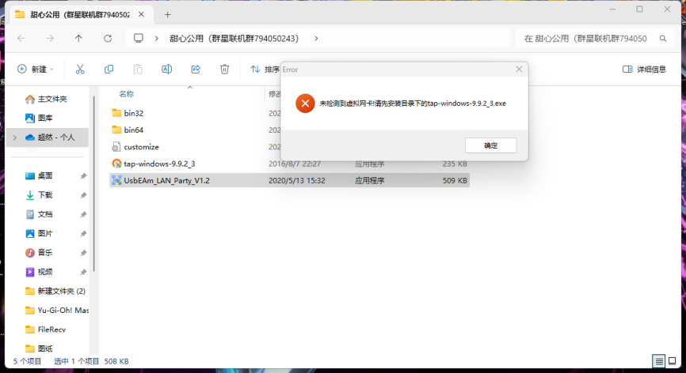
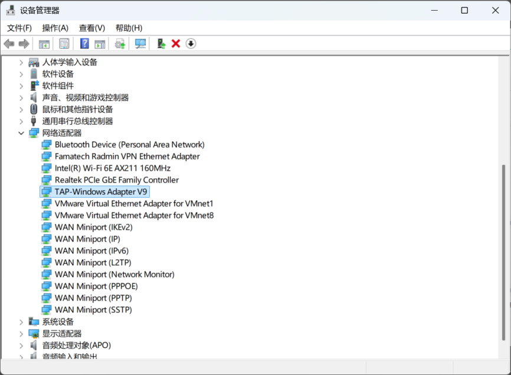

---
title: "已经安装网卡但是仍报错”未检测到虚拟网卡！请先安装目录下的 tap-windows-9.9.2.3.exe”"
date: 2026-07-15
description: "已经安装网卡但是仍报错”未检测到虚拟网卡！请先安装目录下的 tap-windows-9.9.2.3.exe”的排查与解决方法，整理常见原因、操作步骤和相关报错截图。"
categories:
  - "报错"
tags:
  - "群星"
  - "联机"
  - "虚拟网卡"
  - "网络故障"
  - "问题排查"
draft: false
slug: "multiplayer-accelerator-error-02"
---

> 本文整理自《群星常见问题合集及解决办法》，原作者：唏嘘南溪。文档内容会随实际反馈持续修正。

## 1. 报错现象

已经安装网卡但是仍报错”未检测到虚拟网卡！请先安装目录下的 tap-windows-9.9.2.3.exe”。

## 2. 解决方法

出现该问题通常是因为电脑上安装了某些可能影响网卡的软件，如银行业务程序等。这些软件可能会屏蔽虚拟网卡（例如 VPN、虚拟机或其他网络虚拟化工具），以防范安全风险或欺诈行为。解决方法是卸载这些软件，若卸载后问题仍未解决，请尝试重启电脑。如果某些软件对您非常重要，无法卸载，建议换用其他设备进行游戏。

## 3. 仍未解决

如果上述方法不适用，建议记录完整报错文字、复现步骤和 `error.log` 内容后再进一步排查。也可以联系原文作者（QQ：3217344726）反馈，以便补充或修正方案。

