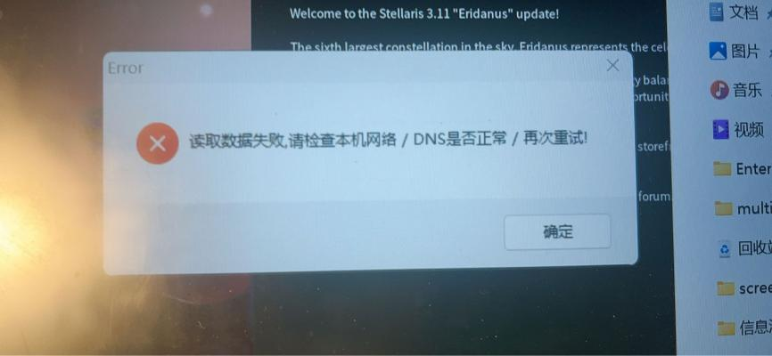
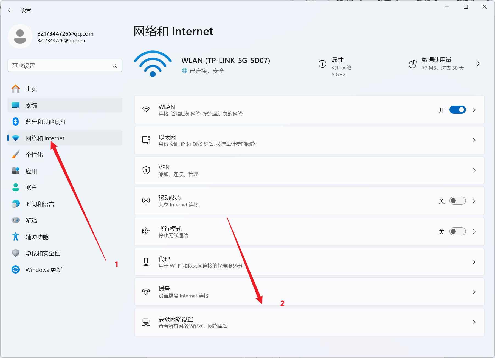
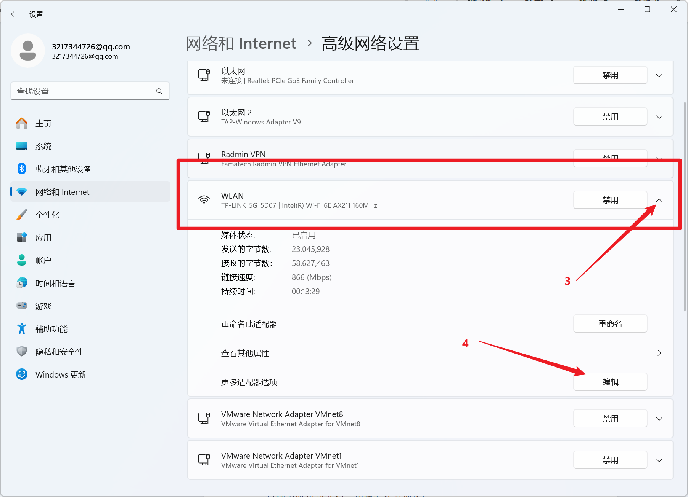
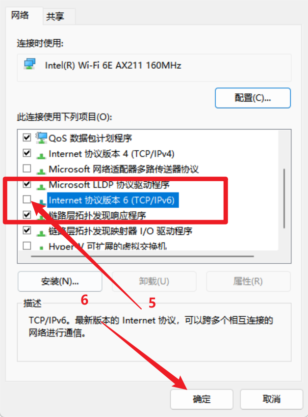

---
title: "联机加速器打开时报错：读取数据失败，请检查本机网络/DNS 是否正常/再次重试！"
date: 2026-07-15
description: "联机加速器打开时报错：读取数据失败，请检查本机网络/DNS 是否正常/再次重试！的排查与解决方法，整理常见原因、操作步骤和相关报错截图。"
categories:
  - "报错"
tags:
  - "群星"
  - "联机"
  - "虚拟网卡"
  - "网络故障"
  - "问题排查"
draft: false
slug: "multiplayer-accelerator-error-03"
---

> 本文整理自《群星常见问题合集及解决办法》，原作者：唏嘘南溪。文档内容会随实际反馈持续修正。

## 1. 报错现象

联机加速器打开时报错：读取数据失败，请检查本机网络/DNS 是否正常/再次重试!。

## 2. 解决方法

首先打开设置，选择网络和 Internet，点击高级网络设置

找到你当前使用的网络，点击小三角展开详细信息，点击更多适配选项后的编辑按钮

在弹出的窗口中取消勾选 ipv6，然后点击确定保存设置

## 3. 仍未解决

如果上述方法不适用，建议记录完整报错文字、复现步骤和 `error.log` 内容后再进一步排查。也可以联系原文作者（QQ：3217344726）反馈，以便补充或修正方案。
