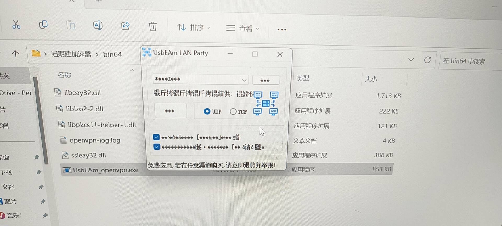
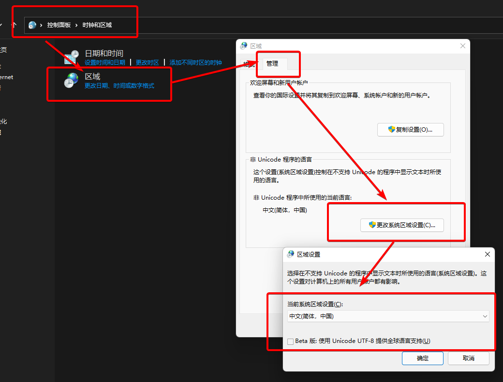

---
title: "联机加速器打开后乱码"
date: 2026-07-15
description: "联机加速器打开后乱码的排查与解决方法，整理常见原因、操作步骤和相关报错截图。"
categories:
  - "报错"
tags:
  - "群星"
  - "联机"
  - "虚拟网卡"
  - "网络故障"
  - "问题排查"
draft: false
slug: "multiplayer-accelerator-error-04"
---

> 本文整理自《群星常见问题合集及解决办法》，原作者：唏嘘南溪。文档内容会随实际反馈持续修正。

## 1. 报错现象

联机加速器打开后乱码。

## 2. 解决方法

打开控制面板->区域->管理->更改系统区域设置，选择中文 (简体，中国),并且不要打钩 beta 选项。

## 3. 仍未解决

如果上述方法不适用，建议记录完整报错文字、复现步骤和 `error.log` 内容后再进一步排查。也可以联系原文作者（QQ：3217344726）反馈，以便补充或修正方案。

