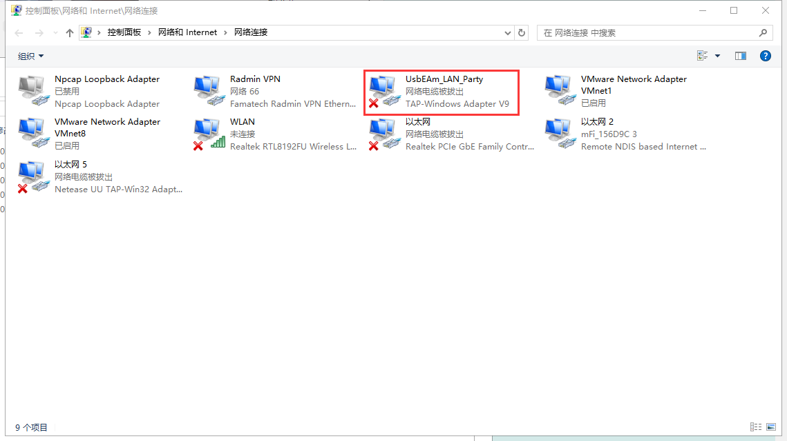
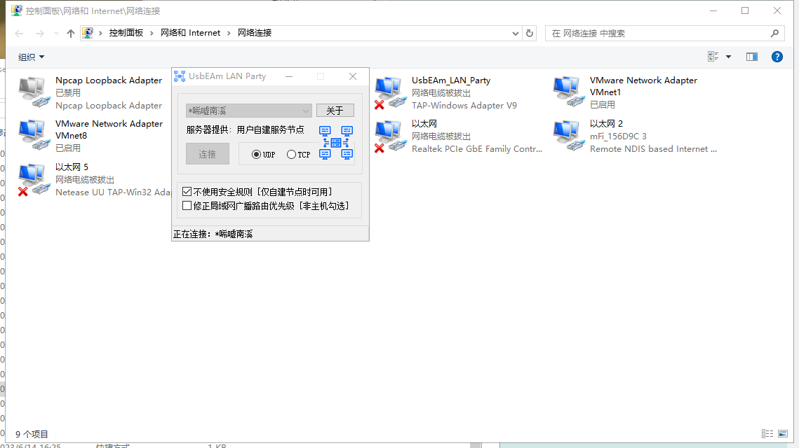

---
title: "在适配器设置中看网络电缆被拔出，启动加速器连接不到服务器"
date: 2026-07-15
description: "在适配器设置中看网络电缆被拔出，启动加速器连接不到服务器的排查与解决方法，整理常见原因、操作步骤和相关报错截图。"
categories:
  - "报错"
tags:
  - "联机加速器"
  - "联机失败"
  - "虚拟网卡"
  - "网络故障"
draft: false
slug: "multiplayer-accelerator-error-05"
related_group: "multiplayer-accelerator"
hidden: true
searchable: true
guide: "/p/multiplayer-accelerator-troubleshooting-guide/"
guide_title: "联机加速器常见问题解决指南"
---

> 本文整理自《群星常见问题合集及解决办法》，原作者：唏嘘南溪。文档内容会随实际反馈持续修正。

## 1. 报错现象

在适配器设置中看网络电缆被拔出，启动加速器连接不到服务器。

## 2. 解决方法

虚拟网卡在加速器没连上时显示被拔出是正常现象，连接不上节点多半是配置文件过时了，加速器节点的服务器或者密码换了你不知道，去下载最新的加速器即可。

## 3. 仍未解决

如果上述方法不适用，建议记录完整报错文字、复现步骤和 `error.log` 内容后再进一步排查。也可以联系原文作者（QQ：3217344726）反馈，以便补充或修正方案。

