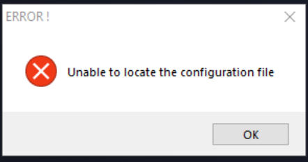
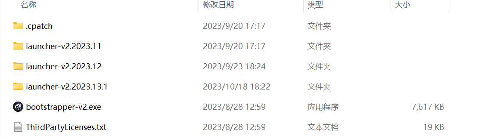

---
title: "打开启动器时报错无法找到配置文件。”Unable to locate the configuration file”"
date: 2026-07-15
description: "打开启动器时报错无法找到配置文件。”Unable to locate the configuration file”的排查与解决方法，整理常见原因、操作步骤和相关报错截图。"
categories:
  - "报错"
tags:
  - "P 社启动器"
  - "配置文件"
  - "启动器故障"
draft: false
slug: "paradox-launcher-error-02"
related_group: "paradox-launcher"
---

> 本文整理自《群星常见问题合集及解决办法》，原作者：唏嘘南溪。文档内容会随实际反馈持续修正。

## 1. 报错现象

打开启动器时报错无法找到配置文件。”Unable to locate the configuration file”。

## 2. 解决方法

很大概率因为是启动器版本更新了，生成了新的文件夹，你之前打的启动器 dlc 补丁还在旧文件夹里。这个问题按照教程重新在新文件里打一遍补丁就好了，比如之前在 2023.12 文件夹里打了补丁，启动器更新后在 2023.13.1 文件夹里重新打一遍即可，如果最新版本的文件夹里没有 resource 文件夹，说明你的启动器还没有更新到这个版本，按照日期找第二新的文件夹即可，如果分不清哪个是最新的就把能打补丁的文件都打一遍补丁。不过从 2024 版本的启动器开始这个报错可能移除了，改为了本节第 3 条报错。

## 3. 仍未解决

如果上述方法不适用，建议记录完整报错文字、复现步骤和 `error.log` 内容后再进一步排查。也可以联系原文作者（QQ：3217344726）反馈，以便补充或修正方案。

