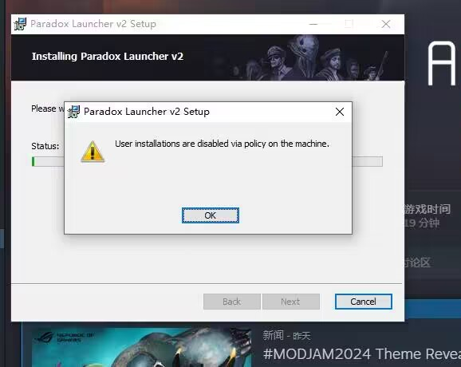

---
title: "安装启动器遇到报错由于机器上的策略限制，用户安装已被禁用。”User installations are disabled via policy on the machine.”"
date: 2026-07-15
description: "安装启动器遇到报错由于机器上的策略限制，用户安装已被禁用。”User installations are disabled via policy on the machine.”的排查与解决方法，整理常见原因、操作步骤和相关报错截图。"
categories:
  - "报错"
tags:
  - "Paradox Launcher"
  - "P 社启动器"
  - "启动器故障"
  - "问题排查"
  - "Windows"
draft: false
slug: "paradox-launcher-error-04"
---

> 本文整理自《群星常见问题合集及解决办法》，原作者：唏嘘南溪。文档内容会随实际反馈持续修正。

## 1. 报错现象

安装启动器遇到报错由于机器上的策略限制，用户安装已被禁用。”User installations are disabled via policy on the machine.”。

## 2. 解决方法

解决方法一：

1、win+R 后在运行里输入 gpedit.msc

2、计算机配置管理>>管理模板>>windows 组件>>windows Installer>>禁止用户安装;

3、打开它禁用此项就可以了。

若方法一不行，请使用方法二：

win+R 后在运行里输入 regedit

进入注册表目录：

HKEY_LOCAL_MACHINE\SOFTWARE\Policies\Microsoft\Windows\Installer，将 DisableUserlnstalls 的值改为 0 再安装即可

## 3. 仍未解决

如果上述方法不适用，建议记录完整报错文字、复现步骤和 `error.log` 内容后再进一步排查。也可以联系原文作者（QQ：3217344726）反馈，以便补充或修正方案。
