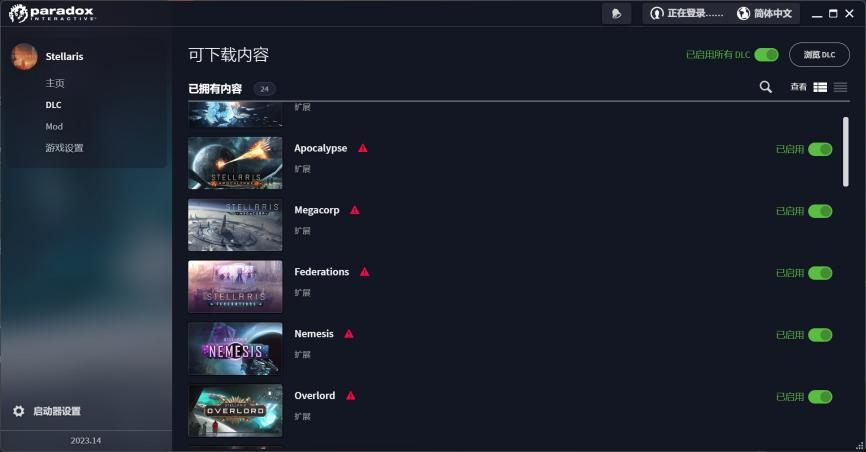

---
title: "启动器 DLC 列表出现警告，无法确认此 DLC 的拥有者"
date: 2026-07-15
description: "启动器 DLC 列表出现警告，无法确认此 DLC 的拥有者的排查与解决方法，整理常见原因、操作步骤和相关报错截图。"
categories:
  - "报错"
tags:
  - "Paradox Launcher"
  - "P 社启动器"
  - "启动器故障"
  - "问题排查"
draft: false
slug: "paradox-launcher-error-05"
---

> 本文整理自《群星常见问题合集及解决办法》，原作者：唏嘘南溪。文档内容会随实际反馈持续修正。

## 1. 报错现象

启动器 DLC 列表出现警告，无法确认此 DLC 的拥有者。

## 2. 解决方法

正常情况不影响使用，只是不美观，想消掉这个警告可以看教程视频，跟着操作一遍就好

【【群星教程】群星 Stellaris-V3.14.1DLC 保姆级安装演示】https://www.bilibili.com/video/BV1rW4vetEEN/?share_source=copy_web&vd_source=04becf7d20fdc437d804d92aa7ca4370

## 3. 仍未解决

如果上述方法不适用，建议记录完整报错文字、复现步骤和 `error.log` 内容后再进一步排查。也可以联系原文作者（QQ：3217344726）反馈，以便补充或修正方案。
