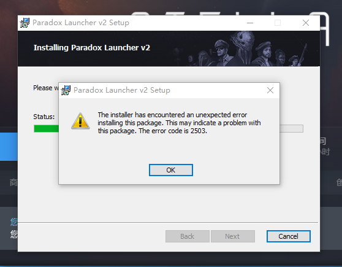
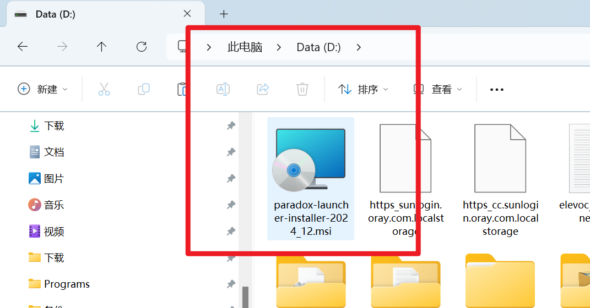
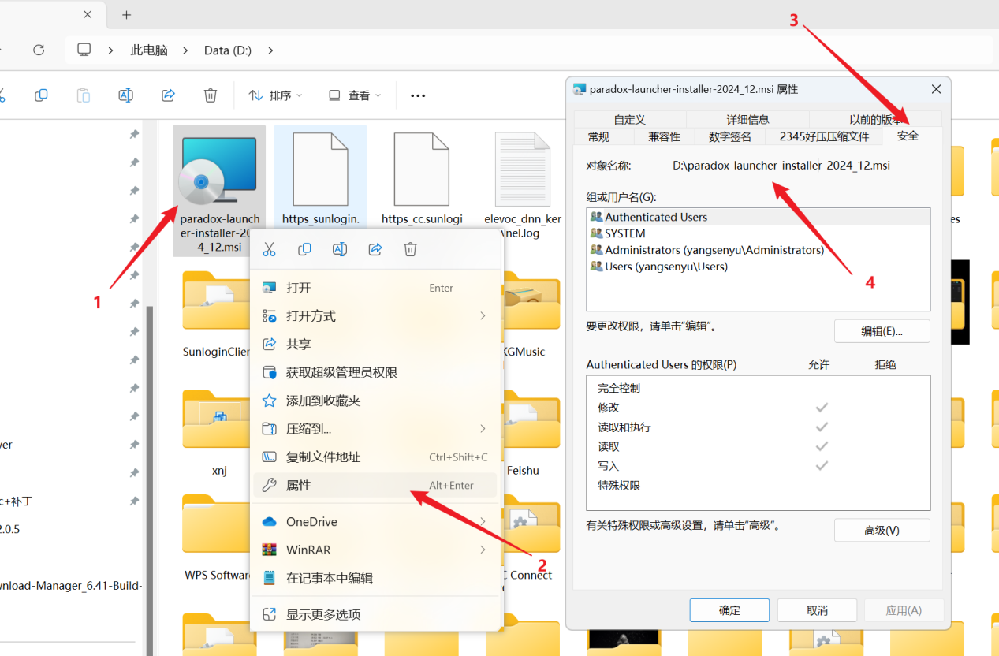
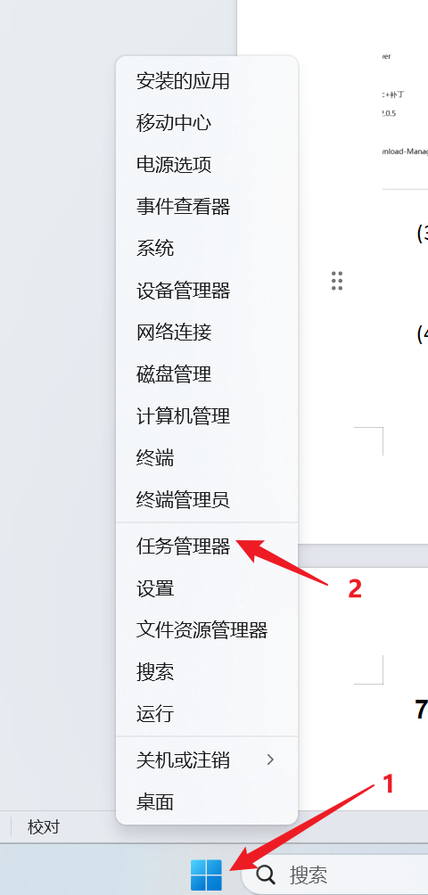
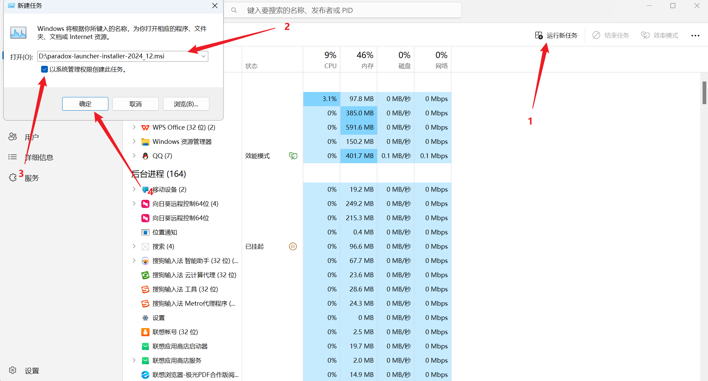
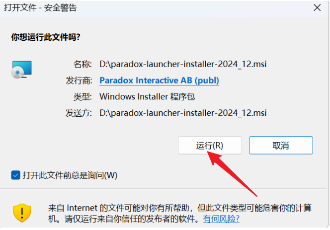

---
title: "启动器安装报错 2503"
date: 2026-07-15
description: "启动器安装报错 2503 的排查与解决方法，整理常见原因、操作步骤和相关报错截图。"
categories:
  - "报错"
tags:
  - "P 社启动器"
  - "安装失败"
  - "启动器故障"
draft: false
slug: "paradox-launcher-error-06"
related_group: "paradox-launcher"
---

> 本文整理自《群星常见问题合集及解决办法》，原作者：唏嘘南溪。文档内容会随实际反馈持续修正。

## 1. 报错现象

启动器安装报错 2503。

## 2. 解决方法

将安装包移动至 D 盘盘符下，方便操作

右键点击安装包，点击属性，选择安全选项卡，复制这里的路径，比如我这里的路径是 D:\paradox-launcher-installer-2024_12.msi

同时按下 Shift+Ctrl+Esc，或者右键 windows，点击任务管理器选项打开任务管理器 (以任何方式打开任务管理器都可以),点击运行新任务，在文本框内输入刚刚复制的路径，勾选以系统管理员权限创建此任务，然后点击确定，之后跟着安装流程正常安装即可。

## 3. 仍未解决

如果上述方法不适用，建议记录完整报错文字、复现步骤和 `error.log` 内容后再进一步排查。也可以联系原文作者（QQ：3217344726）反馈，以便补充或修正方案。

