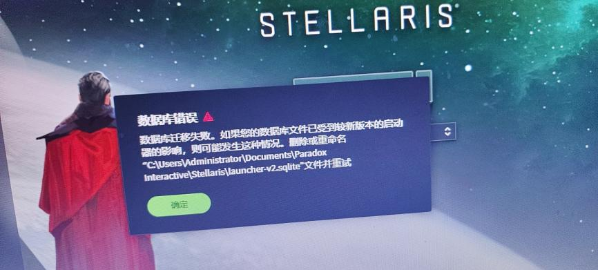

---
title: "启动器数据库错误，数据库迁移失败"
date: 2026-07-15
description: "启动器数据库错误，数据库迁移失败的排查与解决方法，整理常见原因、操作步骤和相关报错截图。"
categories:
  - "报错"
tags:
  - "P 社启动器"
  - "数据库错误"
  - "启动器故障"
draft: false
slug: "paradox-launcher-error-07"
related_group: "paradox-launcher"
hidden: true
searchable: true
guide: "/p/paradox-launcher-troubleshooting-guide/"
guide_title: "P 社启动器报错解决指南"
---

> 本文整理自《群星常见问题合集及解决办法》，原作者：唏嘘南溪。文档内容会随实际反馈持续修正。

## 1. 报错现象

启动器数据库错误，数据库迁移失败。

## 2. 解决方法

该问题一般出现在安装新启动器之后，在大部分情况下，关闭启动器重新启动后该报错会消失。如果该报错频繁弹出，可根据报错提示，按照路径前往文件夹

C:\用户\（你的用户名）\文档\Paradox Interactive\Stellaris

找到文件 launcher-v2.sqlite，然后删除掉它，之后重新启动启动器，问题解决。

## 3. 仍未解决

如果上述方法不适用，建议记录完整报错文字、复现步骤和 `error.log` 内容后再进一步排查。也可以联系原文作者（QQ：3217344726）反馈，以便补充或修正方案。

