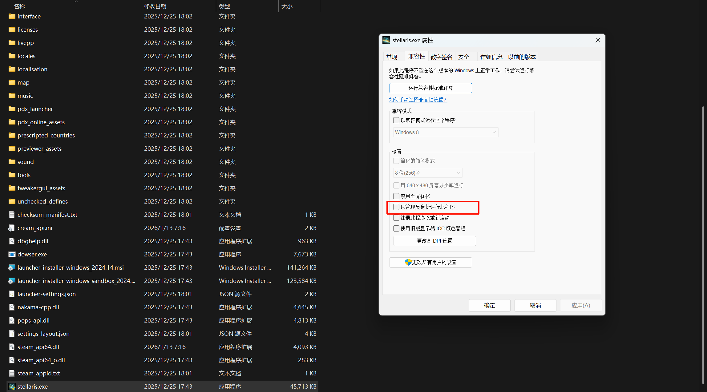
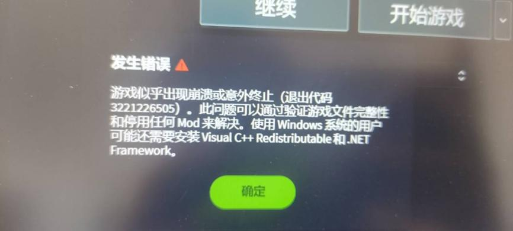
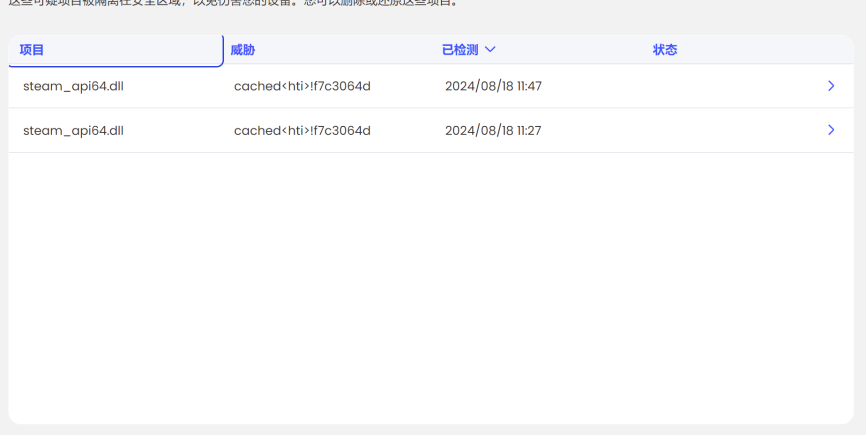
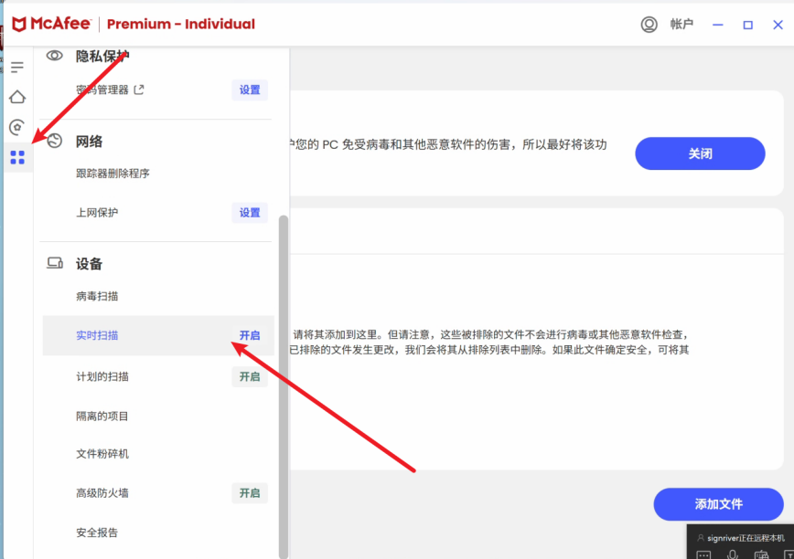
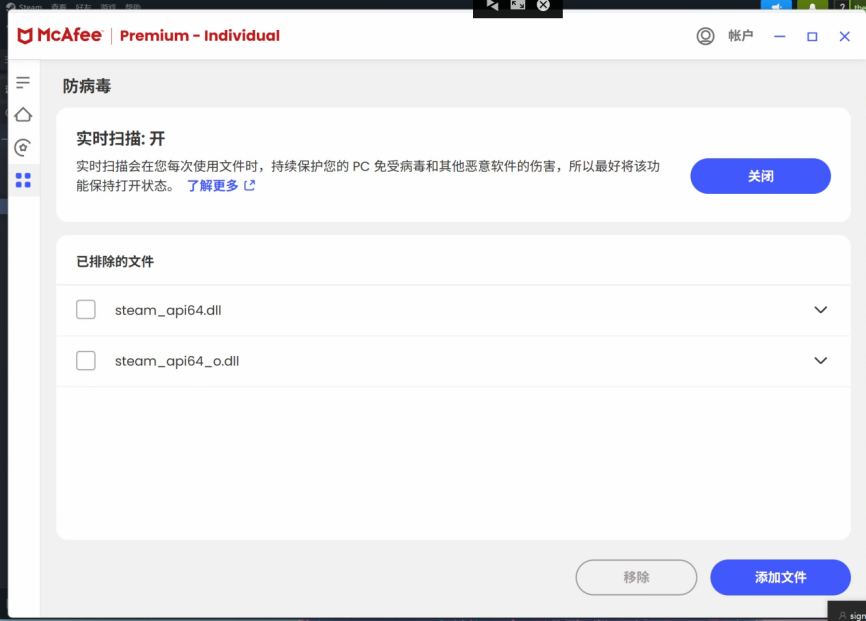
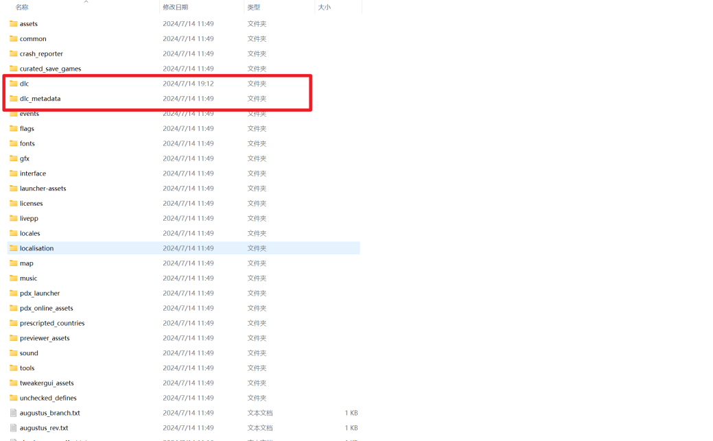
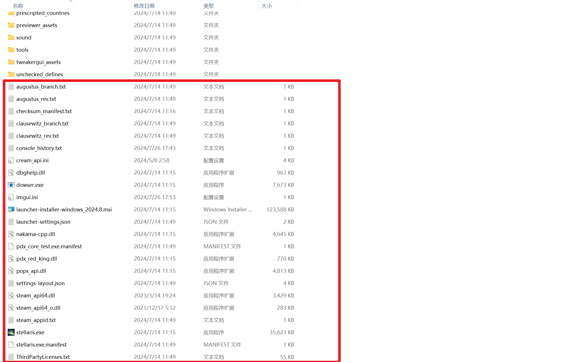
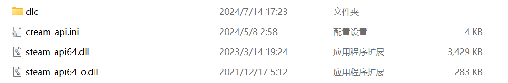
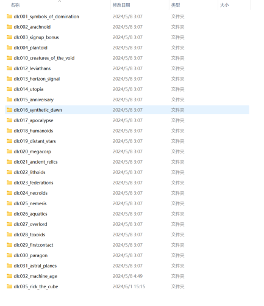
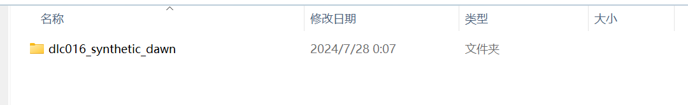

---
title: "游戏似乎出现崩溃或意外终止，缺少.NET Framework 等"
date: 2026-07-15
description: "游戏似乎出现崩溃或意外终止，缺少.NET Framework 等的排查与解决方法，整理常见原因、操作步骤和相关报错截图。"
categories:
  - "报错"
tags:
  - "Paradox Launcher"
  - "P 社启动器"
  - "启动器故障"
  - "问题排查"
draft: false
slug: "paradox-launcher-error-09"
---

> 本文整理自《群星常见问题合集及解决办法》，原作者：唏嘘南溪。文档内容会随实际反馈持续修正。

## 1. 报错现象

游戏似乎出现崩溃或意外终止，缺少.NET Framework 等。

## 2. 解决方法

首先这个报错有两种情况，第一种情况，退出代码是 null:

遇到这个报错，去查看一下你的 stellaris.exe 的权限设置的是不是以管理员身份启动，如果是的话就把以管理员身份启动关掉，因为启动器是普通用户身份而 stellaris.exe 是管理员，导致启动器没有权限去调用 stellaris.exe

第二种情况，退出代码是一串数字：

如果你没有购买游戏本体，那可能是游戏存放路径有中文导致的

如果你购买了游戏本体，但刚下载没有安装凝聚力 dlc 则：

优先更新显卡驱动，如果还不行则在启动器中将显示模式修改为无边框全屏

如果你安装了凝聚力 dlc，则：

出现该报错的原因种类繁多，根本原因是游戏文件缺失或损坏，给出以下两个大类，几个方案，请根据自身情况选择对应方法：

第一大类：设备上有杀毒软件，隔离了补丁导致报错

感谢群友”猪 1226211946”提供的问题解决方案

对于设备上存在杀毒软件的朋友可以检查一下杀毒软件是否拦截了游戏程序或者游戏文件，比如目前已知的会隔离游戏补丁的杀毒软件迈克菲 (McAfee)(如下图所示)

杀毒软件隔离补丁可能会出现第一天刚打完补丁可以正常使用 dlc，但第二天重新登录的时候 dlc 消失的情况，如果确定是杀毒软件导致该报错，在杀毒软件中关闭实时扫描即可。如果不想删杀毒软件可以把文件添加进白名单，下面演示一下迈菲克的添加白名单操作过程：

把补丁移动到 stellaris 根目录以后通过以下操作把补丁加入白名单

第二大类：补丁方面出了问题导致文件缺失

打补丁时打错了位置导致报错，如果你只打过一次补丁，可以对照着下载的补丁把游戏根目录里刚打的补丁文件和文件夹全部删掉，在 Steam 里右键 stellaris->属性->已安装文件->验证文件完整性后，根据正确流程重新打一遍补丁。

曾经多次打补丁，打过各种来源的不同补丁，如不同种类的 dlc 补丁，不同类型的联机补丁等，到最后不同补丁相互冲突，游戏直接崩溃。解决方法（感谢群友浅浅提供的方法），首先删除 dlc 和 dlc_metadata 文件夹 (图一),然后删除下面所有的文件 (图二),之后去 Steam 里右键 stellaris->属性->已安装文件->验证文件完整性把缺失的游戏文件补回来，最后重新打一遍补丁和 dlc。此举的目的是在保证能清除掉杂乱的补丁文件的同时尽可能少的删除文件，减少之后重新下载文件的时间。如果觉得不保险，可以选择记住 stellaris 根目录文件夹的位置，直接卸载 stellaris，然后回到 stellaris 根目录文件夹，删除文件夹内剩余的所有文件，之后重新下载 stellaris，打一遍补丁。

打了不正确的补丁导致报错出现。当上述两种方法都解决不了问题的时候，就要从外部来找原因了。正常情况下补丁包由三个补丁文件和一个 dlc 文件夹组成 (图 1),打开 dlc 文件夹后可以看到所有 dlc 文件 (图 2),打开任意 dlc 文件后里面是 dlc 的子文件 (图 3)。如果补丁包内部出现了问题，比如图二的 dlc16 打开之后不是像图三这样的子文件，而是像图四这样，里面还有一个文件夹，说明该 dlc 多嵌套了一层，这样的补丁打完就会报错，解决方法为找到补丁的发布者，告知错误类型并寻求正确的补丁包，之后重复第 2 步，清除干净之前的补丁后打上新的补丁包。

图 1

图 2 图 3

图 4

## 3. 仍未解决

如果上述方法不适用，建议记录完整报错文字、复现步骤和 `error.log` 内容后再进一步排查。也可以联系原文作者（QQ：3217344726）反馈，以便补充或修正方案。
