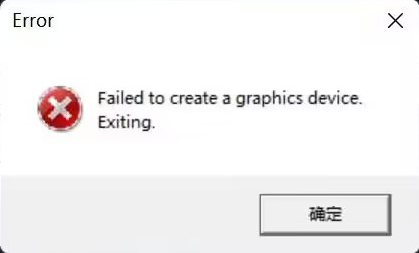
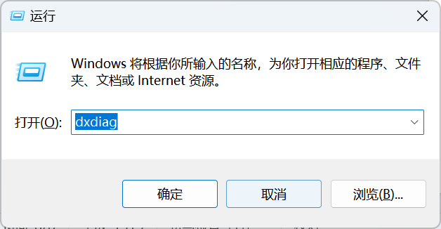
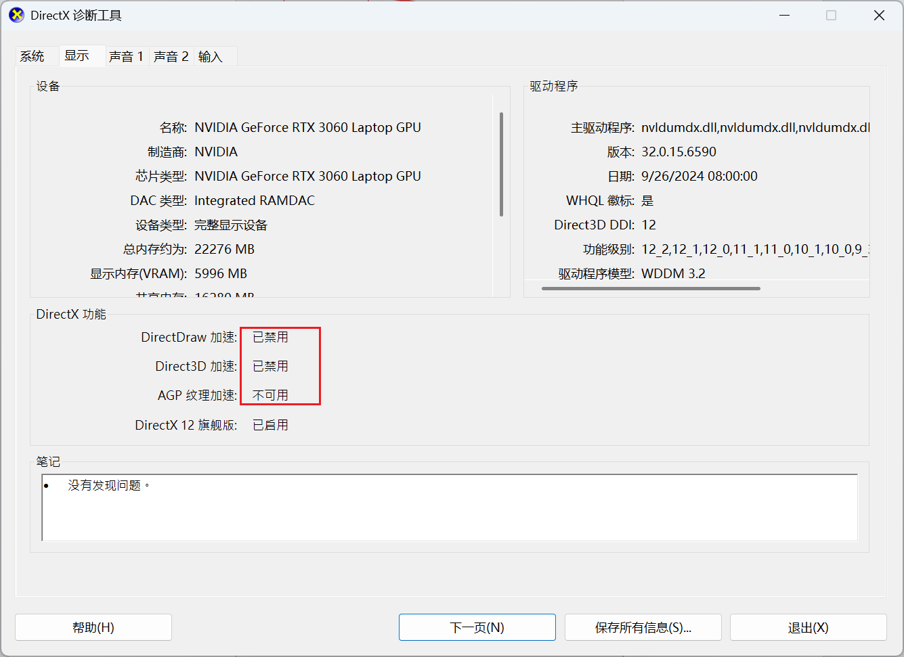
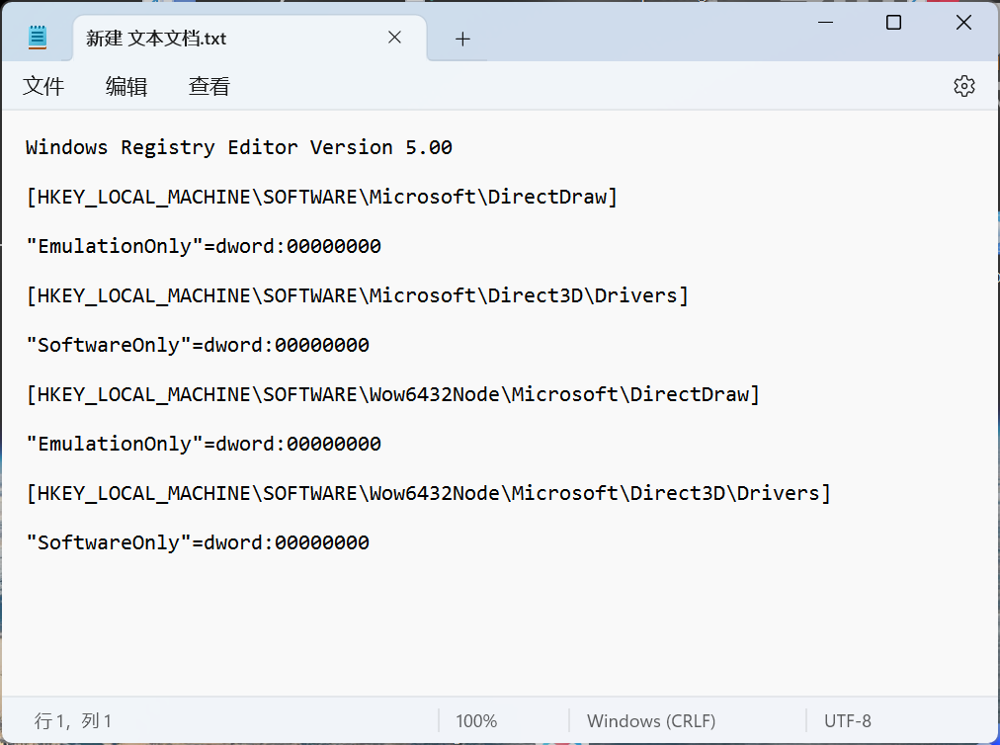
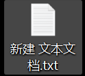
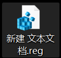
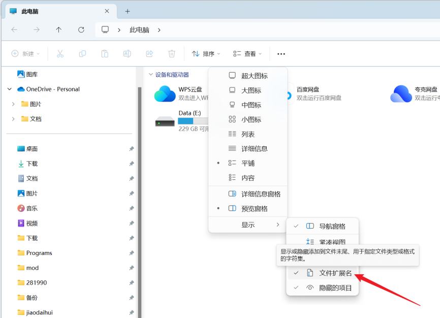

---
title: "启动游戏报错无法创建图形设备:Failed to create a graphics device."
date: 2026-07-15
description: "启动游戏报错无法创建图形设备:Failed to create a graphics device.的排查与解决方法，整理常见原因、操作步骤和相关报错截图。"
categories:
  - "报错"
tags:
  - "P 社启动器"
  - "启动失败"
  - "显示异常"
  - "DirectX"
draft: false
slug: "paradox-launcher-error-10"
related_group: "paradox-launcher"
---

> 本文整理自《群星常见问题合集及解决办法》，原作者：唏嘘南溪。文档内容会随实际反馈持续修正。

## 1. 报错现象

启动游戏报错无法创建图形设备:Failed to create a graphics device.。

## 2. 解决方法

方法一：最实用的办法，如果以前能打开游戏，这次突然打不开游戏了，那就重启电脑，多重启几次，大概率解决该问题，如果不行，再试方法二。

方法二：首先同时按【WIN+R】键，打开【运行】对话框。输入【dxdiag】，点【确定】打开【directx 诊断工具】。

在【directx 诊断工具】中切换到【显示】选项卡，如果这三项不是已启用说明出现了问题。

首先在桌面空白处右键选择【新建】-【文本文档】,在文档内输入以下内容后保存

Windows Registry Editor Version 5.00

[HKEY_LOCAL_MACHINE\SOFTWARE\Microsoft\DirectDraw]

"EmulationOnly"=dword:00000000

[HKEY_LOCAL_MACHINE\SOFTWARE\Microsoft\Direct3D\Drivers]

"SoftwareOnly"=dword:00000000

[HKEY_LOCAL_MACHINE\SOFTWARE\Wow6432Node\Microsoft\DirectDraw]

"EmulationOnly"=dword:00000000

[HKEY_LOCAL_MACHINE\SOFTWARE\Wow6432Node\Microsoft\Direct3D\Drivers]

"SoftwareOnly"=dword:00000000

将文件名后缀改为.reg 后双击运行该文件，点击确定即可

如果你的文件没有拓展名，打开文件资源管理器，点击【查看】，【显示】，勾选【文件拓展名】即可

之后重复最开始的步骤打开【directx 诊断工具】查看是否修改成功。

如果没有生效可能是系统版本过旧不支持无 BOM 的 UTF-8，可以把记事本保存的格式改为 ANSI 后保存并重新运行。

如果采用此方法未成功修改注册表，可以选择手动修改，修改前记得备份注册表以备不测。

## 3. 仍未解决

如果上述方法不适用，建议记录完整报错文字、复现步骤和 `error.log` 内容后再进一步排查。也可以联系原文作者（QQ：3217344726）反馈，以便补充或修正方案。

