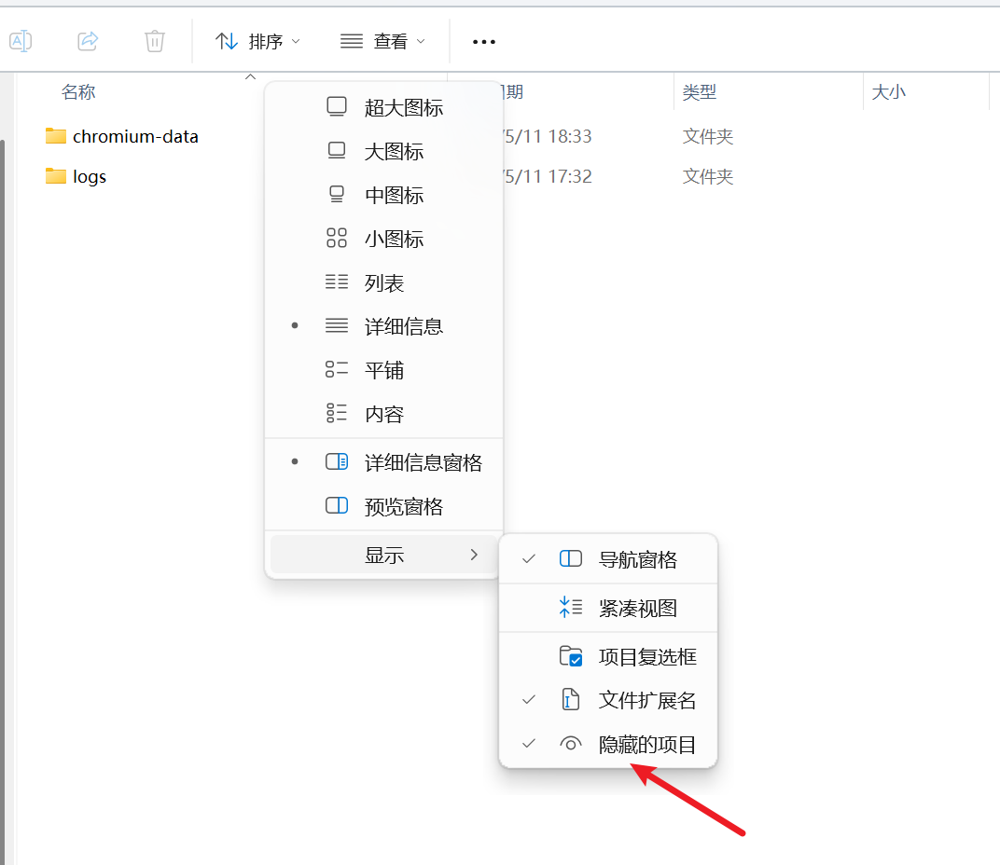
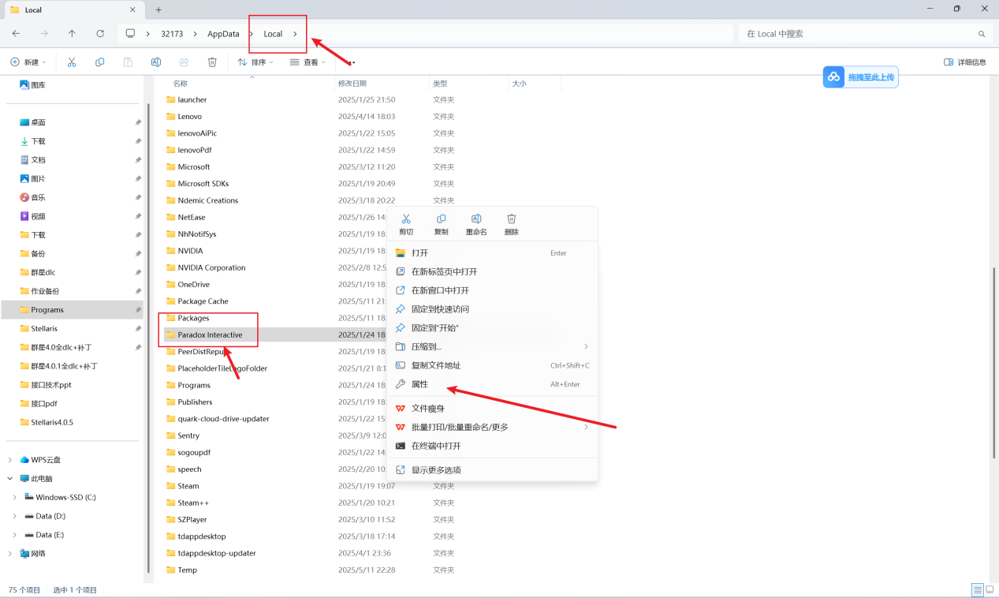

---
title: "安装启动器时报错”Windows Installer 打开安装日志文件时发生错误。请检查指定的日志文件位置是否存在并且可以写入”"
date: 2026-07-15
description: "安装启动器时报错”Windows Installer 打开安装日志文件时发生错误。请检查指定的日志文件位置是否存在并且可以写入”的排查与解决方法，整理常见原因、操作步骤和相关报错截图。"
categories:
  - "报错"
tags:
  - "P 社启动器"
  - "安装失败"
  - "Windows Installer"
draft: false
slug: "paradox-launcher-error-11"
related_group: "paradox-launcher"
---

> 本文整理自《群星常见问题合集及解决办法》，原作者：唏嘘南溪。文档内容会随实际反馈持续修正。

## 1. 报错现象

安装启动器时报错”Windows Installer 打开安装日志文件时发生错误。请检查指定的日志文件位置是否存在并且可以写入”。

## 2. 解决方法

首先找到你安装 p 社启动器的位置，比如我安装启动器时没有改过默认的下载路径，那么启动器的日志路径就为

C:\Users\(你的用户名)\AppData\Local\Paradox Interactive\launcher-v2\logs

其中 AppData 为隐藏文件夹，需要在查看->显示中勾选显示隐藏文件才能看到，操作如下图所示：

找到日志文件夹后回退到 Local 文件夹，右键刚才进入的 Paradox Interactive 文件夹，点击属性

切换到“安全”选项卡，点击编辑

选择当前使用的账户或“Everyone”。如果不确定使用的是哪个账户，也不必担心，可以逐一修改所有账户的权限，简单来说就是全改。然后勾选“完全控制”下的“允许”单选框，勾选后其他“允许”框会自动选中。最后点击“确定”。我的电脑上由于文档权限继承自上级文件夹，所以选项是灰色的。如果你是根据报错条目找到这个解决方案的，那你的情况应该是单选框没有勾选，勾选后会显示绿色，和图片中的颜色不同，但不用担心，按照前面说的操作即可。

## 3. 仍未解决

如果上述方法不适用，建议记录完整报错文字、复现步骤和 `error.log` 内容后再进一步排查。也可以联系原文作者（QQ：3217344726）反馈，以便补充或修正方案。

