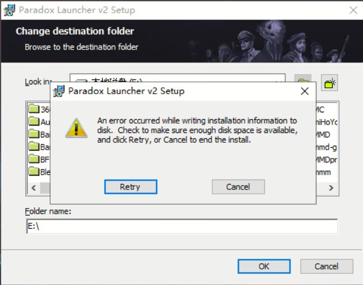
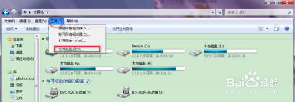
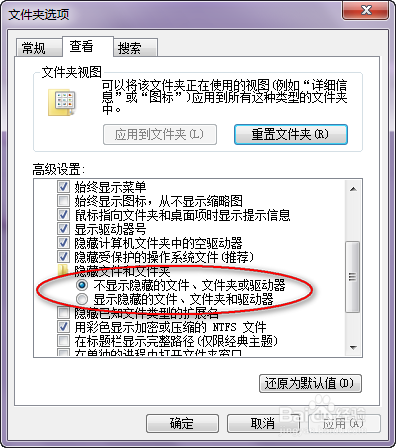
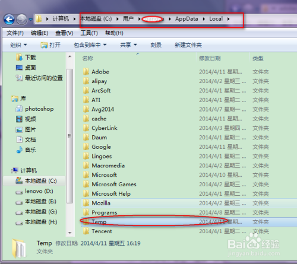
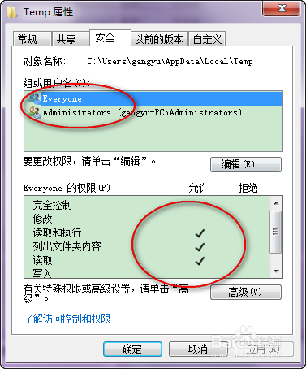
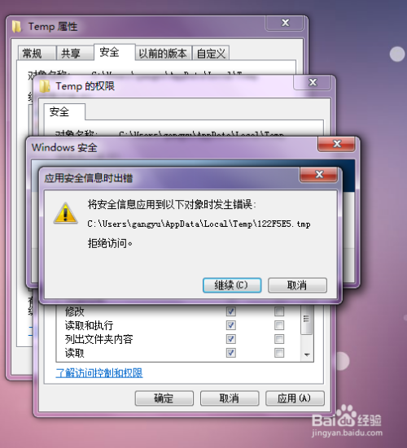
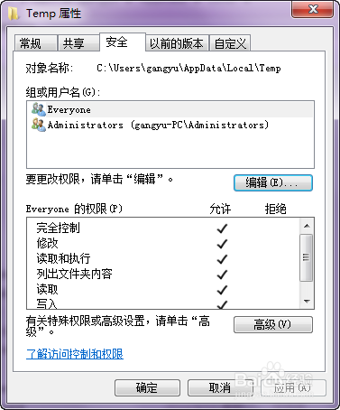

---
title: "启动器安装时报错安装程序在写入安装信息时发生了错误。请检查磁盘空间是否足够，并选择“重试”或“取消”结束安装。An error occurred while writing installation information to disk.check to make sure enough disk space is available and dick Retry, or Cancel to end the install."
date: 2026-07-15
description: "启动器安装时报错安装程序在写入安装信息时发生了错误。请检查磁盘空间是否足够，并选择“重试”或“取消”结束安装。An error occurred while writing installation information to disk.check to make sure enough d..."
categories:
  - "报错"
tags:
  - "Paradox Launcher"
  - "P 社启动器"
  - "启动器故障"
  - "问题排查"
draft: false
slug: "paradox-launcher-error-12"
---

> 本文整理自《群星常见问题合集及解决办法》，原作者：唏嘘南溪。文档内容会随实际反馈持续修正。

## 1. 报错现象

启动器安装时报错安装程序在写入安装信息时发生了错误。请检查磁盘空间是否足够，并选择“重试”或“取消”结束安装。An error occurred while writing installation information to disk.check to make sure enough disk space is available and dick Retry, or Cancel to end the install.。

## 2. 解决方法

该报错在 win7 中较为常见，因缺少设备，样例图片采用网络搜集的图片。

任意打开一个文件夹，在菜单栏找到——工具——文件夹选项——查看——选“显示隐藏的文件、文件夹和驱动器”。

打开用户临时文件夹所在的文件夹，一般为“C:\Users\XXX\AppData\Local”，其中的 XXX 为你的用户名（依次打开 C 盘，用户名，AppData，Local），就可以找到 Temp 文件夹。

右键单击 Temp 文件夹，选“属性”，单击“安全”选项卡，检查“组或用户名”里有没有“Everyone”：

如果有“Everyone”，（一般来说这个时候，可以看到下面的好多权限是没有的）单击“编辑”，在新的选项卡窗口选中“Everyone”，在下面的权限窗口中——选中“完全控制”。此时，一般可能会出现“C:\Users\XXX\AppData\Local\Temp\„„拒绝访问”，选“取消”，可能会有一个警告，不用理会，“确定”。这时再检查一下，就可以看到“Everyone”已经有了完全控制的权限。

如果没有“Everyone”，单击“编辑”按钮，在新的选项卡窗口选“添加”，在新窗口中添加“everyone”，单击确定。然后按照上面一个步骤设置即可

## 3. 仍未解决

如果上述方法不适用，建议记录完整报错文字、复现步骤和 `error.log` 内容后再进一步排查。也可以联系原文作者（QQ：3217344726）反馈，以便补充或修正方案。

