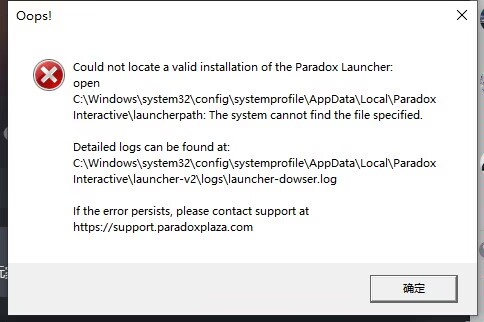
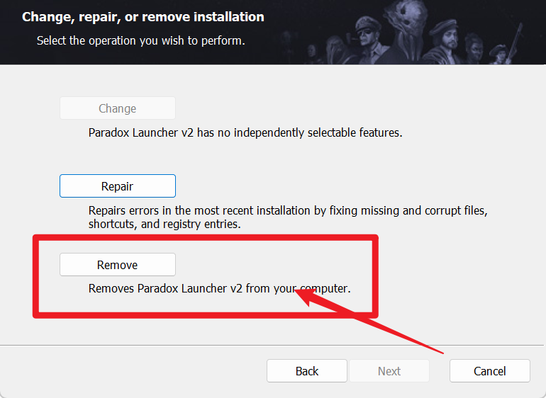
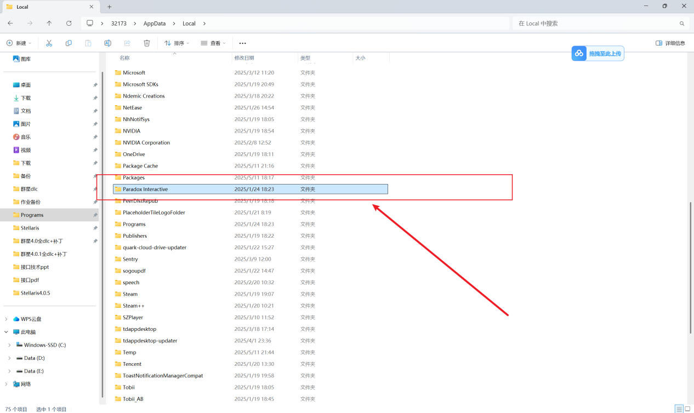
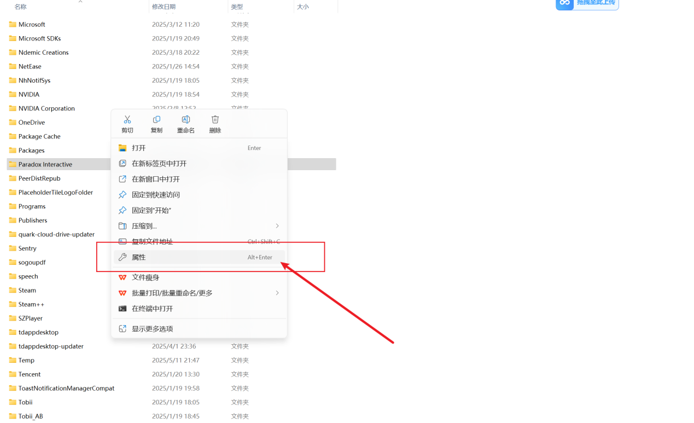
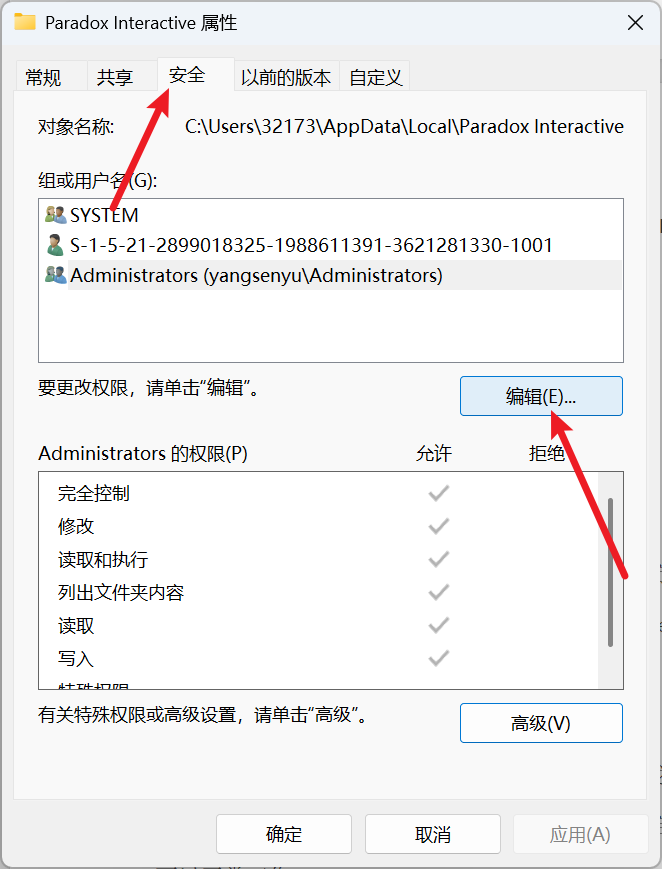
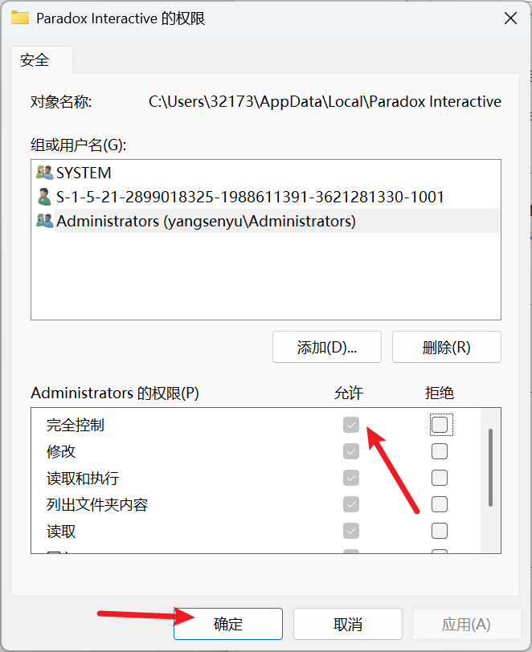

---
title: "启动器打开时报错找不到有效的 Paradox Launcher 安装:Oops!Could not locate a valid installation of the Paradox Launcher."
date: 2026-07-15
description: "启动器打开时报错找不到有效的 Paradox Launcher 安装:Oops!Could not locate a valid installation of the Paradox Launcher.的排查与解决方法，整理常见原因、操作步骤和相关报错截图。"
categories:
  - "报错"
tags:
  - "Paradox Launcher"
  - "P 社启动器"
  - "启动器故障"
  - "问题排查"
draft: false
slug: "paradox-launcher-error-13"
---

> 本文整理自《群星常见问题合集及解决办法》，原作者：唏嘘南溪。文档内容会随实际反馈持续修正。

## 1. 报错现象

启动器打开时报错找不到有效的 Paradox Launcher 安装:Oops!Could not locate a valid installation of the Paradox Launcher.。

## 2. 解决方法

情况一：电脑上缺少启动器，或者卸载启动器后有部分残留，需要重装启动器

下载 p 社启动器安装包 paradox-launcher-installer-2024_11.msi，打开后点击 remove 删掉当前启动器。(最好下载最新版本的安装包)

再次打开安装包，重新安装 p 社启动器，尽量不要修改启动器的安装位置

安装完成后重新打开游戏即可

情况二：启动器文件夹没有足够的权限，需要修改文件夹权限

根据报错里的路径找到 Paradox Interactive 文件夹，这里我用我的电脑做一个演示

右键文件夹，点击属性

切换到“安全”选项卡，点击编辑

选择当前使用的账户或“Everyone”。如果不确定使用的是哪个账户，也不必担心，可以逐一修改所有账户的权限，简单来说就是全改。然后勾选“完全控制”下的“允许”单选框，勾选后其他“允许”框会自动选中。最后点击“确定”。我的电脑上由于文档权限继承自上级文件夹，所以选项是灰色的。如果你是根据报错条目找到这个解决方案的，那你的情况应该是单选框没有勾选，勾选后会显示绿色，和图片中的颜色不同，但不用担心，按照前面说的操作即可。

## 3. 仍未解决

如果上述方法不适用，建议记录完整报错文字、复现步骤和 `error.log` 内容后再进一步排查。也可以联系原文作者（QQ：3217344726）反馈，以便补充或修正方案。
