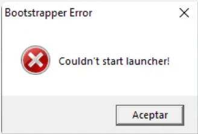

---
title: "打开启动器报错启动程序错误：无法启动启动器:bootstrapper error :couldn't start launcher"
date: 2026-07-15
description: "打开启动器报错启动程序错误：无法启动启动器:bootstrapper error :couldn't start launcher 的排查与解决方法，整理常见原因、操作步骤和相关报错截图。"
categories:
  - "报错"
tags:
  - "Paradox Launcher"
  - "P 社启动器"
  - "启动器故障"
  - "问题排查"
draft: false
slug: "paradox-launcher-error-14"
---

> 本文整理自《群星常见问题合集及解决办法》，原作者：唏嘘南溪。文档内容会随实际反馈持续修正。

## 1. 报错现象

打开启动器报错启动程序错误：无法启动启动器:bootstrapper error :couldn't start launcher。

## 2. 解决方法

如果在启动启动器时看到这样的错误，则说明防病毒程序发挥了作用，这意味着您的防病毒程序将文件 bootstrapper.exe 标记为潜在病毒并将其隔离。

要解决此问题，请执行以下操作：

打开防病毒程序并查看隔离列表（某些程序称之为病毒箱）。如果文件在那里，请恢复它并将其标记为安全，然后启动游戏，它应该可以正常工作。

## 3. 仍未解决

如果上述方法不适用，建议记录完整报错文字、复现步骤和 `error.log` 内容后再进一步排查。也可以联系原文作者（QQ：3217344726）反馈，以便补充或修正方案。

