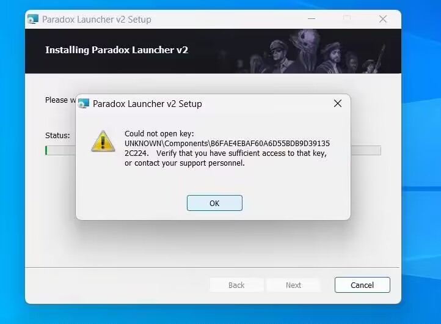

---
title: "安装启动器报错无法打开密钥:Could not open key"
date: 2026-07-15
description: "安装启动器报错无法打开密钥:Could not open key 的排查与解决方法，整理常见原因、操作步骤和相关报错截图。"
categories:
  - "报错"
tags:
  - "P 社启动器"
  - "安装失败"
  - "启动失败"
draft: false
slug: "paradox-launcher-error-15"
related_group: "paradox-launcher"
hidden: true
searchable: true
guide: "/p/paradox-launcher-troubleshooting-guide/"
guide_title: "P 社启动器报错解决指南"
---

> 本文整理自《群星常见问题合集及解决办法》，原作者：唏嘘南溪。文档内容会随实际反馈持续修正。

## 1. 报错现象

安装启动器报错无法打开密钥:Could not open key。

## 2. 解决方法

提示：该解决方案为互联网搜罗整合而来，未经实际操作验证，如果您使用该方案成功解决了问题，请将细节反馈给 3217344726，以便完善报错指南

解决方案：

win+R，输入 cmd 后回车，复制以下字段粘贴到至 cmd 后再次回车即可，之后重新尝试安装启动器

secedit /configure /cfg %windir%\inf\defltbase.inf /db defltbase.sdb /verbose

## 3. 仍未解决

如果上述方法不适用，建议记录完整报错文字、复现步骤和 `error.log` 内容后再进一步排查。也可以联系原文作者（QQ：3217344726）反馈，以便补充或修正方案。

