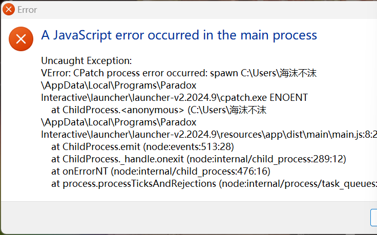
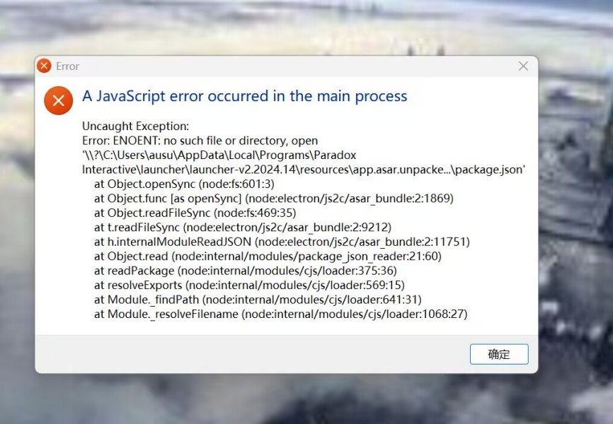
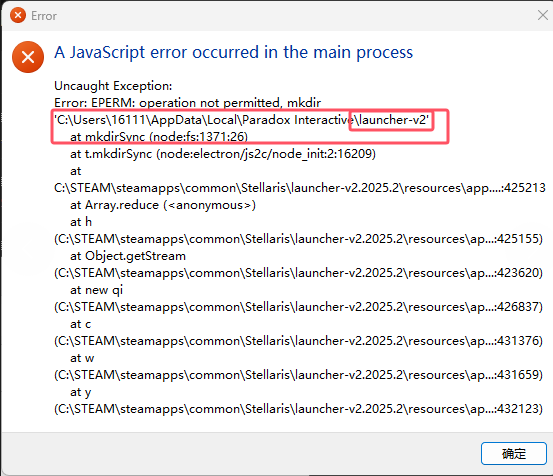
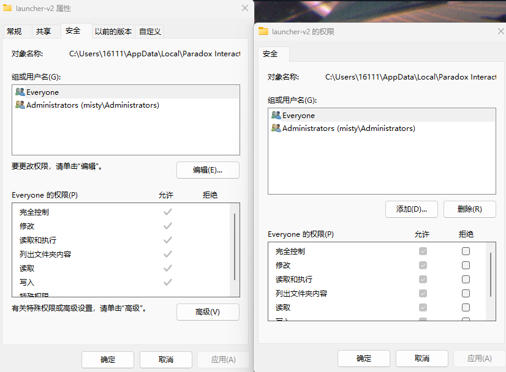
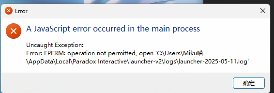
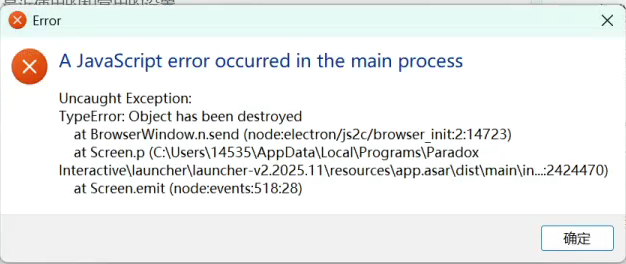
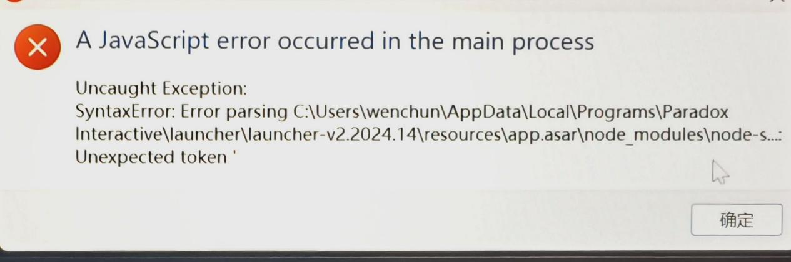

---
title: "启动器报错在主进程中发生了 JavaScript 错误:“A JavaScript error occurred in the main process”"
date: 2026-07-15
description: "启动器报错在主进程中发生了 JavaScript 错误:“A JavaScript error occurred in the main process”的排查与解决方法，整理常见原因、操作步骤和相关报错截图。"
categories:
  - "报错"
tags:
  - "Paradox Launcher"
  - "P 社启动器"
  - "启动器故障"
  - "问题排查"
  - "Windows"
draft: false
slug: "paradox-launcher-error-16"
---

> 本文整理自《群星常见问题合集及解决办法》，原作者：唏嘘南溪。文档内容会随实际反馈持续修正。

## 1. 报错现象

启动器报错在主进程中发生了 JavaScript 错误:“A JavaScript error occurred in the main process”。

## 2. 解决方法

导致该报错具体原因不同。可以根据标题下的详细内容来进一步分析并确定导致报错的具体原因。示例如下：

文件缺失导致报错

(1)Error: CPatch process error occurred: spawn xxxx \cpatch.exe

该报错为启动器文件缺失，可以在群文件下载 p 社启动器安装包，卸载掉原 p 社启动器后用安装包安装新启动器，如果该报错仍然出现，那大概率是文件被杀毒软件拦截，建议打开电脑上的杀毒软件，在隔离区内看看有没有 cpatch.exe 或其他文件，将这些文件移出隔离区或加入白名单即可。

Error: ENOENT: no such file or directory, open xxxx/package.json

该报错虽然也为启动器文件缺失，但用常规卸载重装方法可能无法解决该报错，在卸载启动器后，安装启动器前，需要彻底情况电脑上有关启动器的文件，文件夹，下列路径中的文件夹均要删除

卸载启动器

首先，通过控制面板或其他方式卸载当前的启动器程序。

删除相关文件夹

在卸载启动器之后，不要直接重新安装启动器，您需要手动删除以下路径中的相关文件夹，确保彻底清除启动器的所有残留文件：

C:/Users/<用户名>/AppData/Local/Programs/Paradox Interactive/

C:/Users/<用户名>/AppData/Local/Paradox Interactive/

C:/Users/<用户名>/AppData/Roaming/Paradox Interactive/launcher-v2/

文档/Paradox Interactive/.cpatch/

Documents/Paradox Interactive/ 目录下所有以 launcher-v2 开头的文件夹

重新安装启动器

清除所有相关文件夹后，运行启动器的安装程序进行重新安装。安装完成后，启动器应该可以正常工作。

通过这种方式可以有效避免由于文件残留导致的错误。

缺少权限导致报错

创建文件夹错误

Error: EPERM: operation not permitted, mkdir xxxx(路径)

该报错是由于文件夹权限不足引发的。解决方法如下：根据路径定位到该文件夹，右键点击并选择“属性”，然后进入“安全”选项卡，点击“编辑”。在权限列表中勾选“完全控制”后点击“确定”。如果不清楚自己的账户信息，可以将列表中所有组和用户名的权限都设置为“完全控制”。

访问日志错误

Error: EPERM: operation not permitted,open xxxx

\launcher-xxxx-xx-xx.log

详细解决方案请跳转安装启动器时报错”Windows Installer 打开安装日志文件时发生错误。请检查指定的日志文件位置是否存在并且可以写入”

其他错误

启动相关错误

TypeError: Object has been destroyed

导致该报错的具体诱因未知，猜测与 Windows 快速启动（Fast Startup）与休眠相关，解决方法为：在关机前退出 steam 程序即可。

启动器文件损坏错误

SyntaxError: Error parsing C:\Users\...: Unexpected token '

启动器文件损坏，下载最新的启动器安装程序重新安装一下启动器就好了。

## 3. 仍未解决

如果上述方法不适用，建议记录完整报错文字、复现步骤和 `error.log` 内容后再进一步排查。也可以联系原文作者（QQ：3217344726）反馈，以便补充或修正方案。
