---
title: "无法删除旧版本的 Paradox Launcher v2:The older version of Paradox Launcher v2 cannot be removed. Contact your technical support group."
date: 2026-07-15
description: "无法删除旧版本的 Paradox Launcher v2:The older version of Paradox Launcher v2 cannot be removed. Contact your technical support group.的排查与解决方法，整理常见原因、操作步骤和..."
categories:
  - "报错"
tags:
  - "Paradox Launcher"
  - "P 社启动器"
  - "启动器故障"
  - "问题排查"
  - "Windows"
draft: false
slug: "paradox-launcher-error-18"
---

> 本文整理自《群星常见问题合集及解决办法》，原作者：唏嘘南溪。文档内容会随实际反馈持续修正。

## 1. 报错现象

无法删除旧版本的 Paradox Launcher v2:The older version of Paradox Launcher v2 cannot be removed. Contact your technical support group.。

## 2. 解决方法

<a href="images/error-01.png" target="_blank">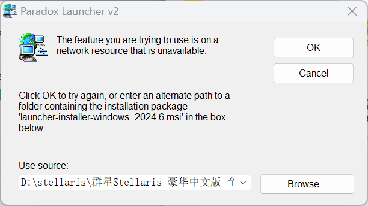</a>

<a href="images/error-02.png" target="_blank">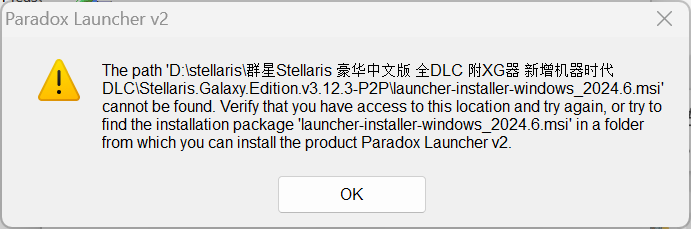</a>

<a href="images/error-03.png" target="_blank">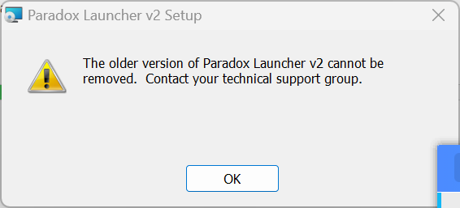</a>

<a href="images/error-04.png" target="_blank">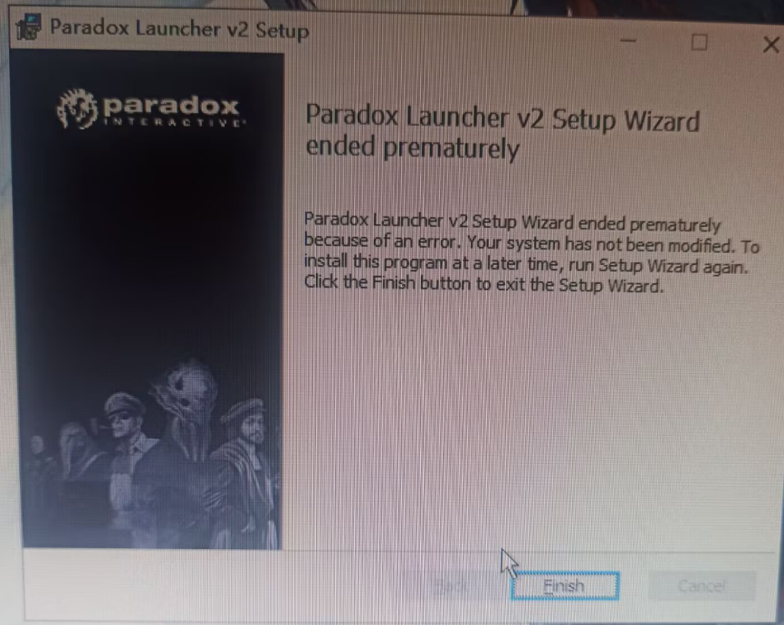</a>

<a href="images/error-05.png" target="_blank">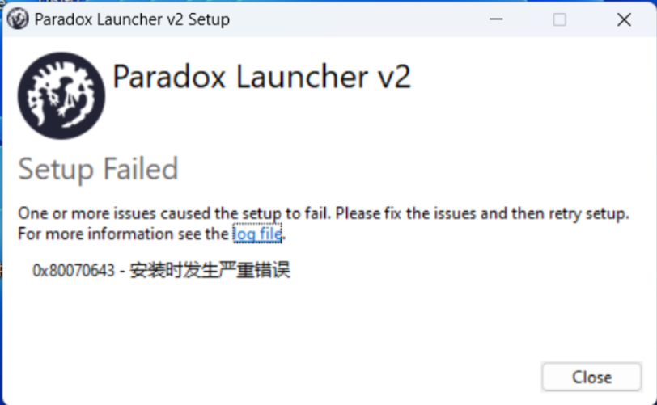</a>

这一串报错是最近最常出现的报错小连招，一般情况下，在玩盗版游戏后，补票正版游戏并重新安装启动器时;或者以不合适的方式删除旧启动器时会出现该报错。该报错的原因是旧启动器的文件没有删除干净，残留的文件影响了新启动器的下载，解决方法如下。

最优先的方法是下载 Windows Installer 修复工具（疑难解答工具）并进行修复，下载网址为

<https://support.microsoft.com/zh-cn/topic/2438651>

或者直接在网盘下载

<https://pan.quark.cn/s/a05bf32ce69b>

或

<https://pan.baidu.com/s/1VqVdd-65iQxVZlphttl-rQ?pwd=9a9b>

提取码：9a9b

<a href="images/error-06.png" target="_blank">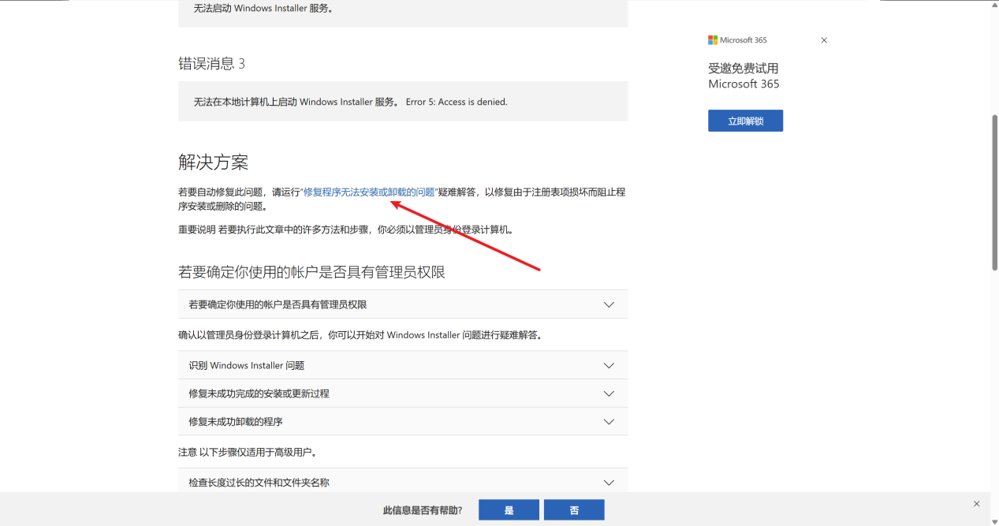</a>

<a href="images/error-07.png" target="_blank">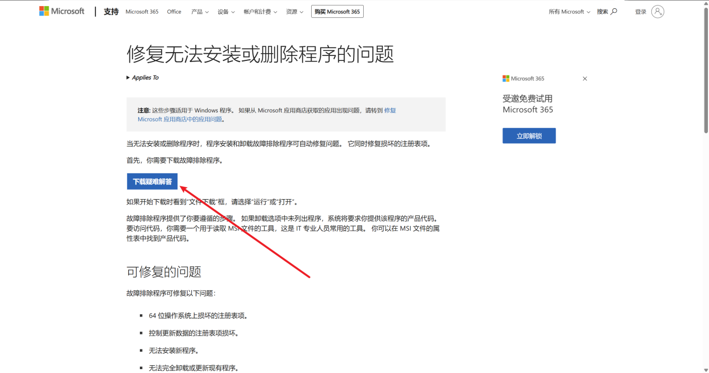</a>

打开程序安装和卸载疑难解答程序后点下一步

<a href="images/error-08.png" target="_blank">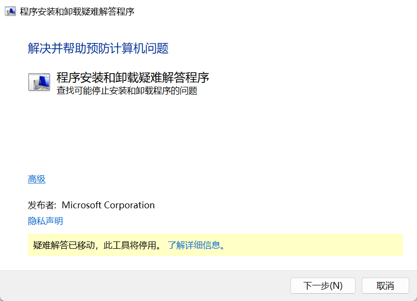</a>

选择安装

<a href="images/error-09.png" target="_blank">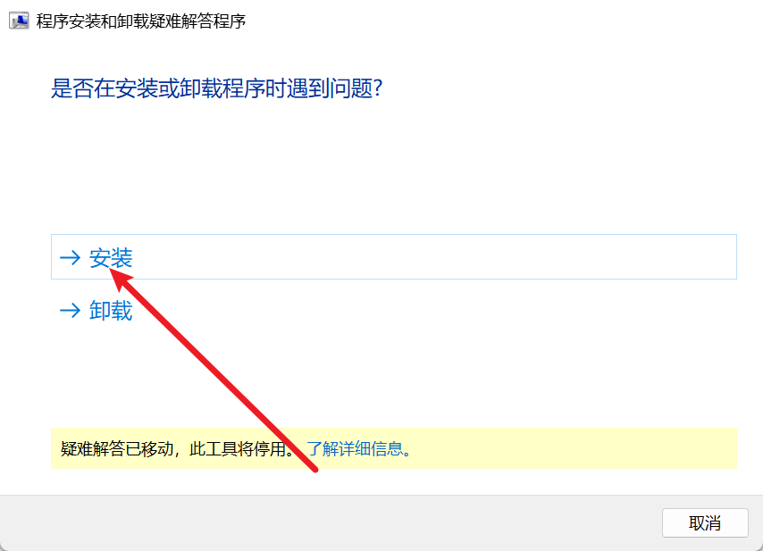</a>

找到 Paradox Launcher v2 点击下一步

<a href="images/error-10.png" target="_blank">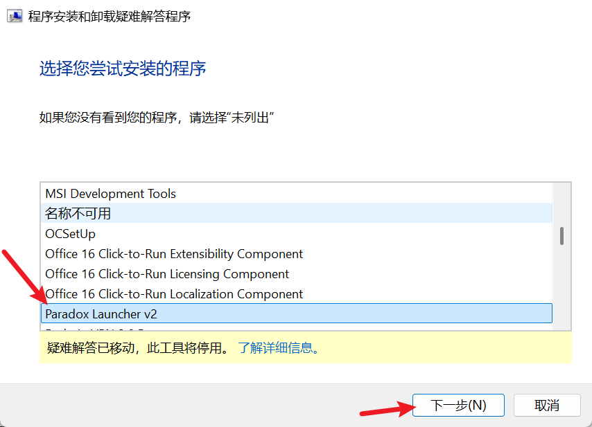</a>

点击是，尝试卸载

<a href="images/error-11.png" target="_blank">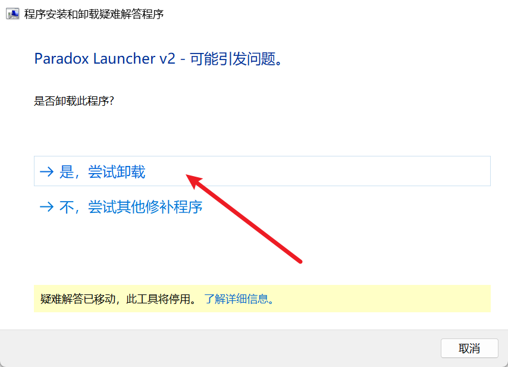</a>

之后重新进行启动器的安装，访问官网 https://www.paradoxinteractive.com/our-games/launcher 下载最新的启动器安装程序。如果无法打开官网，也可以在群文件中的“P 社最新启动器”文件夹中找到下载文件。之后右键点击属性。

<a href="images/error-12.png" target="_blank">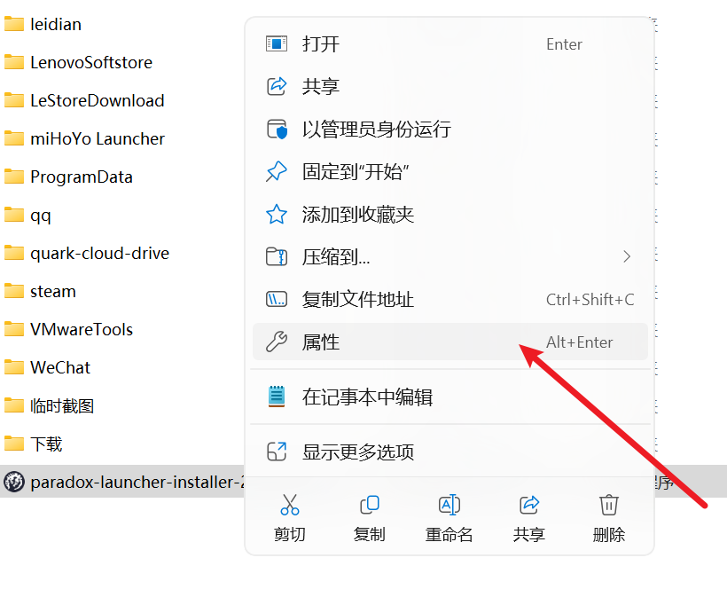</a>

<a href="images/error-13.png" target="_blank">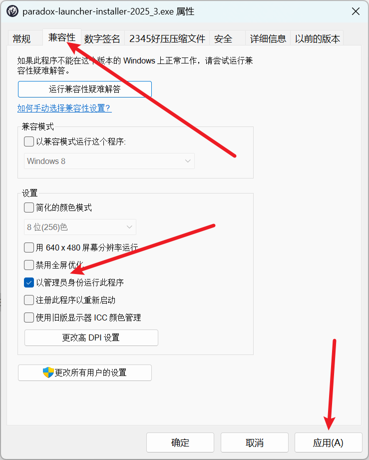</a>

在兼容性选项卡中勾选以管理员身份运行此程序，点击应用，之后重新运行安装程序安装启动器。

如果问题没有解决，请手动删除以下文件夹：

C:/users/(用户名)/AppData/Local/Programs/Paradox Interactive/

C:/users/(用户名)/AppData/Local/Paradox Interactive/

C:/users/(用户名)/AppData/Roaming/Paradox Interactive/launcher-v2/

之后再重新运行安装程序，如果有修复或卸载选项，选择 uninstall(卸载),等待卸载完成后再重新安装。

注意安装路径没事不要改，改了路径出问题以后不好修

<a href="images/error-14.png" target="_blank">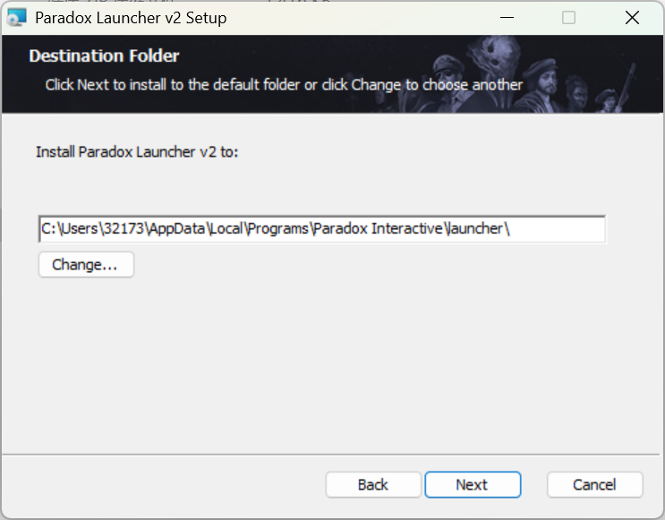</a>

如果成功解决了启动器无法下载或卸载的问题，并成功安装了启动器，但点击启动器图标后无法打开启动器：比如出现双击启动器图标，但是启动器无反应的情况，虽然在任务管理器中可以看到启动器正在运行，但是实际上并没有打开启动器。另一种情况是在 Steam 中直接启动游戏时，点击“开始游戏”并等待一段时间后，启动器未能打开，且按钮又恢复为“开始游戏”,或者干脆卡在那里不动了。遇到这两种情况，请跳转启动器安装完成后无法打开，点击无任何反应，但在任务管理器中可以看到启动器正在运行。如果一切正常就不用管这段，可以直接去游玩了。

## 3. 仍未解决

如果上述方法不适用，建议记录完整报错文字、复现步骤和 `error.log` 内容后再进一步排查。也可以联系原文作者（QQ：3217344726）反馈，以便补充或修正方案。
