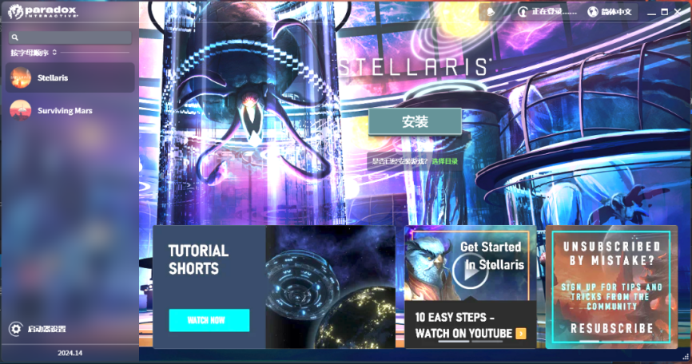
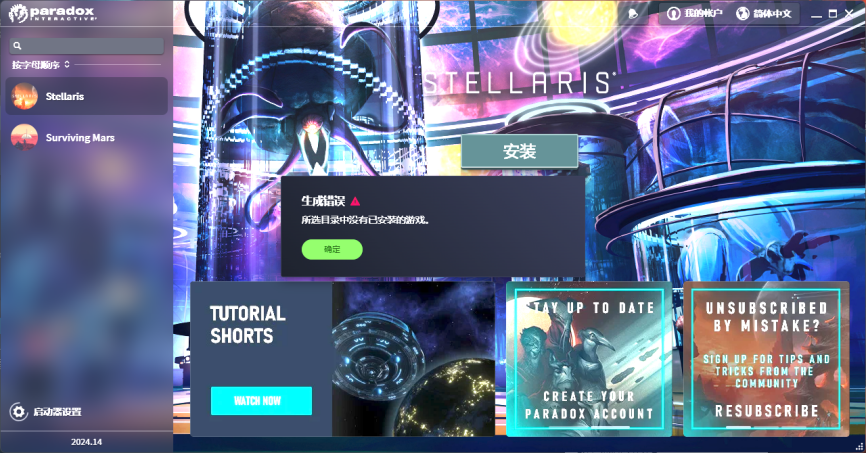

---
title: "在 p 社启动器无法添加已经下载完成的群星游戏，选择目录后显示生成错误，所选目录中没有已安装的游戏"
date: 2026-07-15
description: "在 p 社启动器无法添加已经下载完成的群星游戏，选择目录后显示生成错误，所选目录中没有已安装的游戏的排查与解决方法，整理常见原因、操作步骤和相关报错截图。"
categories:
  - "报错"
tags:
  - "Paradox Launcher"
  - "P 社启动器"
  - "启动器故障"
  - "问题排查"
draft: false
slug: "paradox-launcher-error-21"
---

> 本文整理自《群星常见问题合集及解决办法》，原作者：唏嘘南溪。文档内容会随实际反馈持续修正。

## 1. 报错现象

在 p 社启动器无法添加已经下载完成的群星游戏，选择目录后显示生成错误，所选目录中没有已安装的游戏。

## 2. 解决方法

首先只有从 Steam 里打开 p 社启动器，启动器才能显示拥有游戏 stellaris，直接从启动器快捷方式打开启动器，启动器里没有 stellaris，这是正常现象

如果你从 Steam 打开启动器，但启动器里还是没有游戏，解决方案如下：

去 p 社启动器官网下载最新的启动器安装程序，安装一遍即可，官网链接：

<https://www.paradoxinteractive.com/our-games/launcher>

p 社启动器官网需要挂梯子，如果打不开官网可以去群文件里找，在”p 社最新启动器下载”文件夹里。

## 3. 仍未解决

如果上述方法不适用，建议记录完整报错文字、复现步骤和 `error.log` 内容后再进一步排查。也可以联系原文作者（QQ：3217344726）反馈，以便补充或修正方案。
