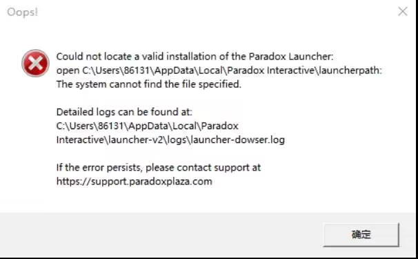

---
title: "无法找到有效的 p 社启动器文件:Could not locate a valid installation of the Paradox Launcher"
date: 2026-07-15
description: "无法找到有效的 p 社启动器文件:Could not locate a valid installation of the Paradox Launcher 的排查与解决方法，整理常见原因、操作步骤和相关报错截图。"
categories:
  - "报错"
tags:
  - "Paradox Launcher"
  - "P 社启动器"
  - "启动器故障"
  - "问题排查"
draft: false
slug: "paradox-launcher-error-22"
---

> 本文整理自《群星常见问题合集及解决办法》，原作者：唏嘘南溪。文档内容会随实际反馈持续修正。

## 1. 报错现象

无法找到有效的 p 社启动器文件:Could not locate a valid installation of the Paradox Launcher。

## 2. 解决方法

访问官网 https://www.paradoxinteractive.com/our-games/launcher 下载最新的启动器安装程序。运行安装程序后，先卸载旧版启动器，再安装新版启动器即可。如果无法打开官网，也可以在群文件中的“P 社最新启动器”文件夹中找到下载文件。

## 3. 仍未解决

如果上述方法不适用，建议记录完整报错文字、复现步骤和 `error.log` 内容后再进一步排查。也可以联系原文作者（QQ：3217344726）反馈，以便补充或修正方案。

