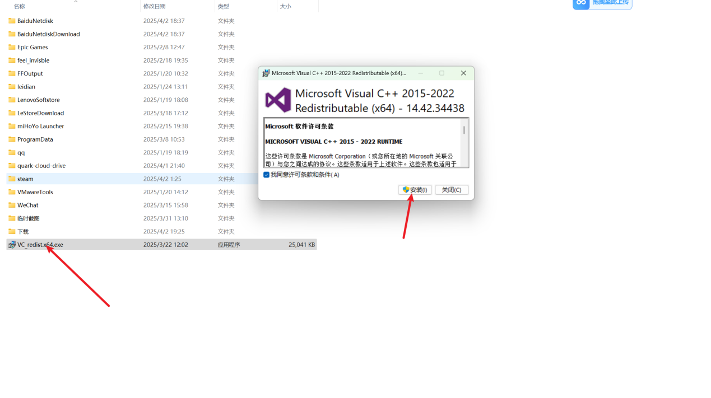

---
title: "启动器安装完成后无法打开，点击无任何反应，但在任务管理器中可以看到启动器正在运行。"
date: 2026-07-15
description: "启动器安装完成后无法打开，点击无任何反应，但在任务管理器中可以看到启动器正在运行的排查与解决方法，整理常见原因、操作步骤和相关报错截图。"
categories:
  - "报错"
tags:
  - "Paradox Launcher"
  - "P 社启动器"
  - "启动器故障"
  - "问题排查"
draft: false
slug: "paradox-launcher-error-23"
---

> 本文整理自《群星常见问题合集及解决办法》，原作者：唏嘘南溪。文档内容会随实际反馈持续修正。

## 1. 报错现象

启动器安装完成后无法打开，点击无任何反应，但在任务管理器中可以看到启动器正在运行。

## 2. 解决方法

出现此情况通常是由于缺少部分运行库，您可以通过访问微软官网下载安装最新版本的 Microsoft Visual C++ Redistributable 来解决。官网链接：

<https://learn.microsoft.com/en-us/cpp/windows/latest-supported-vc-redist?view=msvc-170>

或者从网盘下载

夸克：

<https://pan.quark.cn/s/7b1bea936b6b>

百度：

<https://pan.baidu.com/s/1k4EFIAI4hXPuHwWW_5Regg?pwd=b7xm>

提取码：b7xm

下载完成后，点击安装并完成安装过程。安装结束后重启电脑，重新打开电脑之后以管理员身份运行 Steam，然后直接通过 Steam 启动游戏即可。

## 3. 仍未解决

如果上述方法不适用，建议记录完整报错文字、复现步骤和 `error.log` 内容后再进一步排查。也可以联系原文作者（QQ：3217344726）反馈，以便补充或修正方案。

