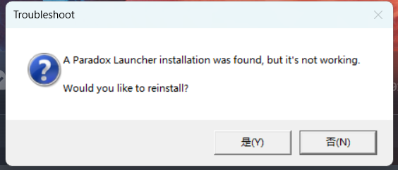
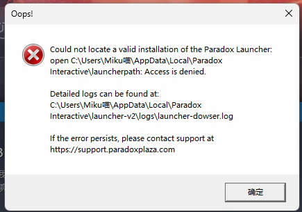

---
title: "启动器启动时报错找到了 Paradox Launcher 的安装，但无法正常工作。您是否想重新安装？:A Paradox Launcher installation was found, but it's not working.Would you like to reinstall?"
date: 2026-07-15
description: "启动器启动时报错找到了 Paradox Launcher 的安装，但无法正常工作。您是否想重新安装？:A Paradox Launcher installation was found, but it's not working.Would you like to reinstall？的排查与..."
categories:
  - "报错"
tags:
  - "P 社启动器"
  - "安装失败"
  - "启动器故障"
draft: false
slug: "paradox-launcher-error-24"
related_group: "paradox-launcher"
---

> 本文整理自《群星常见问题合集及解决办法》，原作者：唏嘘南溪。文档内容会随实际反馈持续修正。

## 1. 报错现象

启动器启动时报错找到了 Paradox Launcher 的安装，但无法正常工作。您是否想重新安装？:A Paradox Launcher installation was found, but it's not working.Would you like to reinstall?。

## 2. 解决方法

点击否后会出现两种不同的报错

情况一：无法找到有效的启动器安装

详细解决方案请跳转启动器打开时报错找不到有效的 Paradox Launcher 安装:Oops!Could not locate a valid installation of the Paradox Launcher.

情况二：无法启动 Paradox Launcher

详细解决方案请跳转无法启动 Paradox Launcher:Could not start the Paradox Launcher at(xxx 路径)

## 3. 仍未解决

如果上述方法不适用，建议记录完整报错文字、复现步骤和 `error.log` 内容后再进一步排查。也可以联系原文作者（QQ：3217344726）反馈，以便补充或修正方案。

