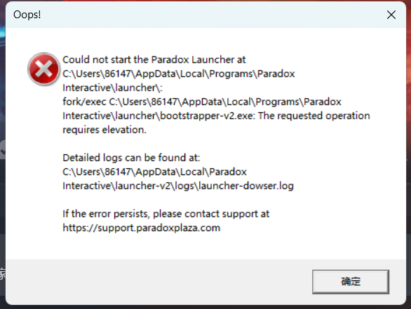
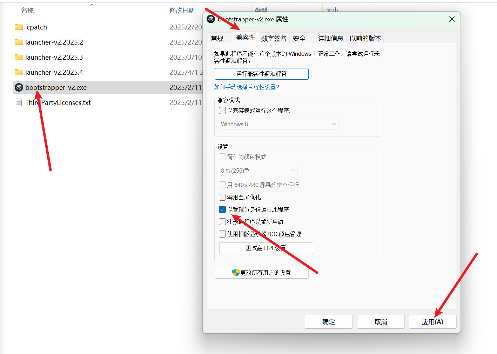

---
title: "无法启动 Paradox Launcher:Could not start the Paradox Launcher at(xxx 路径)"
date: 2026-07-15
description: "无法启动 Paradox Launcher:Could not start the Paradox Launcher at(xxx 路径) 的排查与解决方法，整理常见原因、操作步骤和相关报错截图。"
categories:
  - "报错"
tags:
  - "P 社启动器"
  - "启动失败"
  - "启动器故障"
draft: false
slug: "paradox-launcher-error-25"
related_group: "paradox-launcher"
hidden: true
searchable: true
guide: "/p/paradox-launcher-troubleshooting-guide/"
guide_title: "P 社启动器报错解决指南"
---

> 本文整理自《群星常见问题合集及解决办法》，原作者：唏嘘南溪。文档内容会随实际反馈持续修正。

## 1. 报错现象

无法启动 Paradox Launcher:Could not start the Paradox Launcher at(xxx 路径)。

## 2. 解决方法

这两个报错捆绑出现，第一条报错提示系统检测到你已经安装了 Paradox 启动器，但无法正常启动。第二条报错进一步说明了问题的原因，具体内容为：操作需要管理员权限（"The requested operation requires elevation"）。通过分析报错中的路径 C:\Users\86147\AppData\Local\Programs\Paradox Interactive\launcher\bootstrapper-v2.exe，可以确定问题出在启动器的引导程序 bootstrapper-v2.exe。

为了解决这个问题，请按照以下步骤操作：

找到 bootstrapper-v2.exe 文件，右键点击并选择“属性”。

转到“兼容性”选项卡，取消选中“以管理员身份运行此程序”。

点击“应用”并保存更改。

之所以会出现这个报错，是因为启动器引导程序被设置为以管理员身份运行，而 Steam 启动时默认以普通权限运行。由于普通权限的 Steam 无法调用需要管理员权限的启动器引导程序，因此导致启动失败。

如果你遇到类似的报错，虽然具体细节可能不同，但可以根据上述逻辑进行推理，找出问题所在并采取相应的解决方案。

## 3. 仍未解决

如果上述方法不适用，建议记录完整报错文字、复现步骤和 `error.log` 内容后再进一步排查。也可以联系原文作者（QQ：3217344726）反馈，以便补充或修正方案。

