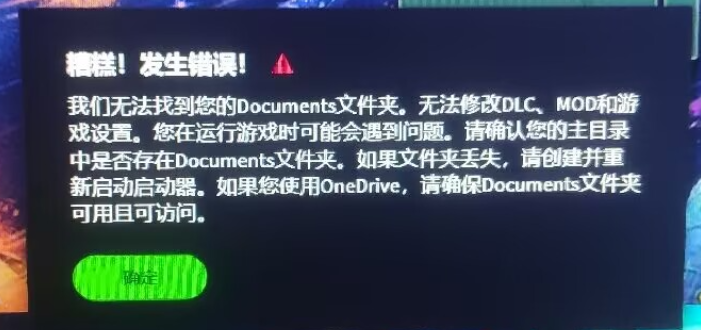
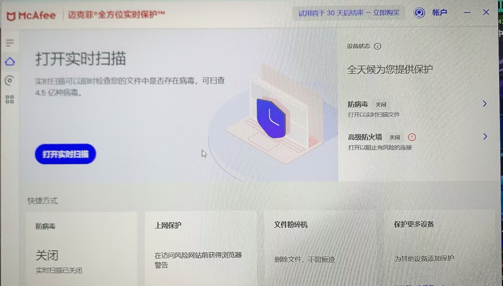

---
title: "糟糕！发生错误！我们无法找到您的 Documents 文件夹。无法修改 DLC、MOD 和游戏设置。您在运行游戏时可能会遇到问题。"
date: 2026-07-15
description: "糟糕！发生错误！我们无法找到您的 Documents 文件夹。无法修改 DLC、MOD 和游戏设置。您在运行游戏时可能会遇到问题的排查与解决方法，整理常见原因、操作步骤和相关报错截图。"
categories:
  - "报错"
tags:
  - "Paradox Launcher"
  - "P 社启动器"
  - "启动器故障"
  - "问题排查"
  - "Windows"
draft: false
slug: "paradox-launcher-error-26"
---

> 本文整理自《群星常见问题合集及解决办法》，原作者：唏嘘南溪。文档内容会随实际反馈持续修正。

## 1. 报错现象

糟糕！发生错误！我们无法找到您的 Documents 文件夹。无法修改 DLC、MOD 和游戏设置。您在运行游戏时可能会遇到问题。

## 2. 解决方法

报错全文为：糟糕！发生错误！我们无法找到您的 Documents 文件夹。无法修改 DLC、MOD 和游戏设置。您在运行游戏时可能会遇到问题。请确认您的主目录中是否存在 Documents 文件夹。如果文件夹丢失，请创建并重新启动启动器。如果您使用 OneDrive，请确保 Documents 文件夹可用且可访问。

当出现该报错时，请检查系统中是否安装了杀毒软件（如 360 安全卫士、McAfee 等）。建议关闭其“实时防护”和“防病毒”功能，或将 Paradox 启动器及 Stellaris（群星）游戏主程序添加至信任/白名单中，以避免其拦截或干扰程序运行。

解决案例：

关闭 mcafee 迈克菲的防病毒功能后问题解决，启动器不再报错。

另外有一个成功案例是修改注册表，不过改注册表需谨慎，请在修改前备份一份原注册表以防出错：

若系统迁移后文档路径异常，需手动修正注册表中的用户文件夹指向：

1. 打开注册表编辑器

- 按 `Win + R` 输入 `regedit` 回车。

2. 修改关键路径

`HKEY_CURRENT_USER\Software\Microsoft\Windows\CurrentVersion\Explorer\User Shell Folders`

双击右侧的 `Personal`，将其值改为

`%USERPROFILE%\Documents`（确保为纯英文路径）。

- 同步修改：

`HKEY_CURRENT_USER\Software\Microsoft\Windows\CurrentVersion\Explorer\Shell Folders`

→ 同样修改 `Personal`的值为上述路径。

3. 重启电脑，检查 `C:\Users\<你的用户名>\Documents` 是否重建成功。

## 3. 仍未解决

如果上述方法不适用，建议记录完整报错文字、复现步骤和 `error.log` 内容后再进一步排查。也可以联系原文作者（QQ：3217344726）反馈，以便补充或修正方案。
