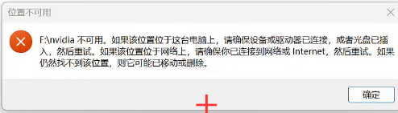
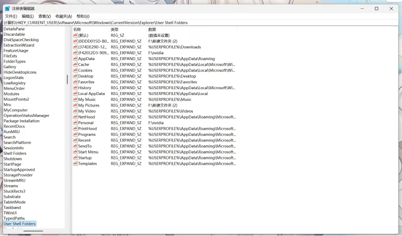
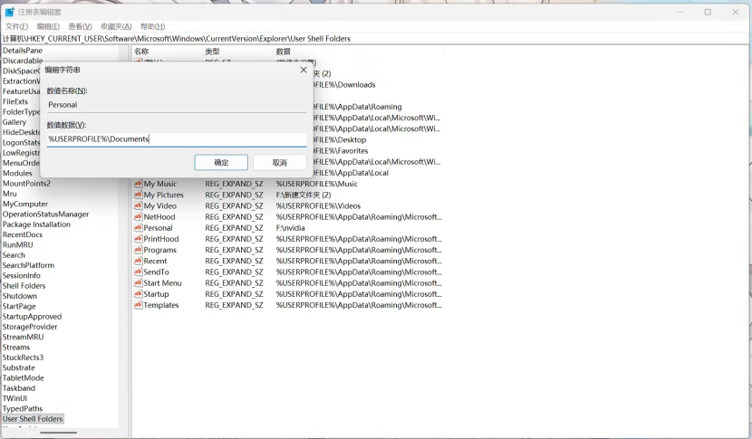

---
title: "糟糕！发生错误！我们无法找到您的 Documents 文件夹。无法修改 DLC、MOD 和游戏设置。您在运行游戏时可能会遇到问题。"
date: 2026-07-15
description: "解决 Paradox 启动器无法找到 Documents 文件夹的问题，包括安全软件拦截和 Windows 文档路径错误两类情况。"
categories:
  - "报错"
tags:
  - "P 社启动器"
  - "DLC 异常"
  - "MOD 异常"
  - "权限"
  - "注册表"
  - "Windows"
draft: false
slug: "paradox-launcher-error-26"
related_group: "paradox-launcher"
---

> 本文整理自《群星常见问题合集及解决办法》，原作者：唏嘘南溪。文档内容会随实际反馈持续修正。

## 1. 报错现象

报错全文如下：

> 糟糕！发生错误！我们无法找到您的 Documents 文件夹。无法修改 DLC、MOD 和游戏设置。您在运行游戏时可能会遇到问题。请确认您的主目录中是否存在 Documents 文件夹。如果文件夹丢失，请创建并重新启动启动器。如果您使用 OneDrive，请确保 Documents 文件夹可用且可访问。
> <a href="images/2026-07-20-23-18-28.png" target="_blank">  </a>

<a href="images/2026-07-20-23-18-37.png" target="_blank">  </a>

## 2. 解决方法

该问题通常由安全软件拦截，或者 Windows 的“文档”文件夹路径配置错误引起。可以依次尝试以下两种解决方法。

### 2.1. 关闭安全软件防护

首先检查系统中是否安装了杀毒软件，例如 360 安全卫士、McAfee 等。建议暂时关闭其“实时防护”和“防病毒”功能，或者将 Paradox 启动器及 Stellaris（群星）游戏主程序添加至信任列表或白名单，避免安全软件拦截、干扰程序运行。

已有案例在关闭 McAfee（迈克菲）的防病毒功能后解决了该问题，启动器不再报错。

<a href="images/2026-07-20-23-24-52.png" target="_blank">  </a>

### 2.2. 修复 Windows 文档文件夹路径

另一个成功案例是通过修改注册表修复 Windows 的“文档”文件夹路径。如果关闭安全软件后仍未解决，可以继续尝试此方法。

> 修改注册表存在风险，操作前建议先导出相关注册表项作为备份。

#### 2.2.1. 确认文档路径异常

按 `Win + R`，输入以下命令并回车：

```text
shell:Personal
```

如果出现“位置不可用”，并显示 `F:\nvidia` 等路径，说明 Windows 的“文档”文件夹被错误地指向了该位置，而对应磁盘或文件夹目前不存在或无法访问。

<a href="images/2026-07-20-23-25-04.png" target="_blank">  </a>

#### 2.2.2. 修改注册表中的文档路径

再次按 `Win + R`，输入 `regedit` 并回车，打开注册表编辑器。在顶部地址栏输入以下路径：

```text
计算机\HKEY_CURRENT_USER\Software\Microsoft\Windows\CurrentVersion\Explorer\User Shell Folders
```

<a href="images/2026-07-20-23-25-19.png" target="_blank">  </a>

在右侧找到 `Personal`，双击打开，然后将“数值数据”修改为：

```text
%USERPROFILE%\Documents
```

点击 **确定** 保存。

<a href="images/2026-07-20-23-25-29.png" target="_blank">  </a>

#### 2.2.3. 创建新的文档文件夹

按 `Win + R`，输入 `cmd` 并回车。在打开的命令提示符中执行：

```cmd
mkdir "%USERPROFILE%\Documents"
```

该命令会在当前用户目录下创建新的“文档”文件夹。如果系统提示文件夹已经存在，直接跳过即可。

#### 2.2.4. 重启并验证

重启电脑，再次按 `Win + R` 并输入：

```text
shell:Personal
```

此时应该可以正确打开当前用户的“文档”文件夹。随后重新启动 Paradox 启动器，检查报错是否消失，并确认 DLC、MOD 和游戏设置是否可以正常修改。

## 3. 仍未解决

如果上述方法不适用，建议记录完整报错文字、复现步骤和 `error.log` 内容后再进一步排查。也可以联系原文作者（QQ：3217344726）反馈，以便补充或修正方案。
