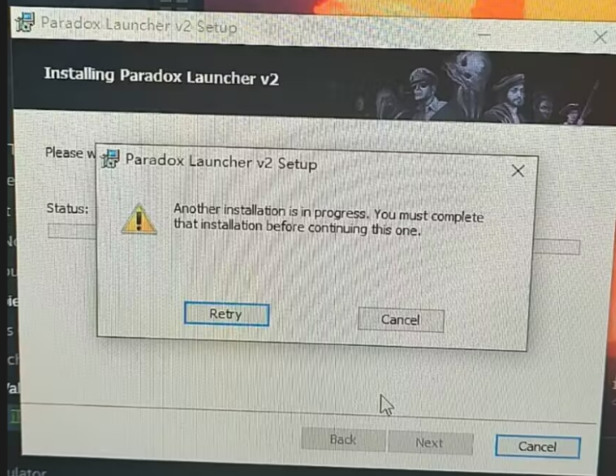
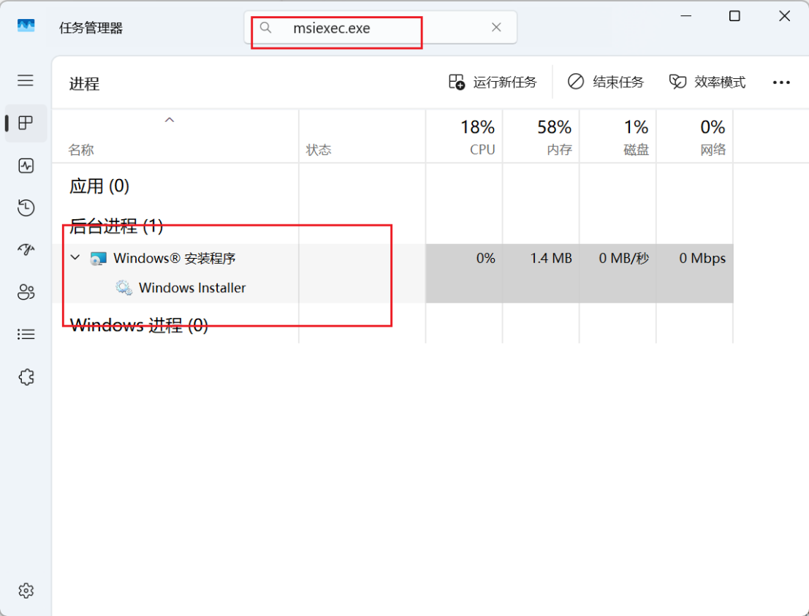
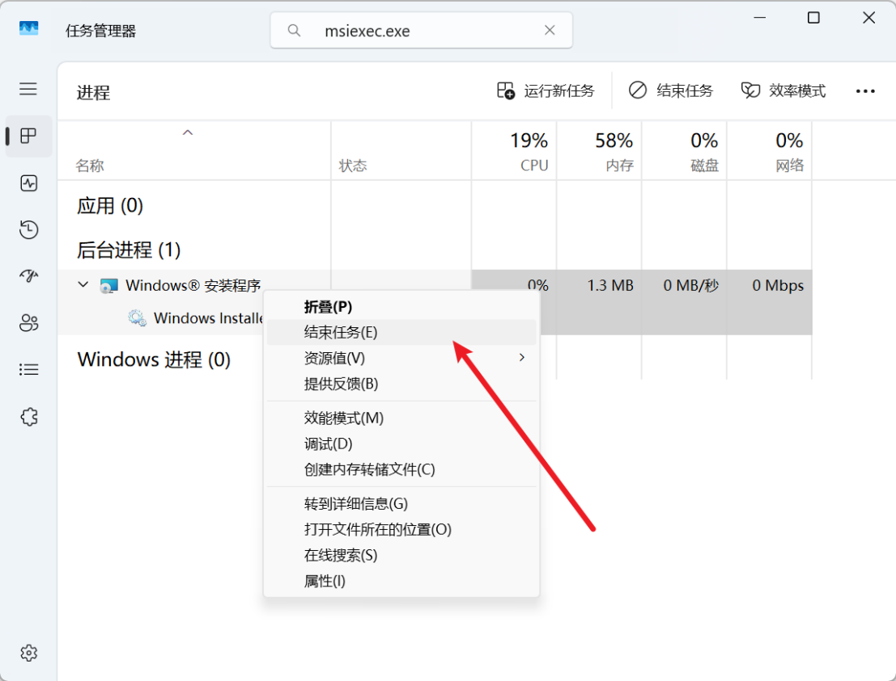

---
title: "另一个安装正在进行中。在继续此安装之前，您必须完成当前的安装。Another installation is in progress. You must complete that installation before continuing this one."
date: 2026-07-15
description: "另一个安装正在进行中。在继续此安装之前，您必须完成当前的安装。Another installation is in progress. You must complete that installation before continuing this one.的排查与解决方法，整理常见原因、..."
categories:
  - "报错"
tags:
  - "P 社启动器"
  - "安装失败"
  - "Windows Installer"
draft: false
slug: "paradox-launcher-error-27"
related_group: "paradox-launcher"
---

> 本文整理自《群星常见问题合集及解决办法》，原作者：唏嘘南溪。文档内容会随实际反馈持续修正。

## 1. 报错现象

另一个安装正在进行中。在继续此安装之前，您必须完成当前的安装。Another installation is in progress. You must complete that installation before continuing this one.。

## 2. 解决方法

同时按住 Esc+Shift+Ctrl 打开任务管理器，搜索 msiexec.exe，找到 Windows Installer

右键点击结束任务即可

## 3. 仍未解决

如果上述方法不适用，建议记录完整报错文字、复现步骤和 `error.log` 内容后再进一步排查。也可以联系原文作者（QQ：3217344726）反馈，以便补充或修正方案。

