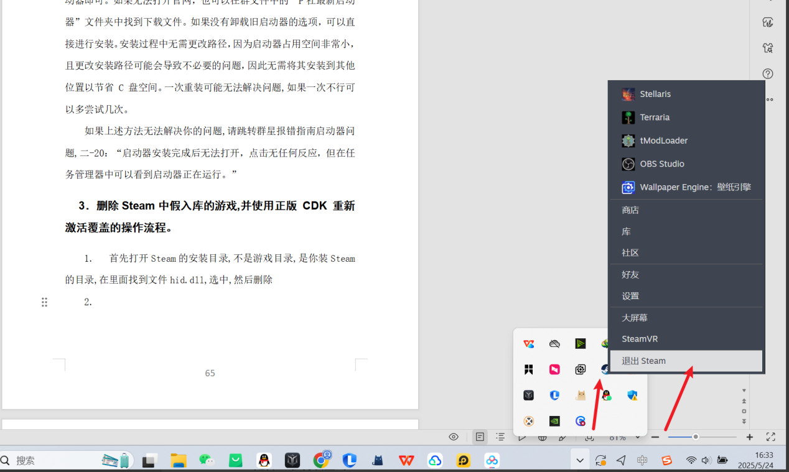

---
title: "删除 Steam 中假入库的游戏，并使用正版 CDK 重新激活覆盖的操作流程。"
date: 2026-07-15
description: "删除 Steam 中假入库的游戏，并使用正版 CDK 重新激活覆盖的操作流程的排查与解决方法，整理常见原因、操作步骤和相关报错截图。"
categories:
  - "报错"
tags:
  - "Steam"
  - "游戏故障"
  - "问题排查"
draft: false
slug: "steam-error-03"
---

> 本文整理自《群星常见问题合集及解决办法》，原作者：唏嘘南溪。文档内容会随实际反馈持续修正。

## 1. 报错现象

删除 Steam 中假入库的游戏，并使用正版 CDK 重新激活覆盖的操作流程。

## 2. 解决方法

这里以游戏群星 stellaris 为例，想在 Steam 库中删除假入库的游戏没必要卸载下载好的游戏文件，二十来 G 重新下一遍挺费事，按照下面的操作来就好：

首先打开 Steam 的安装目录，不是游戏目录，是你装 Steam 的目录，在里面找到文件 hid.dll，选中，然后删除

在电脑右下角这个隐藏的图标框中右键 Steam 图标，点击退出 Steam

重新打开 Steam，此时你电脑上的群星游戏文件还在，但是 Steam 库中原来开始游戏按钮已经变成了购买游戏按钮了

接下来以任意正版形式重新激活即可，比如去 Steam 商店购买游戏，不过不推荐，不打折很贵;或者去小黑盒买 cdk 过来激活，小黑盒买的 cdk 有保障，不会买到盗版，不过小黑盒也不是一直搞活动，不搞活动时的价格和 Steam 商店差不多;如果你想玩 stellaris 的时候不凑巧 Steam 和小黑盒都不打折，可以去 steampy 买 cdk,steampy 一直处于比较低价的区间，不过操作有点麻烦，需要登录 Steam 账号，登录以后你购买 cdk 会直接帮你在库中激活，质量同样有保障。

购买完成后刷新 Steam，可以看到购买游戏按钮又变回了开始游戏按钮，此时不管是打 dlc+ 补丁包还是正常玩游戏都不影响了。

## 3. 仍未解决

如果上述方法不适用，建议记录完整报错文字、复现步骤和 `error.log` 内容后再进一步排查。也可以联系原文作者（QQ：3217344726）反馈，以便补充或修正方案。

