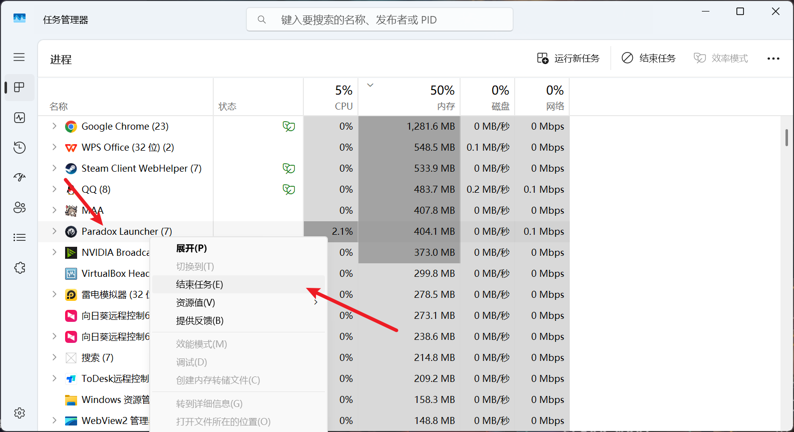

---
title: "游戏报错无法打开，但 steam 库中显示游戏一直在运行，无法关闭游戏"
date: 2026-07-15
description: "游戏报错无法打开，但 steam 库中显示游戏一直在运行，无法关闭游戏的排查与解决方法，整理常见原因、操作步骤和相关报错截图。"
categories:
  - "报错"
tags:
  - "Steam"
  - "游戏故障"
  - "问题排查"
draft: false
slug: "steam-error-04"
---

> 本文整理自《群星常见问题合集及解决办法》，原作者：唏嘘南溪。文档内容会随实际反馈持续修正。

## 1. 报错现象

游戏报错无法打开，但 steam 库中显示游戏一直在运行，无法关闭游戏。

## 2. 解决方法

其实是启动器问题，Shift+Ctrl+Esc 打开任务管理器，找到 Paradox Launcher，右键结束任务即可，需要注意的是，如果你遇到这个报错，任务管理器里多半不止这一个进程，如果有同名进程全部关闭即可。另外这个方法治标不治本，如果你的报错问题没有解决，重新打开游戏还是会复现该情况。解决报错问题请根据游戏报错描述查找报错指南对应条目。

## 3. 仍未解决

如果上述方法不适用，建议记录完整报错文字、复现步骤和 `error.log` 内容后再进一步排查。也可以联系原文作者（QQ：3217344726）反馈，以便补充或修正方案。

