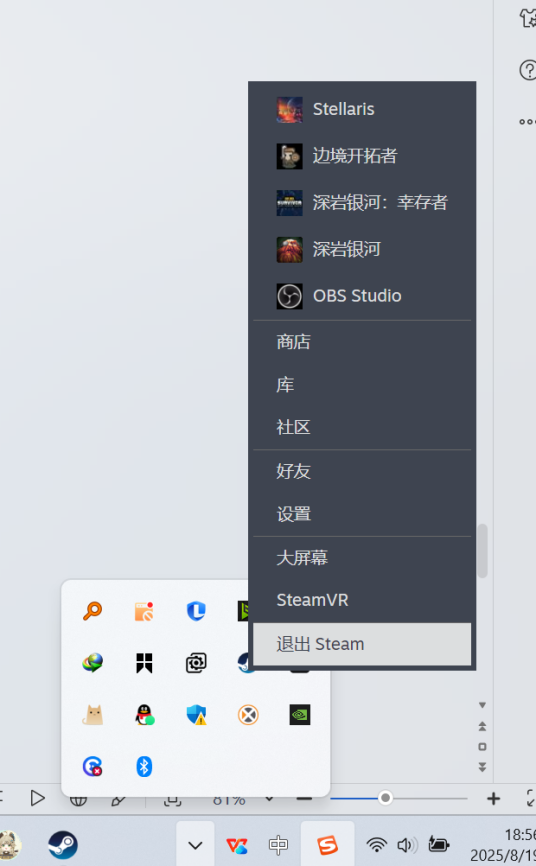

---
title: "关闭游戏后 steam 库中一直显示正在停止，无法彻底关掉游戏"
date: 2026-07-15
description: "关闭游戏后 steam 库中一直显示正在停止，无法彻底关掉游戏的排查与解决方法，整理常见原因、操作步骤和相关报错截图。"
categories:
  - "报错"
tags:
  - "Steam"
  - "进程异常"
  - "Steam 客户端"
draft: false
slug: "steam-error-05"
related_group: "steam"
hidden: true
searchable: true
guide: "/p/steam-troubleshooting-guide/"
guide_title: "Steam 常见问题解决指南"
---

> 本文整理自《群星常见问题合集及解决办法》，原作者：唏嘘南溪。文档内容会随实际反馈持续修正。

## 1. 报错现象

关闭游戏后 steam 库中一直显示正在停止，无法彻底关掉游戏。

## 2. 解决方法

方法一：彻底关掉 steam 后重新打开 steam 即可

方法二：关掉有可能和 steam 冲突的进程，目前已知的有：

Wps 云盘进程，qq 输入法进程等

关闭方法：通过 Ctrl+Shift+ESC 打开任务管理器，在里面关掉对应进程。

## 3. 仍未解决

如果上述方法不适用，建议记录完整报错文字、复现步骤和 `error.log` 内容后再进一步排查。也可以联系原文作者（QQ：3217344726）反馈，以便补充或修正方案。

