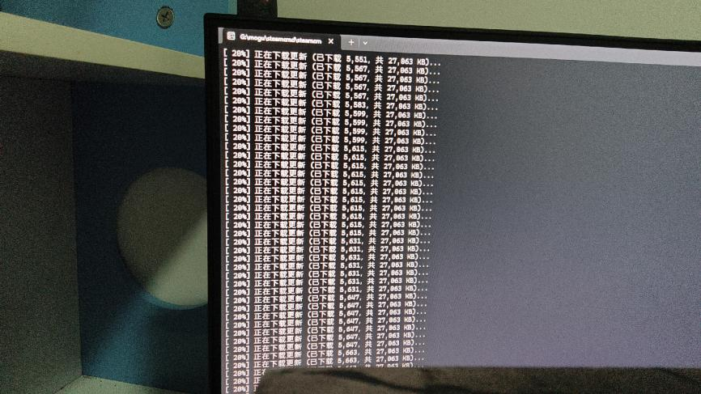
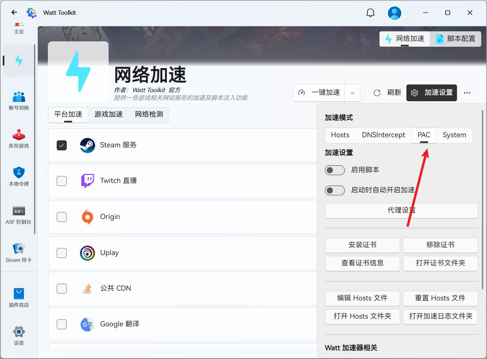

---
title: "不断重复正在下载更新，但是进度条不变"
date: 2026-07-15
description: "不断重复正在下载更新，但是进度条不变的排查与解决方法，整理常见原因、操作步骤和相关报错截图。"
categories:
  - "报错"
tags:
  - "SteamCMD"
  - "命令行工具"
  - "下载故障"
  - "问题排查"
draft: false
slug: "steamcmd-error-04"
---

> 本文整理自《群星常见问题合集及解决办法》，原作者：唏嘘南溪。文档内容会随实际反馈持续修正。

## 1. 报错现象

不断重复正在下载更新，但是进度条不变。

## 2. 解决方法

使用 SteamCMD 时也需要加速器，就像使用 Steam 客户端一样。不过，如果你使用 Steam++ 进行加速，不能直接开启 Steam 的加速模式，而是需要在加速设置中将模式切换为 PAC 模式。或者，如果你有其他梯子，也可以直接使用全局加速模式。

## 3. 仍未解决

如果上述方法不适用，建议记录完整报错文字、复现步骤和 `error.log` 内容后再进一步排查。也可以联系原文作者（QQ：3217344726）反馈，以便补充或修正方案。
