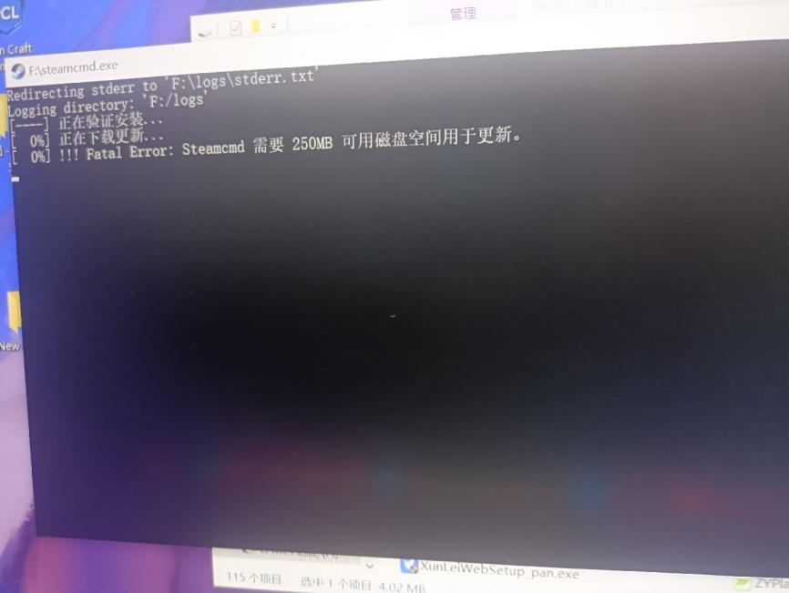

---
title: "出现报错!!! Fatal Error: Steamcmd 需要 250MB 可用磁盘空间用于更新。"
date: 2026-07-15
description: "出现报错!!! Fatal Error: Steamcmd 需要 250MB 可用磁盘空间用于更新的排查与解决方法，整理常见原因、操作步骤和相关报错截图。"
categories:
  - "报错"
tags:
  - "SteamCMD"
  - "命令行工具"
  - "下载故障"
  - "问题排查"
draft: false
slug: "steamcmd-error-05"
---

> 本文整理自《群星常见问题合集及解决办法》，原作者：唏嘘南溪。文档内容会随实际反馈持续修正。

## 1. 报错现象

出现报错!!! Fatal Error: Steamcmd 需要 250MB 可用磁盘空间用于更新。

## 2. 解决方法

有时权限问题可能阻止正确写入磁盘，尝试以管理员身份运行 steamcmd.exe。不过每次重启都需要重新选择以管理员身份运行，想一劳永逸可以右键图标，在属性中勾选以管理员身份运行。

## 3. 仍未解决

如果上述方法不适用，建议记录完整报错文字、复现步骤和 `error.log` 内容后再进一步排查。也可以联系原文作者（QQ：3217344726）反馈，以便补充或修正方案。
