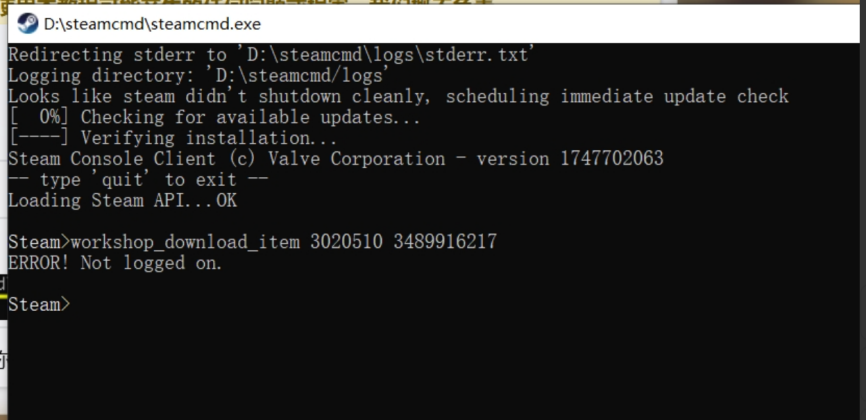
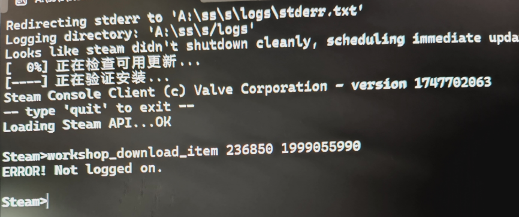

---
title: "下载时报错“ERROR! Not logged on.”"
date: 2026-07-15
description: "下载时报错“ERROR! Not logged on.”的排查与解决方法，整理常见原因、操作步骤和相关报错截图。"
categories:
  - "报错"
tags:
  - "SteamCMD"
  - "命令行工具"
  - "下载故障"
  - "问题排查"
draft: false
slug: "steamcmd-error-08"
---

> 本文整理自《群星常见问题合集及解决办法》，原作者：唏嘘南溪。文档内容会随实际反馈持续修正。

## 1. 报错现象

下载时报错“ERROR! Not logged on.”。

## 2. 解决方法

在使用 steamcmd 下载 mod 前需要先登录！登录完才能下载！

详细流程可以参考视频：

【【群星教程】如何用 steamcmd 下载创意工坊的 mod?】https://www.bilibili.com/video/BV1Ju4y1v7B2/?share_source=copy_web&vd_source=04becf7d20fdc437d804d92aa7ca4370

## 3. 仍未解决

如果上述方法不适用，建议记录完整报错文字、复现步骤和 `error.log` 内容后再进一步排查。也可以联系原文作者（QQ：3217344726）反馈，以便补充或修正方案。

