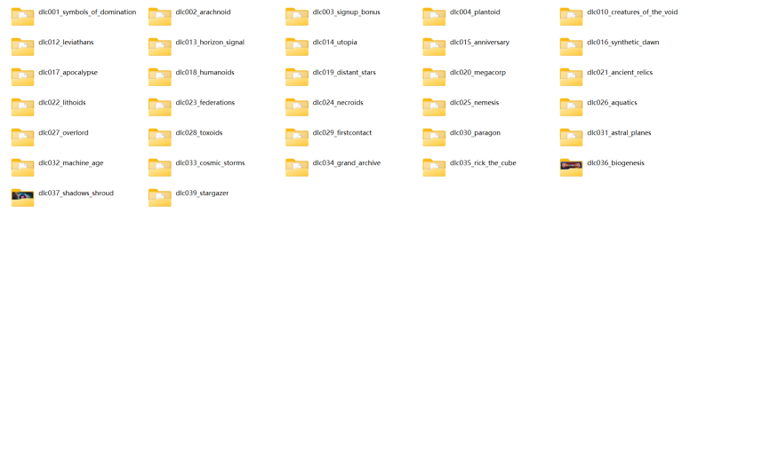

---
title: "解压 dlc 补丁包后发现 dlc 序号不连续"
date: 2026-07-15
description: "解压 dlc 补丁包后发现 dlc 序号不连续的排查与解决方法，整理常见原因、操作步骤和相关报错截图。"
categories:
  - "报错"
tags:
  - "群星"
  - "DLC"
  - "DLC 异常"
  - "文件缺失"
draft: false
slug: "stellaris-dlc-error-02"
related_group: "stellaris-dlc"
hidden: true
searchable: true
guide: "/p/stellaris-dlc-troubleshooting-guide/"
guide_title: "群星 DLC 异常解决指南"
---

> 本文整理自《群星常见问题合集及解决办法》，原作者：唏嘘南溪。文档内容会随实际反馈持续修正。

## 1. 报错现象

解压 dlc 补丁包后发现 dlc 序号不连续。

## 2. 解决方法

如图：

部分玩家看到 DLC 序号不连续，会怀疑是不是缺少了某个 DLC。这里需要说明几点：

大面积序号缺失的情况

如果 DLC 序号出现了大面积的空缺，那确实有可能是缺少了部分 DLC。上图展示的是 Stellaris 在 4.1 版本时的全部 DLC，共有 32 个文件夹，你可以据此进行逐一核对。

序号空缺的正常情况

Stellaris 的 DLC 更新并不是严格按照序号顺序进行的，因此出现序号空缺是正常现象。也就是说，即使存在某些序号的缺口，也不一定意味着 DLC 文件缺失。

如何进一步确认

如果你已经核对过，确认 DLC 文件本身没有缺少，但游戏内确实缺少某些 DLC，请参考本章节的其他条目，逐一对照排查。

## 3. 仍未解决

如果上述方法不适用，建议记录完整报错文字、复现步骤和 `error.log` 内容后再进一步排查。也可以联系原文作者（QQ：3217344726）反馈，以便补充或修正方案。

