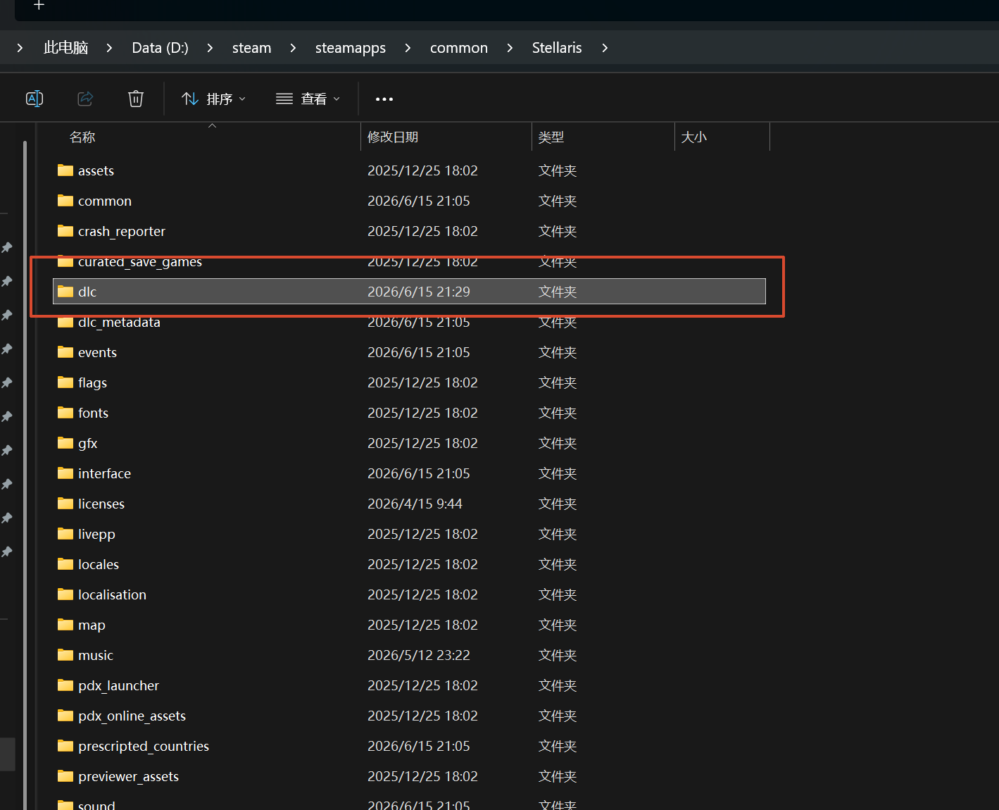
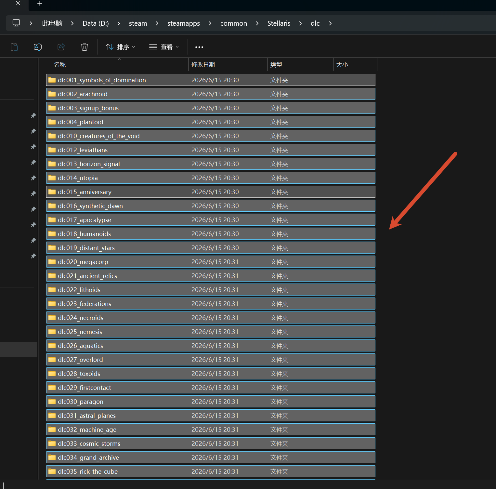

---
title: "打完 dlc 补丁包后其他 dlc 正常激活，但一部分旧的 dlc 没有被激活"
date: 2026-07-15
description: "打完 dlc 补丁包后其他 dlc 正常激活，但一部分旧的 dlc 没有被激活的排查与解决方法，整理常见原因、操作步骤和相关报错截图。"
categories:
  - "报错"
tags:
  - "群星"
  - "Stellaris"
  - "DLC"
  - "问题排查"
draft: false
slug: "stellaris-dlc-error-04"
---

> 本文整理自《群星常见问题合集及解决办法》，原作者：唏嘘南溪。文档内容会随实际反馈持续修正。

## 1. 报错现象

打完 dlc 补丁包后其他 dlc 正常激活，但一部分旧的 dlc 没有被激活。

## 2. 解决方法

去游戏根目录，找到 dlc 文件夹，进去把所有 dlc 文件全删掉，然后下载 dlc 一键安装程序一键安装一下。

记得只删里面的文件，不要把文件夹也删了

dlc 一键安装程序下载地址：

<https://gitlink.org.cn/signriver/file-warehouse/releases/download/v/Stellaris-DLC-Helper-v1.0.5.zip>

## 3. 仍未解决

如果上述方法不适用，建议记录完整报错文字、复现步骤和 `error.log` 内容后再进一步排查。也可以联系原文作者（QQ：3217344726）反馈，以便补充或修正方案。
