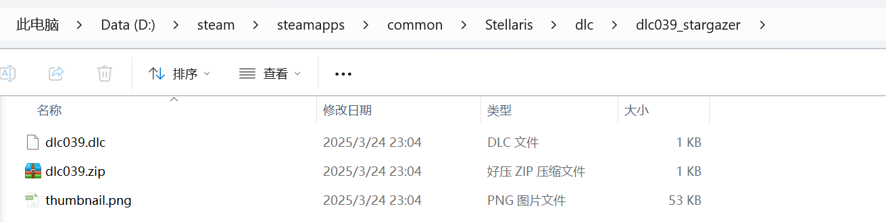

---
title: "打完 dlc 补丁包后其他 dlc 正常激活，但最新的一个或几个 dlc 没有被激活"
date: 2026-07-15
description: "打完 dlc 补丁包后其他 dlc 正常激活，但最新的一个或几个 dlc 没有被激活的排查与解决方法，整理常见原因、操作步骤和相关报错截图。"
categories:
  - "报错"
tags:
  - "群星"
  - "Stellaris"
  - "DLC"
  - "问题排查"
draft: false
slug: "stellaris-dlc-error-05"
---

> 本文整理自《群星常见问题合集及解决办法》，原作者：唏嘘南溪。文档内容会随实际反馈持续修正。

## 1. 报错现象

打完 dlc 补丁包后其他 dlc 正常激活，但最新的一个或几个 dlc 没有被激活。

## 2. 解决方法

确认下你下载的补丁包对不对的上版本，如果你 4.0 游戏下载 3.14 版本的补丁包，肯定会缺失 4.0 才出的新 dlc.群文件有全 dlc+ 补丁包，升级包和单独 dlc 包，如果你不清楚该下哪个包，下当前游戏版本对应的全 dlc 补丁包即可。

另外如果你确实下载的是当前版本对应的补丁包，那就去游戏根目录下的 dlc 文件夹里看看各个 dlc 子文件夹是否存在文件夹嵌套现象，如下图

打开 `dlc039_stargazer` 文件夹后，应直接显示所有 DLC 内容文件；若仍存在多余的子文件夹，请将其中的文件手动移动到正确位置。此类问题通常由解压过程中的错误引起。

记得更新游戏本体，比如有个哥们打了 4.1 的 dlc 问我为什么没有生效，截图一看选的版本是 4.0.23

如果你所有方法都试过了还不行，那就下载群文件全 dlc+ 补丁那个，全部替换，dlc 和补丁肯定有一个出问题了。

## 3. 仍未解决

如果上述方法不适用，建议记录完整报错文字、复现步骤和 `error.log` 内容后再进一步排查。也可以联系原文作者（QQ：3217344726）反馈，以便补充或修正方案。

